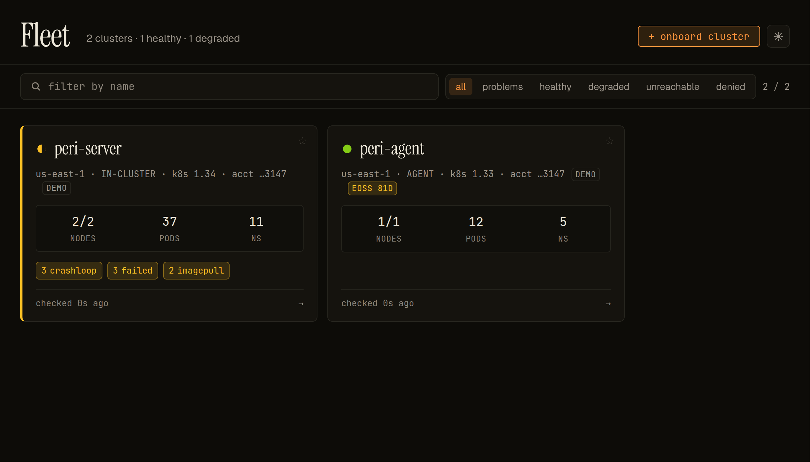

<p align="center">
  <picture>
    <source media="(prefers-color-scheme: dark)" srcset="https://periscopehq.dev/readme-banner-dark.png">
    
  </picture>
</p>

# Periscope

> A Kubernetes console built **for** EKS — keyless cluster access, every action signed by the human who took it.

[](https://github.com/gnana997/periscope/actions/workflows/ci.yaml)
[](LICENSE)
[](https://github.com/gnana997/periscope/releases/latest)
[](https://artifacthub.io/packages/search?repo=periscope)
[](https://artifacthub.io/packages/search?repo=periscope-agent)
[](https://scorecard.dev/viewer/?uri=github.com/gnana997/periscope)

<p align="center">
  
</p>

## The problem

Modern AWS security baselines are retiring long-lived IAM credentials — and most Kubernetes dashboards quietly depend on them. Take the static keys away and your console either stops working, or falls back to a single shared service-account identity. With a shared identity the audit trail goes blind: every action reads as `dashboard-bot`, never the person who actually took it.

Periscope is built for that world.

## What is Periscope

Periscope is a self-hosted, multi-cluster Kubernetes console focused on EKS. It authenticates **to** clusters with Pod Identity / IRSA — no static AWS keys on the console pod — authenticates **users** via OIDC, and impersonates each user on every API call, so your cluster's own audit log records `alice@corp`, never a shared bot. It runs as a single stateless binary.

## What makes it different

- **Keyless on EKS.** Cluster access is obtained on demand through Pod Identity or IRSA. Nothing static lives on the console pod.
- **A real human in every audit row.** Impersonation carries each user's OIDC identity onto every Kubernetes call — so both your cluster's apiserver audit log and Periscope's own signed, searchable audit trail show the person, never `periscope-bot`.
- **It understands EKS, not just Kubernetes.** IAM access analysis ("which workloads can perform action X?"), Amazon Inspector v2 CVE findings grouped by package, EKS Access Entries / aws-auth reconciliation, upgrade-readiness insights, add-on management, and a Karpenter dashboard.
- **And it's a complete console.** Multi-cluster fleet view, live resource browsing over SSE, a schema-aware YAML editor with server-side apply, the full Helm lifecycle (install / upgrade / rollback / diff), logs, in-browser `exec` — plus an agent tunnel that manages any cluster with outbound HTTPS, no IAM trust required.

## Quickstart

**Live demo:** [demo.periscopehq.dev](https://demo.periscopehq.dev) — a read-only fleet, no signup.

### Try locally with kind — 60 seconds

The fastest way to see Periscope without touching AWS or an IdP. Runs on any local Kubernetes — kind / k3d / minikube. Sign-in uses an in-process dev fallback, so anyone hitting the dashboard becomes `dev@local`.

```sh
# 1. Create a local cluster
kind create cluster --name periscope-demo

# 2. Install with the kind-tuned values
helm install periscope \
  oci://ghcr.io/gnana997/charts/periscope --version 1.1.2 \
  --namespace periscope --create-namespace \
  --values https://periscopehq.dev/examples/values-kind.yaml

# 3. Wait + open
kubectl -n periscope wait --for=condition=Available deploy/periscope --timeout=120s
kubectl -n periscope port-forward svc/periscope 8080:8080

# 4. Visit http://localhost:8080 in your browser.
#    Sign-in is automatic — you arrive as "dev@local". No IdP setup.
```

Cleanup: `kind delete cluster --name periscope-demo`.

> ⚠️  Dev sign-in is for local evaluation only. Don't run this profile against a cluster that holds real workloads — anyone who can reach the SPA becomes the configured `dev` user with `cluster-admin` impersonation.


### Run locally

Prerequisites: Go 1.26, Node 22, and a kubeconfig with access to at least one cluster.

```sh
make backend    # Go API on :8088
make frontend   # Vite dev server on :5173 (proxies /api -> :8088)
```

Open <http://localhost:5173>.

### Install on a cluster

A Helm chart lives at [`deploy/helm/periscope/`](deploy/helm/periscope/). Full walkthrough including OIDC client setup and Pod Identity / IRSA wiring: [`docs/setup/deploy.md`](docs/setup/deploy.md).


```sh
# Pin to a specific version. Find the latest at
# https://artifacthub.io/packages/helm/periscope/periscope
helm install periscope \
  oci://ghcr.io/gnana997/charts/periscope \
  --version <VERSION> \
  --namespace periscope --create-namespace
```

For CI / scripts that always want the latest stable, resolve the tag from the GitHub API:

```sh
LATEST=$(curl -s https://api.github.com/repos/gnana997/periscope/releases/latest \
  | jq -r .tag_name | sed 's/^v//')
helm install periscope \
  oci://ghcr.io/gnana997/charts/periscope \
  --version "$LATEST" \
  --namespace periscope --create-namespace
```

Both signed (cosign keyless) and discoverable on [Artifact Hub](https://artifacthub.io/packages/helm/periscope/periscope). To verify the chart signature before install, see the verification snippet in [`docs/RELEASING.md`](docs/RELEASING.md).

## Features

The [What makes it different](#what-makes-it-different) section above is the short version. For the complete capability list — authentication, multi-cluster, browsing, editing, Helm, EKS add-ons, upgrade readiness, Karpenter, CVE surfacing, AWS Access, and audit — see **[docs/features.md](docs/features.md)**.

## Status

**v1.1 stable.** The public HTTP API, configuration shape, and Helm values are covered by semver — breaking changes will land in a future major (v2); bugfixes and additive features land on minor / patch tags off `main`. See [`CHANGELOG.md`](CHANGELOG.md) for what shipped per release.

## Documentation

**Setup**
- [Configuration & deployment](docs/setup/deploy.md)
- [Helm values reference](docs/setup/values.md)
- [Environment variables reference](docs/setup/environment-variables.md)
- [OIDC setup — Auth0](docs/setup/auth0.md)
- [OIDC setup — Okta](docs/setup/okta.md)
- [In-cluster RBAC the backend needs](docs/setup/cluster-rbac.md)
- [Audit log persistence](docs/setup/audit.md)
- [Watch streams (SSE) operator guide](docs/setup/watch-streams.md)
- [Helm release browser](docs/setup/helm-releases.md)
- [Pod exec setup](docs/setup/pod-exec.md)
- [NetworkPolicy](docs/setup/networkpolicy.md)
- [Apply YAML dialog](docs/setup/apply-yaml.md) — paste/drop multi-doc YAML with per-doc RBAC pre-flight
- [Multi-cluster onboarding (agent)](docs/setup/agent-onboarding.md) — register a managed cluster via the periscope-agent tunnel
- [EKS upgrade readiness](docs/setup/eks-upgrade-readiness.md) — Upgrade Insights + managed node group AMI drift

**Usage**
- [Karpenter dashboard](docs/usage/karpenter-view.md) — NodePool/$/hr/Drift/pending-pods walkthrough + cost-RBAC sample
- [CVE surfacing (Inspector v2)](docs/usage/cve.md) — chip column + Security tab walkthrough, enablement, audit + cost

**Architecture**
- [Architecture overview](docs/architecture/README.md) — component map, source-tree guide, reading order for new contributors
- [Watch streams — push model, fallback, RBAC](docs/architecture/watch-streams.md)
- [Agent tunnel — multi-cluster transport, PKI, registration](docs/architecture/agent-tunnel.md)

**Reference**
- [HTTP API reference (stability tiers, auth, conventions)](docs/api.md)

**RFCs**
- [RFC 0001 — Pod exec support](docs/rfcs/0001-pod-exec.md)
- [RFC 0002 — Authentication (OIDC + per-user K8s authz)](docs/rfcs/0002-auth.md)
- [RFC 0003 — Audit log: schema and retention semantics](docs/rfcs/0003-audit-log.md)

## Configuration

| What | Where |
|---|---|
| OIDC (user auth) | [`examples/config/auth.yaml.auth0`](examples/config/auth.yaml.auth0), [`examples/config/auth.yaml.okta`](examples/config/auth.yaml.okta) |
| Cluster registry | Helm values; see [deploy guide](docs/setup/deploy.md) |
| In-cluster RBAC | [`docs/setup/cluster-rbac.md`](docs/setup/cluster-rbac.md) |
| Audit persistence | Helm `audit:` block; see [`docs/setup/audit.md`](docs/setup/audit.md) |
| Watch streams | Helm `watchStreams:` block; see [`docs/setup/watch-streams.md`](docs/setup/watch-streams.md) |

## Architecture

Single Go binary embeds the React SPA. Stateless with respect to user credentials — OIDC sessions kept in memory only; no kubeconfigs or AWS keys persisted. Runs as non-root with a read-only root filesystem, no privilege escalation, and a `RuntimeDefault` seccomp profile (configured in the Helm chart).

For component-level detail see [`docs/architecture/`](docs/architecture/) and [`docs/rfcs/`](docs/rfcs/).

## Development

Repository layout:

```
cmd/periscope/    backend entry point
internal/         backend packages (auth, authz, audit, clusters, credentials, exec, k8s, secrets, sse, httpx, spa)
web/              React + TypeScript SPA (Vite, Monaco editor)
deploy/helm/      Helm chart
docs/             setup guides, architecture notes, RFCs
examples/         reference configs
Makefile          common targets
```

Common targets:

| Target | Purpose |
|---|---|
| `make backend` | Run the Go backend on `:8088` |
| `make frontend` | Run the Vite dev server on `:5173` |
| `make build` | Build the SPA, embed it, produce a single binary at `bin/periscope` |
| `make test` | Run Go tests |
| `make image` | Build the container image |
| `make helm-lint` / `make helm-template` | Validate or render the chart locally |

Frontend tests:

```sh
cd web && npx vitest run
```

CI: every push and PR runs `golangci-lint`, `go test`, `npm run lint`, `npm test`, `npm run build`, `helm lint` + `helm template` smoke renders, and an embedded-binary build. See [`.github/workflows/ci.yaml`](.github/workflows/ci.yaml).

(See [`CONTRIBUTING.md`](CONTRIBUTING.md) for coding conventions, PR process, and a longer dev guide.)

## Roadmap

Planning is tracked in [GitHub Milestones](https://github.com/gnana997/periscope/milestones). **v1.1 (shipped)** delivered the AWS Access surfaces — Cluster Access page reconciling EKS Access Entries + aws-auth + IRSA + Pod Identity, per-workload AWS Access tab with sensitive-permissions chips, and reverse lookup ("which workloads can perform action X?").

- **[v1.2](https://github.com/gnana997/periscope/milestone/2): operator daily-driver layer.** GPU + AI workload visibility (Pod ↔ GPU map, idle-GPU finder, DCGM reconciler), in-browser cluster shell (#104), SSM shell into EKS nodes (#105), Helm private-OCI auth via Pod Identity / IRSA (#121).
- **[v1.3](https://github.com/gnana997/periscope/milestone/3): AWS depth + observability.** IAM effective-access engine (conditions, SCPs, cross-account `AssumeRole` walking), CloudTrail compliance lens, cluster-wide kube-apiserver audit ingestion, related-resources graph, CronJob CVE-ownership chain, per-NodeGroup CVE rollup.
- **[v1.4](https://github.com/gnana997/periscope/milestone/4): agent-native.** MCP-style tool registry over the v1.1–v1.3 wire shapes (#151), LLM provider abstraction, in-app chat surface, `agent_tool_call` audit verb.

## Community & support

- **Bugs & feature requests:** [GitHub Issues](https://github.com/gnana997/periscope/issues)
- **Questions & discussion:** [GitHub Discussions](https://github.com/gnana997/periscope/discussions)
- **Security vulnerabilities:** see [`SECURITY.md`](SECURITY.md)

## Contributing

Contributions are welcome. Read [`CONTRIBUTING.md`](CONTRIBUTING.md) before opening a PR. By participating in this project you agree to abide by its [`CODE_OF_CONDUCT.md`](CODE_OF_CONDUCT.md).

## License

[Apache License 2.0](LICENSE).
