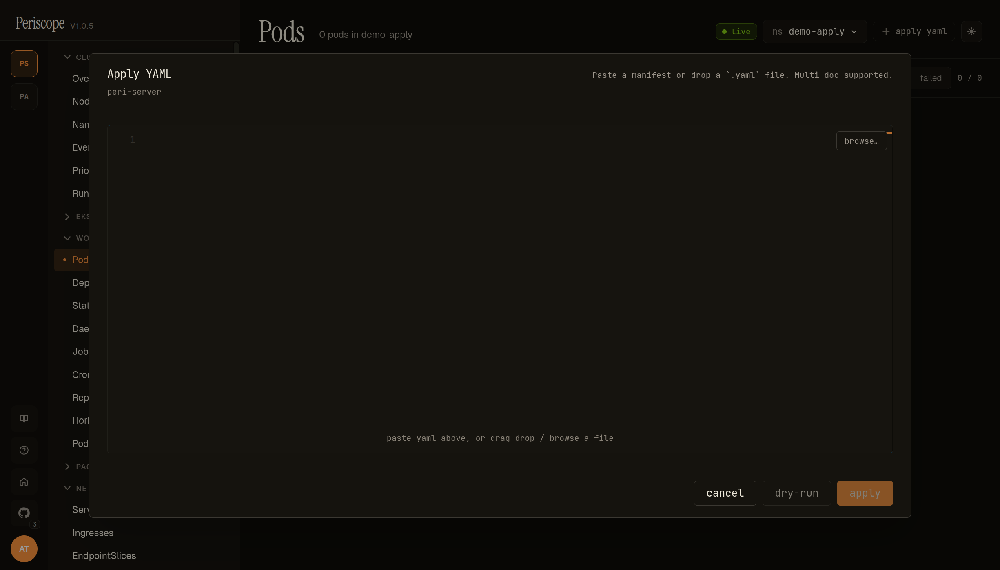
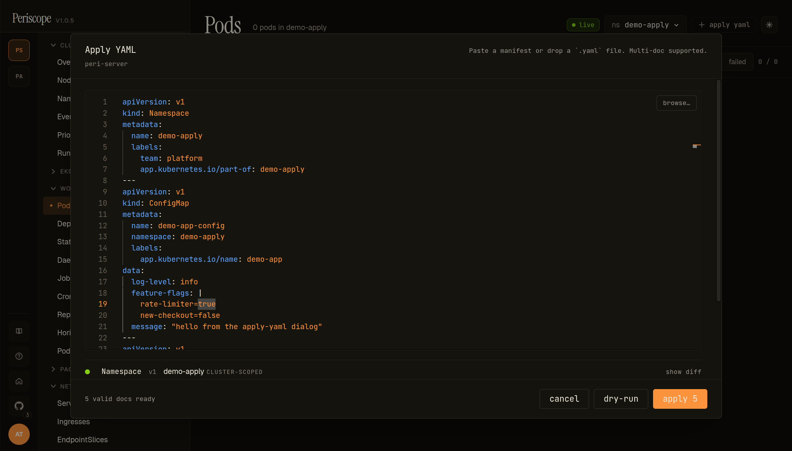
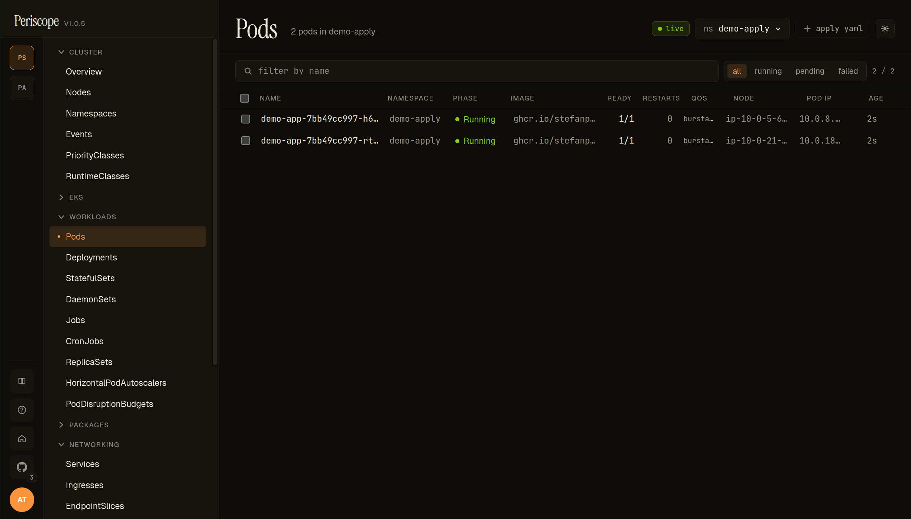

# Apply YAML

The **+ apply yaml** action in the page header is Periscope's
`kubectl apply -f` for the browser. Paste a manifest, drag-drop a
`.yaml` file, or use the **browse…** picker. Multi-doc YAML is parsed
and each document is dry-run + RBAC pre-flighted independently before
the real apply lands.

It's the operator's hand-applied path for one-off resources — quick
fix-its, demo seeding, copy-paste from a runbook. For everything that
needs version-control + review, GitOps remains the right tool.

---

## What you see

### Empty dialog



The dialog opens centered over the current page. The header carries:

- **Apply YAML** title + the cluster context (`peri-server` here).
- The **drop zone hint** — `Paste a manifest or drop a `.yaml` file. Multi-doc supported.`
- **browse…** button — opens the OS file picker; selected file's
  contents replace whatever is in the editor.

The editor itself is Monaco YAML with line numbers and full
syntax highlighting + linting.

The footer carries:

- **cancel** — discards the draft, dialog closes.
- **dry-run** — runs the same parse + RBAC pre-flight + server-side
  dry-run apply that the real **apply** uses, but without persisting.
- **apply** — runs the dry-run first, then the real apply. Disabled
  until the editor has at least one valid YAML document.

### Dry-run / pre-flight



Once the editor parses, two surfaces light up:

**1. Per-doc preview list** (between the editor and the footer) — one row per parsed doc:

- **Kind / apiVersion / namespace / name chip** — `Namespace v1 demo-apply CLUSTER-SCOPED` for the lead doc in the screencap. Cluster-scoped docs render with the `CLUSTER-SCOPED` chip; namespaced docs render `ns:<namespace>`.
- **State glyph** — `○` idle, `◐` running, `●` success, `✕` failure, `⚠` conflict — colored to match. Glyph flips as the dialog walks the docs.
- **Per-row actions** appear after dry-run completes:
  - **`force`** — yellow chip on conflict rows; retries this single doc with `force=true` (takes ownership of conflicting fields). One-shot, scoped to the row.
  - **`show diff`** — toggle that appears on **successful dry-run rows only**. Expands a `<pre>` block with the apiserver's server-side-apply dry-run response — the full computed manifest after schema defaults + admission + conversion. Useful for spot-checking what the server would actually persist (defaulted fields, mutating-webhook injections, etc.). **Not** a current-vs-proposed diff — Periscope does not fetch the existing object and render a unified diff. The label is historical.

Bad-input rows render a red `bad input` badge with the parse error message inline; **apply** stays disabled until every doc parses cleanly.

**2. Footer status text** — `X valid docs ready[, Y skipped][, Z denied]`. The screencap reads `5 valid docs ready`. While a run is in flight the text reads `running dry-run…` / `applying…` and a `cancel run` button replaces the action buttons.

**Footer buttons** — `cancel` / `dry-run` / `apply`. `apply` always runs the same dry-run + RBAC pre-flight + audit pipeline before the real apply, so clicking `dry-run` first is optional — its value is letting you inspect the server's response in `show diff` before committing.

If RBAC pre-flight denies one or more verbs, the affected rows render a `denied` chip with a tooltip naming the `(verb, resource, namespace)` tuple, the footer text adds `, N denied`, and **apply** stays disabled. The familiar "your role can't do this" gate, surfaced *before* the real apply runs (see [`Per-doc RBAC pre-flight`](#per-doc-rbac-pre-flight)).

### After apply



When **apply** succeeds, the dialog closes, a success toast lands,
and the page you were on (Pods, in the screencap) refreshes with the
new resources visible. The screencap shows the result of applying
the 5-doc demo: a `demo-apply` namespace, ConfigMap + Secret +
Deployment + Service, with the Deployment's two podinfo replicas
running.

---

## Per-doc RBAC pre-flight

Periscope runs a `SelfSubjectAccessReview` for the matching `(verb,
resource, namespace)` of every doc *before* the apply lands. Verbs:

| Doc state | Verb tested |
|---|---|
| Resource doesn't exist on cluster | `create` |
| Resource exists | `patch` |
| Doc has `metadata.deletionTimestamp` set explicitly | `delete` |

If any verb is denied, **apply** is disabled and the denial list is
surfaced with the same wording the rest of the SPA uses ("your role
can't do this"). No partial applies — the dry-run is gated on the
full set passing.

---

## Multi-doc behavior

- Documents are parsed by `---` separators (the standard YAML
  multi-doc convention).
- Each document gets its own dry-run + RBAC pre-flight.
- `apply` runs them sequentially. If the 3rd of 5 docs fails the
  real apply (e.g. an admission webhook rejected it), docs 1+2
  stay applied — Periscope does not auto-rollback. The result toast
  names the failed doc and the remaining docs are reported as not
  attempted.

For the **all-or-nothing** semantics that GitOps tools provide, use
GitOps. The Apply YAML dialog is for hand-applied one-offs.

---

## Audit

Every successful apply (dry-run *and* real) writes one audit row per
doc with `verb=apply`, `kind/namespace/name`, the `operation`
(`create` / `update` / `delete`), and `dryRun=true|false`. See
[`audit.md`](./audit.md) for the audit-page filters that surface
these rows.

---

## Demo: 5-doc mini-app

The 5-doc YAML used in the screencaps above lives in this repo at
[`discussions/demo-apply-yaml.yaml`](https://github.com/gnana997/periscope/blob/main/discussions/demo-apply-yaml.yaml)
(seeded for v1.0.5 demos). It exercises:

| Doc | Kind | Why it's in the demo |
|---|---|---|
| 1 | Namespace `demo-apply` | Cluster-scoped create — exercises the cluster-scope RBAC path. |
| 2 | ConfigMap `demo-app-config` | Namespaced create with a multi-line `data` field. |
| 3 | Secret `demo-app-secrets` | Namespaced create — exercises the `create:secrets` RBAC path (often denied for read-only roles). |
| 4 | Deployment `demo-app` (podinfo, 2 replicas) | Workload create — exercises the `apps/v1` group; pods are visible on the Pods page after apply. |
| 5 | Service `demo-app` | ClusterIP service binding to the Deployment via label selector. |

Cleanup:

```sh
kubectl --context peri-server delete namespace demo-apply
```

---

## Related docs

- [`workload-rollback.md`](./workload-rollback.md) — for changes that
  *update* an existing Deployment, the dialog uses `patch` semantics;
  use the rollback dialog if you need to undo.
- [`audit.md`](./audit.md) — every apply lands in the audit log.
- [`cluster-rbac.md`](./cluster-rbac.md) — what verbs the
  `periscope-write` role needs for apply to succeed.
