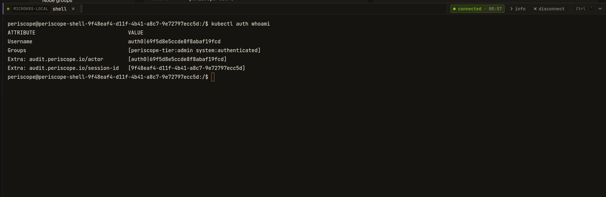

# Cluster shell

Periscope ships an in-browser cluster-wide kubectl REPL — the **Shell**
button in the cluster page header opens a WebSocket-attached terminal
backed by a per-session ephemeral pod that runs on the target cluster.
Every action the operator takes inside the shell impersonates the
human's identity and lands as their tier in apiserver RBAC.

This page is the operator guide: when it's available, how to enable
it, the RBAC scaffolding the chart installs, how the per-session pod
is constructed, the audit shape, and what to do when things misbehave.
The design lands the GitHub epic at
[issue #104](https://github.com/gnana997/periscope/issues/104).

---

## What you see


Click **shell** on any cluster page. Periscope provisions an ephemeral
pod in `periscope-system` on the target cluster, mounts a per-session
Secret carrying a kubeconfig wired with your impersonation identity,
and attaches the same drawer the pod-exec terminal uses. The tab is
labeled `shell` (vs `<pod>/<container>` for pod-exec); the info
expander shows `kind: cluster shell`, `mode: bash`, and
`(cluster-scoped)` instead of namespace/pod/container.

The shell streams stdin / stdout / stderr through the same
hello/stdin/stdout/closed/error WebSocket frame protocol that pod-exec
uses, so reconnect / idle / heartbeat / cap behavior all match.



---

## 1. Default behavior

Cluster shell is **opt-in** and **off by default** — opposite stance
from pod-exec. The feature requires `auth.authorization.mode=tier`
(it doesn't make sense without tier-narrow impersonation), and chart
install fails fast with a clear recipe message if you enable
cluster-shell while leaving authz in raw or shared mode.

### Backend support matrix

| Backend | Cluster shell works? | Notes |
|---|---|---|
| `eks` (Pod Identity / IRSA) | Yes | Direct apiserver dial; pod created on the EKS cluster itself |
| `kubeconfig` | Yes | Same as eks |
| `in-cluster` | Yes | Pod lands in Periscope's own cluster, on the `periscope-system` namespace the chart provisioned |
| `agent` | Yes | Pod-create / Secret-create / exec stream route through the agent tunnel to the target cluster; transparent to the operator. See [Operator notes for agent-backed clusters](#operator-notes-for-agent-backed-clusters) below. |

### Operator notes for agent-backed clusters

On the agent-managed cluster, the **agent's** ServiceAccount becomes
the apiserver caller for the pod-create / secret-create / sa-token
mint requests Periscope main issues through the tunnel. The
periscope-agent chart's `clusterShell.enabled=true` block installs:

- A namespace-scoped `Role` granting `pods` / `secrets` /
  `serviceaccounts/token` write verbs on `periscope-system`, bound to
  the agent SA via a `RoleBinding`.
- The same per-tier `ServiceAccount` + impersonator `ClusterRole`
  primitives the main chart installs (so the kubeconfig delivered
  into the shell pod looks the same regardless of which side
  provisioned the pod).

Server-side `clusterShell.tiers` and agent-side `clusterShell.tiers`
**must match**. A tier listed on the server but missing on the agent
would 403 when a session tries to mint its SA token.

### CA discovery for kubeconfig generation

The kubeconfig the shell pod uses needs the target apiserver's CA
bundle. Periscope main reads this differently per backend:

| Backend | Source |
|---|---|
| `in-cluster` | `/var/run/secrets/kubernetes.io/serviceaccount/ca.crt` on the Periscope main pod |
| `eks` / `kubeconfig` | The cluster's existing kubeconfig entry |
| `agent` | `kube-public/cluster-info` ConfigMap on the target cluster, fetched through the tunnel and cached per cluster |

The agent-backend path mirrors the kubeadm-style discovery contract:
the `cluster-info` ConfigMap is readable unauthenticated and carries
the apiserver CA. No additional config is required on the agent
chart for CA delivery.

### Per-cluster opt-out

Cluster shell is currently a **server-wide toggle** — when
`clusterShell.enabled=true` on the central server, it's available on
every registered cluster whose target chart also has
`clusterShell.enabled=true`. A future release will expose a per-cluster
override in `clusters[i].clusterShell`; until then, omit the agent
chart's `clusterShell.enabled=true` on any managed cluster you want
to keep out of scope.

When `clusterShell.enabled: false` on the server:

- The SPA hides the **shell** action everywhere (the per-cluster meta
  field `clusterShellEnabled` returns `false`).
- A direct WebSocket request to `/api/clusters/{c}/shell` returns
  HTTP 403 with body `{"error": "E_CLUSTER_SHELL_DISABLED"}`.

### Required RBAC

Two layers:

1. **The operator** must belong to a tier listed in
   `clusterShell.tiers`. The handler rejects non-listed tiers with
   `E_FORBIDDEN`. Default `tiers: [admin]`.
2. **Periscope main's SA** (or the agent SA on tunnel-managed
   clusters) needs pod / secret / serviceaccounts-token write verbs
   on `clusterShell.namespace`. Both chart's `clusterShell` blocks
   install this `Role` + `RoleBinding` automatically when
   `clusterShell.enabled=true`.

The per-tier impersonator `ClusterRole`s are **tier-narrow** — the
group impersonation rule uses `resourceNames:
["periscope-tier:<tier>"]` so a stolen SA token cannot impersonate
across tiers. See [Security posture](#7-security-posture) below for
the threat model.

---

## 2. Enable it on the central server

```yaml
# values.yaml for the periscope chart on the central server
auth:
  authorization:
    mode: tier             # REQUIRED — chart install fails if mode != tier
    groupTiers:
      platform-admins: admin

clusterRBAC:
  adminTier:
    enabled: true          # The admin tier ClusterRoleBinding to cluster-admin

clusterShell:
  enabled: true
  mode: bash               # bash (default). kubectl-only ships in a follow-up release.
  tiers: [admin]           # Only these tiers may open a session
  namespace: periscope-system
  idleSeconds: 1200        # 20 min — longer than pod-exec's 10 min default
  podStartTimeoutSeconds: 30
  transcriptMaxBytes: 1048576
  maxSessionsPerUser: 2
  maxSessionsTotal: 10
  image:
    repository: ghcr.io/gnana997/periscope-shell
    tag: ""                # defaults to Chart.AppVersion
    pullPolicy: IfNotPresent
```

Each value renders to a `PERISCOPE_CLUSTER_SHELL_*` environment
variable on the Periscope pod. Cross-reference:

| Helm value | Env var | Code default |
|---|---|---|
| `clusterShell.enabled` | `PERISCOPE_CLUSTER_SHELL_ENABLED` | `false` |
| `clusterShell.mode` | `PERISCOPE_CLUSTER_SHELL_MODE` | `bash` |
| `clusterShell.tiers` | `PERISCOPE_CLUSTER_SHELL_TIERS` | `admin` |
| `clusterShell.namespace` | `PERISCOPE_CLUSTER_SHELL_NAMESPACE` | `periscope-system` |
| `clusterShell.idleSeconds` | `PERISCOPE_CLUSTER_SHELL_IDLE_SECONDS` | `1200` (20 min) |
| `clusterShell.podStartTimeoutSeconds` | `PERISCOPE_CLUSTER_SHELL_POD_START_TIMEOUT_SECONDS` | `30` |
| `clusterShell.transcriptMaxBytes` | `PERISCOPE_CLUSTER_SHELL_TRANSCRIPT_MAX_BYTES` | `1048576` (1 MiB) |
| `clusterShell.maxSessionsPerUser` | `PERISCOPE_CLUSTER_SHELL_MAX_SESSIONS_PER_USER` | `2` |
| `clusterShell.maxSessionsTotal` | `PERISCOPE_CLUSTER_SHELL_MAX_SESSIONS_TOTAL` | `10` |
| `clusterShell.image.repository` + `tag` | `PERISCOPE_CLUSTER_SHELL_IMAGE` | `ghcr.io/gnana997/periscope-shell:<AppVersion>` |
| `clusterShell.image.pullPolicy` | `PERISCOPE_CLUSTER_SHELL_IMAGE_PULL_POLICY` | `IfNotPresent` |

---

## 3. Enable it on each managed cluster

For every agent-backed cluster that should accept cluster-shell
sessions, set the matching values in the periscope-agent chart:

```yaml
# values.yaml for the periscope-agent chart on each managed cluster
clusterShell:
  enabled: true
  namespace: periscope-system  # MUST match the server's clusterShell.namespace
  tiers: [admin]               # MUST match the server's clusterShell.tiers
```

For **in-cluster** backend (Periscope main targeting the cluster it
runs in), no separate agent chart install is needed — the main chart
already provisions everything because `clusterShell.enabled=true`
triggers the namespace + per-tier RBAC + provisioner Role rendering
in the main chart too.

For **eks / kubeconfig** backends, you must install the RBAC manifests
on the target cluster manually. The shipped templates in
`deploy/helm/periscope-agent/templates/cluster-shell-*` are a
reference; apply equivalent manifests via your existing GitOps flow.

---

## 4. The per-session pod

Each session creates one ephemeral pod in `clusterShell.namespace`
(default `periscope-system`) with these properties:

- **Image:** `clusterShell.image.repository:tag` —
  `debian:bookworm-slim` runtime carrying `bash`, `kubectl`, `helm`,
  `nano`, `jq`, `coreutils`, `curl`, and `ca-certificates`. The
  binaries are SHA-pinned in the Dockerfile.
- **ServiceAccount:** `periscope-shell-<tier>` (e.g.
  `periscope-shell-admin`) — owns ONLY the per-tier impersonate
  rules. Token-stealing nets nothing beyond what the operator could
  already do.
- **Mounted Secret:** `periscope-shell-<session-id>` carries a
  kubeconfig whose `users[0]` entry has the SA bearer token AND the
  `as: <operator-sub>`, `as-groups: [periscope-tier:<tier>]`, and
  `as-user-extra: { audit.periscope.io/session-id: [<uuid>],
  audit.periscope.io/actor: [<sub>] }` impersonation fields baked in.
- **Entrypoint:** `cmd/periscope-shell/main.go` reads
  `PERISCOPE_SHELL_SESSION_ID` / `PERISCOPE_SHELL_MODE` /
  `PERISCOPE_SHELL_AUDIT_FILE`, then `syscall.Exec`s into
  `/bin/bash --login` with `KUBECONFIG=/etc/periscope/kubeconfig`.
- **Audit wrapper:** `/usr/local/bin/kubectl` AND `/usr/local/bin/helm`
  are both symlinks to `periscope-audit-exec`, a tiny Go wrapper that
  keys off its own `argv[0]` to figure out which real binary to invoke
  (`kubectl-real` / `helm-real` under `/opt/periscope/bin/`). For every
  call it appends a `{ts, pid, argv}` JSON line to the in-pod audit
  file before `syscall.Exec`-ing the real binary. Best-effort — audit
  write failure does NOT block the command. Adding a new wrapped tool
  is a one-line allow-list entry in the wrapper plus a matching
  symlink in `Dockerfile.shell`.
- **`KUBE_EDITOR=nano` pinned in the image** so `kubectl edit` (and
  other editor-using subcommands) work without operators having to
  set the variable themselves. The image only ships `nano`; vi/vim
  are not installed.

The pod is deleted on session close (clean `exit` / Ctrl-D / WS close
/ idle-timeout). Pod + Secret cleanup is idempotent and runs even on
error paths.

---

## 5. Concurrency caps

Two caps gate session creation; both return HTTP 429 with `{"error":
"E_CAP_USER"}` / `{"error": "E_CAP_CLUSTER"}` and an
`activeSessions` body field:

| Cap | Default | Helm value |
|---|---|---|
| Per OIDC subject, all clusters | 2 | `clusterShell.maxSessionsPerUser` |
| Per cluster, all subjects | 10 | `clusterShell.maxSessionsTotal` |

Caps are deliberately tighter than pod-exec's (5 / 50) — each
cluster-shell session burns a full pod + Secret on the target
cluster, vs pod-exec's zero-side-effect attach.

---

## 6. Lifecycle: idle, heartbeat, warn, close

The handler reuses `internal/exec.Run` for WebSocket lifecycle
plumbing — so heartbeat (20s default) and idle-warn (30s lead)
behavior is **identical to pod-exec**. The only difference is the
idle-cut timeout itself:

| Knob | pod-exec default | cluster-shell default |
|---|---|---|
| Idle before cut | 10 min (`exec.serverIdleSeconds`) | 20 min (`clusterShell.idleSeconds`) |
| Idle-warn lead | 30s | 30s |
| Heartbeat | 20s | 20s |

Activity = any stdin or stdout byte. The longer cluster-shell
default reflects the typical session — `kubectl get` / `helm list`
loops, reading describe output — vs the tighter pod-exec pattern.

---

## 7. Audit

Three verbs land in the audit pipeline; the cross-reference key
that joins the SPA-side audit row to the apiserver's own audit log is
`audit.periscope.io/session-id`:

| Verb | When emitted | Body fields |
|---|---|---|
| `cluster_shell_open` | After cap checks pass, before WS upgrade | `cluster`, `mode`, `tier`, `session_id` |
| `cluster_shell_command` | (reserved — currently bulk-on-close in body of close) | — |
| `cluster_shell_close` | After session ends, regardless of cause | `cluster`, `mode`, `duration_ms`, `exit_code`, `bytes_in`, `bytes_out`, `close_reason`, `commands: [{timestamp, argv, pid}]` |

The `commands` slice on `cluster_shell_close` is read from the
in-pod audit file (`PERISCOPE_SHELL_AUDIT_FILE`) via a final exec
stream during teardown. It captures every `kubectl` and `helm`
invocation made through the session (both wrapped by the
`periscope-audit-exec` binary). Other commands (`cat`, `jq`,
`grep`, bash builtins) don't write per-invocation rows here — they
still contribute to the `bytes_in` / `bytes_out` counters, and any
K8s API calls they trigger show up in the apiserver audit log
keyed by the session UUID.

Best-effort: a pod that died before the readback completes loses
its command log, but the open / close envelopes are durable.

---

## 8. Security posture

Three properties limit blast radius:

1. **Tier-narrow impersonator ClusterRoles.** The per-tier
   `periscope-shell-impersonator-<tier>` rule uses
   `resourceNames: ["periscope-tier:<tier>"]` on the `groups`
   impersonate rule. An admin-tier SA token cannot escalate to a
   different tier's group; users impersonation stays wildcard (the
   user identity is the operator's OIDC sub anyway).
2. **Audit-extras impersonation.** Every kubectl call from the shell
   carries `audit.periscope.io/session-id` + `actor` as user-extras.
   The apiserver audit log records these, and Periscope's own
   `cluster_shell_close` envelope carries the same session id —
   joining the two logs is one `grep` of the UUID.
3. **No shared kubeconfig.** The Secret is per-session and deleted on
   close. There is no persistent SA token left on the cluster after
   teardown; the per-tier SA carries only the impersonate rules and
   no cluster read.

The full RBAC posture writeup is in
[`docs/security/rbac-posture.md`](../security/rbac-posture.md#cluster-shell-104).

---

## 9. Troubleshooting

> Cross-cutting issues (chart-versions OOM, scanner false-positives, local-dev TLS, image-pull behind a corporate proxy) live in [troubleshooting.md](troubleshooting.md).

| Symptom | Likely cause | Fix |
|---|---|---|
| **Shell button missing on the cluster header** | Backend says `clusterShellEnabled=false` on this cluster | Check `/api/clusters` response; confirm `clusterShell.enabled=true` on the server helm release |
| **403 `E_FORBIDDEN` on click** | Operator's tier not in `clusterShell.tiers` | Either add the operator to a listed tier or add their tier to the list |
| **429 `E_CAP_USER` / `E_CAP_CLUSTER`** | Cap reached | Close an old session, or bump `maxSessionsPerUser` / `maxSessionsTotal` |
| **Pod stays `Pending` for >30s** | Image not pulled / scheduling issue | `kubectl -n periscope-system describe pod periscope-shell-*` for events. Common: image pull from `ghcr.io/gnana997/periscope-shell` rejected by an air-gapped cluster — mirror to your registry and set `clusterShell.image.repository` accordingly |
| **Pod runs but `kubectl auth whoami` shows nothing** | Operator's group claim missing | Verify `auth.authorization.groupsClaim` matches your IdP, then re-log-in for the new claim |
| **`kubectl get` returns 403** | Tier's ClusterRoleBinding not installed on target cluster | Set `clusterRBAC.enabled=true` (and `adminTier.enabled=true` if your tier maps to admin) on the periscope-agent chart |
| **Agent-backed cluster: `Forbidden` on pod-create** | Provisioner Role/RoleBinding missing on managed cluster | Set `clusterShell.enabled=true` on the periscope-agent chart so the chart installs the namespace-scoped Role binding the agent SA |
| **Session disconnects after ~20 min of typing pause** | Hit `idleSeconds` cut | Expected — re-open the shell, or bump `clusterShell.idleSeconds` for long-running incidents |

For deeper agent-tunnel diagnostics — request IDs, pod-create
failures observed on the agent side — see
[`docs/architecture/agent-tunnel.md`](../architecture/agent-tunnel.md).
