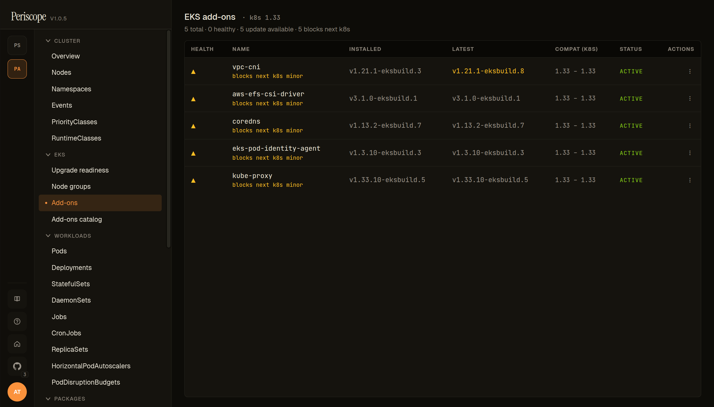
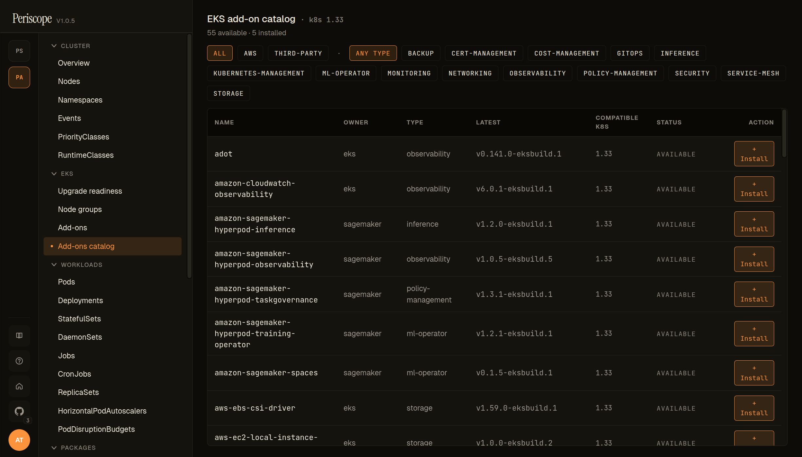

# EKS managed add-ons

Periscope ships a read + write surface for **EKS managed add-ons** —
list installed add-ons with version drift, browse the AWS-published
catalog, and install / upgrade / delete add-ons from the SPA. Pairs
with [`eks-upgrade-readiness.md`](./eks-upgrade-readiness.md): the
Insights page tells you *which* add-ons block your next K8s minor;
the Add-ons page is *where you act on it*.

The surface is EKS-only — see the same backend-independence rule as
upgrade readiness ([same caveats](./eks-upgrade-readiness.md#what-you-see)):
on any registered cluster with `arn` + `region` set, regardless of
the K8s auth backend.

---

## What you see

### Installed add-ons (with drift)



Each row carries a **HEALTH** glyph (yellow triangle when AWS-published `health.issues[]` are non-empty, OR when the addon blocks the next K8s minor), the **NAME** with an optional `blocks next k8s minor` sub-label, the **INSTALLED** version, the **LATEST** AWS-published version compatible with the cluster's K8s, the **COMPAT (k8s)** range AWS supports for the installed version, the **STATUS** (`ACTIVE`, `CREATING`, `UPDATING`, `DEGRADED`, `DELETING`), and a per-row **ACTIONS** menu (upgrade / delete). When the INSTALLED version differs from LATEST, both cells render in the warning palette so drift is visible at scroll glance.

Click an addon row to open the detail pane: full version history, configuration values, IAM service-account role ARN, and the **Upgrade** / **Delete** actions.

### Catalog browser



The **+ Install add-on** action opens the catalog browser. It lists
every add-on AWS publishes for the cluster's K8s version — both
**AWS-built** (`vpc-cni`, `coredns`, `kube-proxy`, `eks-pod-identity-agent`,
`aws-ebs-csi-driver`, `aws-efs-csi-driver`) and **partner add-ons**
(`adot`, `external-dns`, etc). Each entry shows the **publisher**
(amazon / kubernetes / partner name), **type** (`networking`, `storage`,
`observability`, `security`), and the **default version** AWS would
install.

Pick an addon, choose a version (defaults to the latest compatible),
optionally provide a Service-Account-bound IAM role for addons that
need AWS credentials (e.g. EBS CSI), and **install**. Periscope
fires `eks:CreateAddon` and shows the new row in the installed list
with `status=CREATING`; the row updates live as AWS provisions.

---

## IAM permissions

Read-only and write actions split into two policy statements so a
read-only deployment can scope down by removing the second:

```json
{
  "Version": "2012-10-17",
  "Statement": [
    {
      "Sid": "EKSAddonsRead",
      "Effect": "Allow",
      "Action": [
        "eks:ListAddons",
        "eks:DescribeAddon",
        "eks:DescribeAddonVersions",
        "eks:DescribeAddonConfiguration"
      ],
      "Resource": "*"
    },
    {
      "Sid": "EKSAddonsWrite",
      "Effect": "Allow",
      "Action": [
        "eks:CreateAddon",
        "eks:UpdateAddon",
        "eks:DeleteAddon"
      ],
      "Resource": [
        "arn:aws:eks:*:*:addon/*/*/*",
        "arn:aws:eks:*:*:cluster/*"
      ]
    }
  ]
}
```

`EKSAddonsRead` covers the list, detail, and catalog views. Drop
`EKSAddonsWrite` if you want a read-only deployment — the
**Upgrade** / **Delete** / **+ Install add-on** buttons render
disabled with a hover hint.

If an add-on uses a service-account role (Pod Identity or IRSA), the
operator-supplied role ARN is passed verbatim to `eks:CreateAddon`;
Periscope's own role does **not** need `iam:PassRole` because
`CreateAddon` is the trust-policy holder, not Periscope.

---

## Async operations

`CreateAddon` and `UpdateAddon` return 202 immediately and AWS
processes asynchronously. The SPA polls the affected row every 4
seconds while `status=CREATING|UPDATING|DELETING`, switching back to
the standard 30-second cadence once the row settles to `ACTIVE` or
a terminal state. No spinning in your tab while AWS rolls a
DaemonSet across nodes — Periscope's status-aware refetch keeps the
view live without you reloading.

---

## Audit trail

Every read and write emits an audit row:

| Verb | Triggered by |
|---|---|
| `eks_addons_read` | List + detail page loads |
| `eks_addon_install` | `+ Install add-on` action |
| `eks_addon_upgrade` | Per-row `Upgrade` action |
| `eks_addon_delete` | Per-row `Delete` action |

The mutation rows include the addon name, target version, IAM role
ARN (when supplied), and the AWS update ID returned by
`CreateAddon` / `UpdateAddon` for cross-referencing in CloudTrail.

---

## Related docs

- [`eks-upgrade-readiness.md`](./eks-upgrade-readiness.md) — companion
  surface; insights + node-group AMI drift.
- [`audit.md`](./audit.md) — audit log shape and retention.
- [`cluster-rbac.md`](./cluster-rbac.md) — tier-mode mapping that
  controls which operators can use the write actions.
