# Helm release browser

Periscope ships a **read-only Helm release browser** as part of the
core binary. It surfaces the helm releases installed on each managed
cluster — list, detail (manifest + values), revision history, and
diff between any two revisions — under the SPA's "Helm" sidebar
group and the API path `/api/clusters/{cluster}/helm/...`.

There is no chart configuration to enable it; the routes are always
registered. Visibility is governed entirely by the impersonated
user's RBAC on the storage objects Helm uses (Secrets by default,
ConfigMaps as a fallback).

This page covers the operational surface: what's there, what RBAC
is required, the limits that bound the responses, and how cache
behavior affects what you see in the UI.

---

## What you see

### Releases list

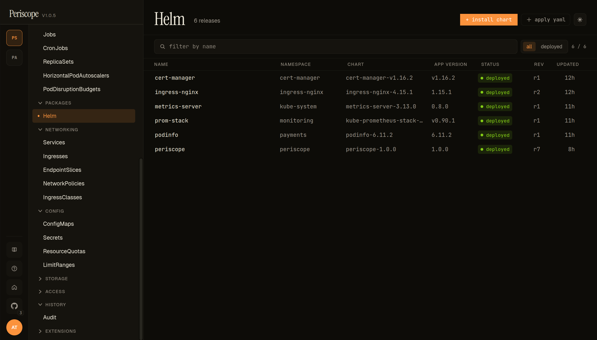

The list page shows every release on the cluster — **name**, **namespace**, **chart and chart version**, **app version**, **status pill** (`deployed`, `superseded`, `failed`), and **current revision number**. Clicking a row opens the detail pane.

### Install dialog

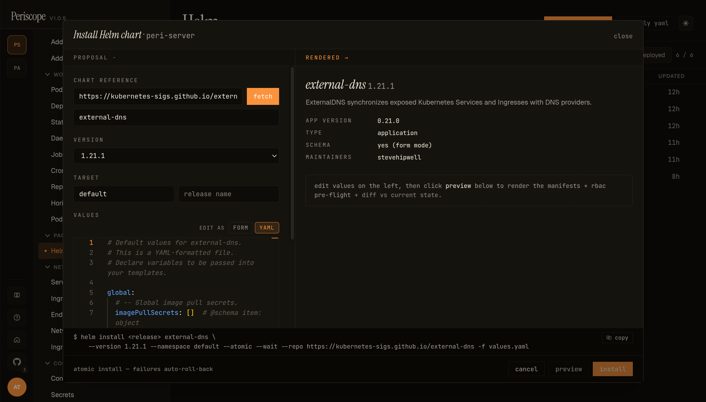

The **+ Install chart** action opens a side-pane installer. Left column carries the **chart reference** (helm repo URL or OCI ref), **version** dropdown, **target namespace + release name**, and a **values editor** that toggles between **YAML** and **FORM** modes (form mode renders when the chart ships a `values.schema.json`). Right column carries the **rendered preview** — chart metadata (app version, type, schema availability, maintainers) at the top, and once you click **preview** the rendered manifest + RBAC pre-flight + diff vs current state below. Footer: the equivalent `helm install ...` command Periscope would run, copyable for ops who prefer to run it themselves; **atomic install** is on by default so failures auto-roll-back.

### Upgrade dialog

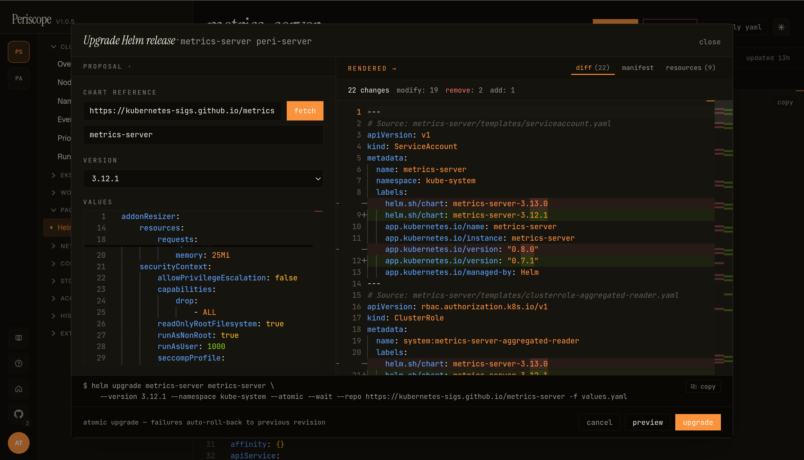

Click **upgrade** on a release to open the upgrade variant of the same dialog. Pre-filled with the release's current chart ref + values from the Periscope-written annotation, so the operator only changes the **version dropdown** + edits the values they need. The right pane carries the chart-action tabs:

- **diff** — side-by-side YAML diff between the current rendered manifests and what the upgrade would produce. Header counts changes by kind (`modify: 19 · remove: 2 · add: 1` in the screencap above).
- **manifest** — the proposed full rendered output (read-only Monaco viewer).
- **resources** — flat list of every K8s object the upgrade touches, grouped by kind:

  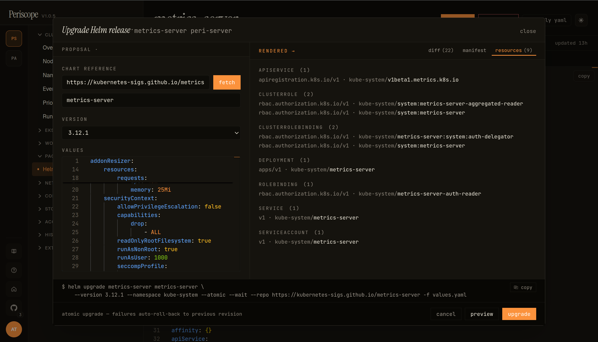

  Counts per kind on the section headers (`CLUSTERROLE (2)`, `CLUSTERROLEBINDING (2)`, …); each row is `apiVersion · namespace/name`. Useful for spotting an upgrade that adds an unexpected resource (a new CRD, a new ClusterRole) before clicking **upgrade**.

Bottom strip carries the **command preview** — the literal `helm upgrade …` that Periscope would run, copyable for operators who prefer to run it themselves. **atomic upgrade** is on by default, called out under the strip: `atomic upgrade — failures auto-roll-back to previous revision`.

While the upgrade is in flight the action button reads `upgrading…` (disabled) and the dialog stays open so the operator sees the result without losing context:

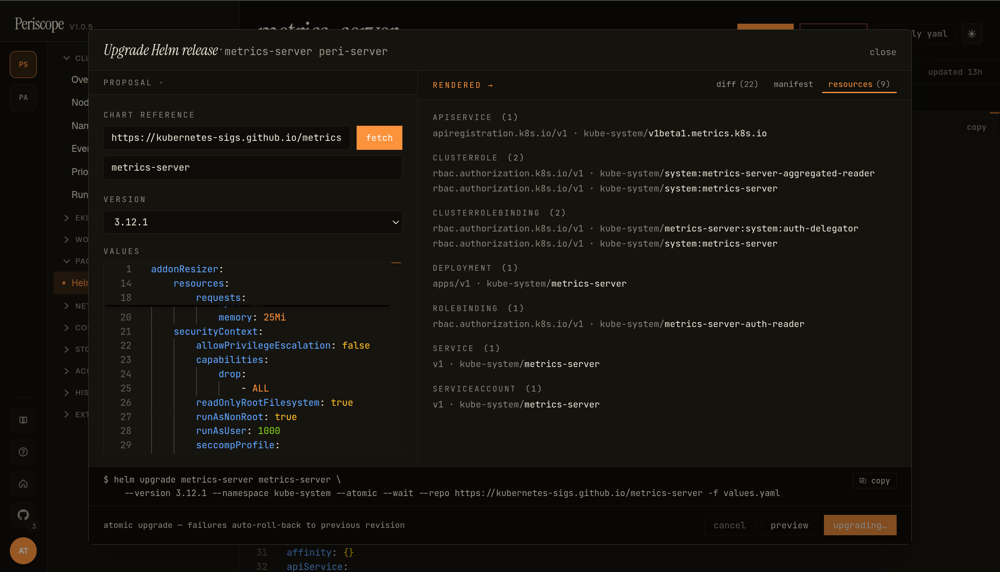

### Rollback

The release detail's **history** tab carries a per-revision `rollback` action, plus a `compare selected` affordance to diff any two revisions before deciding which one to roll back to:

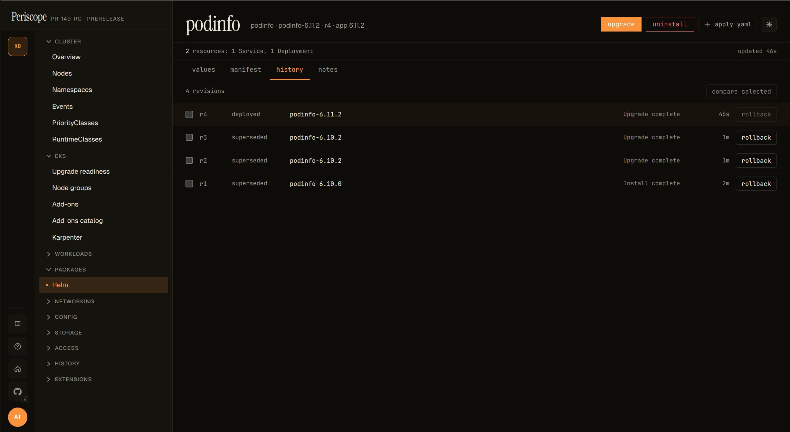

Clicking **rollback** opens a focused dialog scoped to the chosen revision pair. The body shows the side-by-side YAML diff that Helm would apply (current → target), so the operator sees exactly which fields change before committing. **Advanced** flags are exposed at the bottom: **wait** (default on — block until rolled-back resources are ready), **cleanup on fail** (default on — remove partially-applied resources if the rollback errors mid-flight), and **disable hooks** (off — skip pre-/post-rollback hooks, only useful when a hook itself is the thing that's stuck):

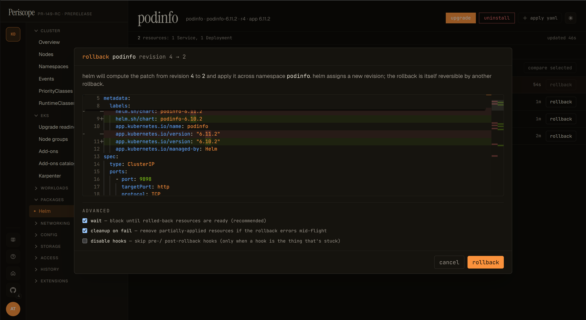

While the rollback is in flight the action button reads `rolling back…` (disabled), matching the upgrade dialog's mid-flight UX:

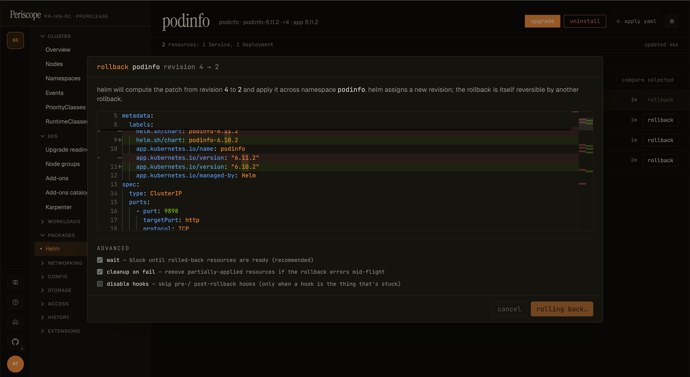

After the rollback succeeds, the history tab shows a fresh revision row with the description **`Rollback to N`** — Helm assigns the new highest revision number to the rollback itself, so the rollback is itself reversible by another rollback:

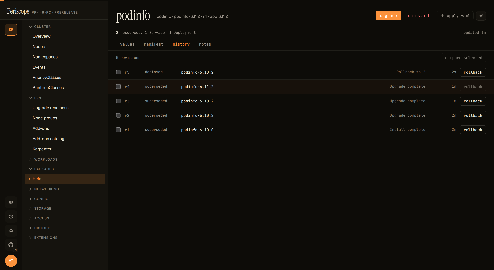

The action emits a `helm_rollback` audit row (one per release) with the `from_revision` / `to_revision` extras. Like all helm mutations the rollback runs under the requesting user's impersonated identity — a user without the verbs Helm needs (`patch`/`delete`/`create` on the rendered resource kinds) gets a clean apiserver 403 surfaced in the dialog before the rollback starts.

### Release detail — values

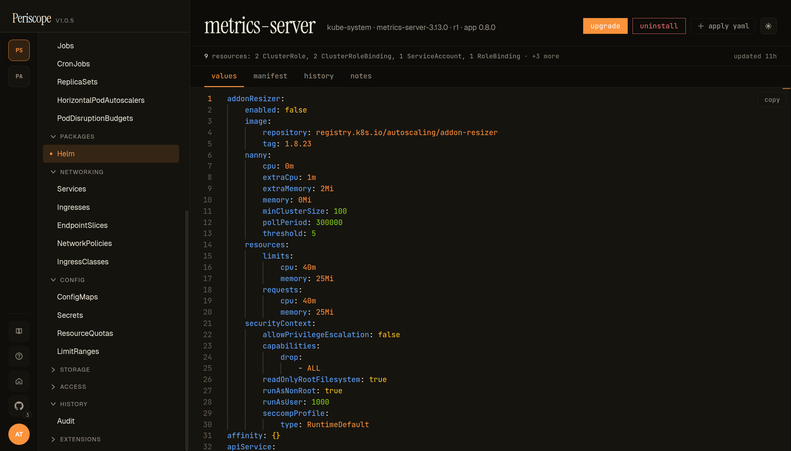

Each release detail has four tabs: **values** (the values yaml the release was installed with — pictured), **manifest** (every K8s object Helm produced from the chart + values), **history** (per-revision metadata with diff-between-any-two-revisions), and **notes** (the chart's NOTES.txt rendered output). The header strip carries `upgrade` and `uninstall` actions, plus a resource summary like `9 resources · 2 ClusterRole · 1 ClusterRoleBinding · …` so an operator sees the chart's footprint at a glance.

### Comparing revisions

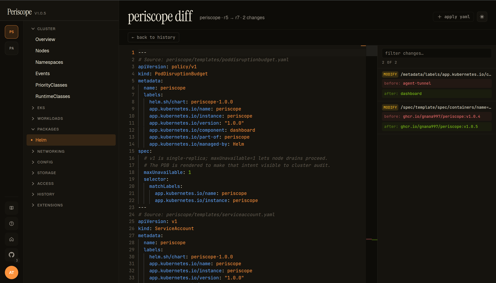

Clicking **diff** between any two revisions on the **history** tab opens the standalone diff page (`/helm/releases/{ns}/{name}/diff?from=N&to=M`). The page is a full-width viewer designed for revision archaeology — what changed, when, and why.

- **Header** — `periscope diff · {release} · r{from} → r{to} · N changes`. Direction is always old → new; flip the URL params to invert.
- **Left pane** — the full rendered manifest at the `to` revision, with each doc preceded by a `# Source: chart/templates/...yaml` comment so you can find which template a change came from.
- **Right pane (Filter changes)** — every change as a row: `MODIFY` / `ADD` / `REMOVE` chip, JSON Pointer path (`/metadata/labels/app.kubernetes.io/component`), and **before** / **after** values. Filterable by substring; useful when a release has dozens of edits but you're hunting one of them.
- **Per-row click** — scrolls the left pane to the matching line and highlights the change inline.

The same `/diff` API the upgrade dialog's **diff** tab uses, but rendered as a full-page navigation target so an operator can deep-link to "what changed between r5 and r7" in an incident-review or PR comment.


### Forbidden state

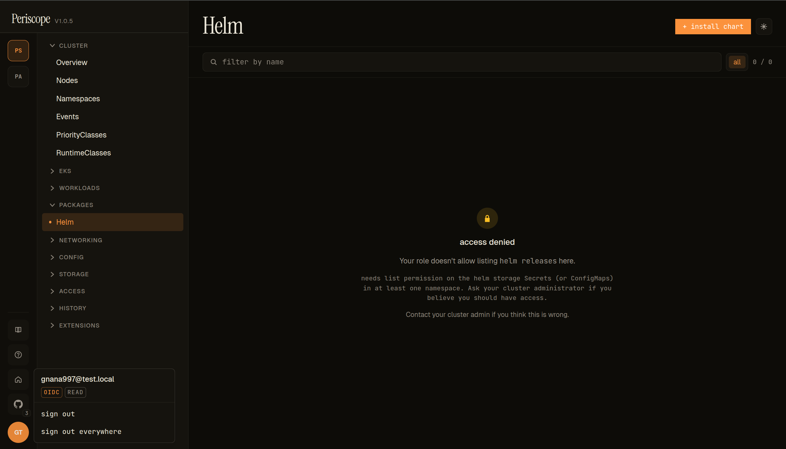

When the impersonated user's K8s identity lacks `list` on the Helm storage kind for the cluster (Secrets by default), the Helm page renders as a centered access-denied state instead of the list:

- **Lock icon** + **`access denied`** title.
- **Kind-specific copy** — `Your role doesn't allow listing helm releases here. needs list permission on the helm storage Secrets (or ConfigMaps) in at least one namespace.` Operator-actionable: names the verb + the kind + the namespace scope.
- **`Contact your cluster admin if you think this is wrong.`** — falls back to the standard forbidden-state copy.
- The avatar popover (cluster rail, lower-left) confirms the tier — the screencap shows `OIDC` + `READ` badges, so the user is on the `read` tier and the `view` ClusterRole's deliberate Secret-read exclusion is what's blocking them.

To unblock read-tier users for Secret-driver releases, see [`cluster-rbac.md` → Helm release browser RBAC](./cluster-rbac.md#helm-release-browser-rbac).

---

## 1. Endpoints

| Method | Path | Purpose |
|---|---|---|
| `GET` | `/api/clusters/{cluster}/helm/releases` | List releases on the cluster (current revision per release). |
| `GET` | `/api/clusters/{cluster}/helm/releases/{namespace}/{name}` | Release detail: values, rendered manifest, parsed resources, metadata. |
| `GET` | `/api/clusters/{cluster}/helm/releases/{namespace}/{name}/history` | Revision history (newest first). |
| `GET` | `/api/clusters/{cluster}/helm/releases/{namespace}/{name}/diff?from=N&to=M` | Structured diff (values + manifest) between revisions N and M. |

All endpoints run under the requesting user's impersonated identity.
A user who can't read the underlying storage objects gets a clean
403 from the apiserver, which Periscope forwards.

---

## 2. Storage driver auto-probe

Helm 3 stores releases in **Secrets** (the default driver) or
**ConfigMaps**. Periscope auto-detects which driver the cluster uses:

1. Try listing `Secrets` cluster-wide with the helm `owner=helm`
   label. If any are returned, lock to the **secret** driver.
2. Otherwise, try the same against `ConfigMaps`. If any are returned,
   lock to the **configmap** driver.
3. Otherwise, default to the **secret** driver — downstream LIST
   calls will surface the real distinction (403 vs empty) cleanly.

The probe result is cached per-cluster for 5 minutes. The `sql`
driver is **not supported** (it's rare in practice and would require
managing a connection pool to an external DB the operator
configured).

---

## 3. RBAC requirements

The impersonated user needs:

| Driver | Verbs needed |
|---|---|
| `secret` (default) | `get`, `list` on `secrets` in the release namespaces |
| `configmap` | `get`, `list` on `configmaps` in the release namespaces |

For the auto-probe to succeed cluster-wide (so the SPA's "Releases"
list is populated across namespaces), `list` on the storage kind
should be cluster-scoped. A namespace-scoped binding works for
single-namespace use but the cluster-wide list returns empty in that
case.

The shipped tier ClusterRoles cover this:

- `read` (`view`) — gets `secrets:get` and `configmaps:get`/`list`,
  enough for the configmap driver only. Helm releases stored as
  Secrets aren't readable from the `view` ClusterRole alone (Secret
  reads are intentionally privileged in the upstream `view` role).
- `triage`, `write`, `maintain`, `admin` — all cover both drivers.

If you want **read-tier users** to also see secret-driver releases,
add a ClusterRoleBinding that grants them `get`/`list` on Secrets in
the relevant namespaces — see the
[cluster-rbac.md helm browser appendix](./cluster-rbac.md#helm-release-browser-rbac)
for a copy-pasteable sample.

Mutations (install, upgrade, rollback, uninstall) additionally need
`patch` / `create` / `delete` on every kind the rendered chart
manifests touch. Periscope runs a SubjectAccessReview pre-flight
fan-out for the dialog's preview step and surfaces denials inline
before the action fires.

---

## 4. Response caps and truncation

Three constants bound the responses to keep payloads predictable
under impersonation:

| Cap | Value | Where |
|---|---|---|
| Release list | **200 releases** | `cmd/periscope/helm_handler.go: helmListCap` |
| Detail / diff payload | **5 MiB** | `cmd/periscope/helm_handler.go: helmDetailMaxBytes` |
| History default | **10 revisions** | `internal/k8s/helm.go` (override with `?limit=N`) |

When the list cap binds, the response carries `truncated: true` and
the SPA shows a "showing first 200 of N" banner. The 200-cap reflects
realistic helm fleet sizes (most clusters run < 50 releases); past
that, a search-by-name UX is the right answer rather than scrolling
a thousand-row list.

The 5 MiB detail cap is generous (a real-world chart's manifest +
values rarely exceeds 200 KiB) but exists to defend against
accidentally-huge releases (a chart inlining a binary blob in
`values.yaml`, for example).

---

## 5. Caching

The list endpoint caches per `(actor, cluster, impersonation
groups)` for **30 seconds**. Subsequent navigations across the SPA's
Helm tab feel instant; a release just-installed by `helm install`
appears within ~30s of the install completing.

Detail, history, and diff endpoints are **not cached** — each
request hits the apiserver. These pages are rarer-clicked and the
freshness signal matters more (an operator looking at "what
happened in revision 7" wants the live answer).

To force a list refresh, the SPA's Helm tab has a "refresh" button
that bypasses the cache.

---

## 6. What's read, what's not

The browser surfaces:

- Release name, namespace, revision, status, chart name + version,
  app version, last-updated timestamp.
- Rendered manifest (parsed into a structured resource list per
  revision).
- Computed values (`helm get values --all` equivalent — chart
  defaults merged with user overrides).
- Release notes (`NOTES.txt` output).
- Revision history with status transitions.
- Side-by-side diff between any two revisions: values diff +
  manifest diff.

Mutations supported (v1.1):

- **Install** — `helm install` with atomic-on-default + RBAC
  pre-flight against the rendered resources.
- **Upgrade** — `helm upgrade` with the same atomic + pre-flight
  guarantees, prefilled from the live release's values.
- **Rollback** — per-revision rollback with side-by-side diff and
  the standard wait / cleanup-on-fail / disable-hooks knobs.
- **Uninstall** — `helm uninstall` with confirmation.

Not supported:

- Chart catalog browsing.
- Repository management (helm repo add / update).
- The `sql` storage driver.

For longer-term deploy strategy, your existing GitOps (ArgoCD, Flux)
or pipeline tooling should remain the source of truth — the helm
mutations in Periscope are operator-grade, not pipeline replacements.

---

## 7. Verifying

After install:

```sh
# 1. Route is registered (will 401 if you're not authenticated):
kubectl -n periscope port-forward svc/periscope 8080:8080
curl -i http://localhost:8080/api/clusters/<cluster>/helm/releases

# 2. The SPA shows the "Helm" group in the sidebar (under any
#    cluster). Clicking it lists releases.

# 3. RBAC sanity:
kubectl --context <cluster> auth can-i list secrets \
  --as=auth0\|alice \
  --as-group=periscope-tier:write
# yes
```

If the list is empty but you know there are releases on the cluster,
check (a) the user's impersonated groups have `list` on the storage
kind cluster-wide, (b) the auto-probe locked onto the right driver
(check pod logs for `helm: driver auto-detected driver=...`).

---

## 8. Related docs

- [`docs/setup/cluster-rbac.md`](./cluster-rbac.md) — RBAC modes,
  tier verbs, helm browser sample binding.
- [`docs/setup/audit.md`](./audit.md) — read-side observability for
  privileged actions (helm browser reads aren't audited; only
  privileged mutations are).
- `internal/k8s/helm.go` — the storage decoder and auto-probe.
- `cmd/periscope/helm_handler.go` — list/detail/history/diff handlers.
- `cmd/periscope/helm_cache.go` — the per-actor list cache.
