# AWS Access — Cluster Access page, per-workload tab, Reverse Lookup

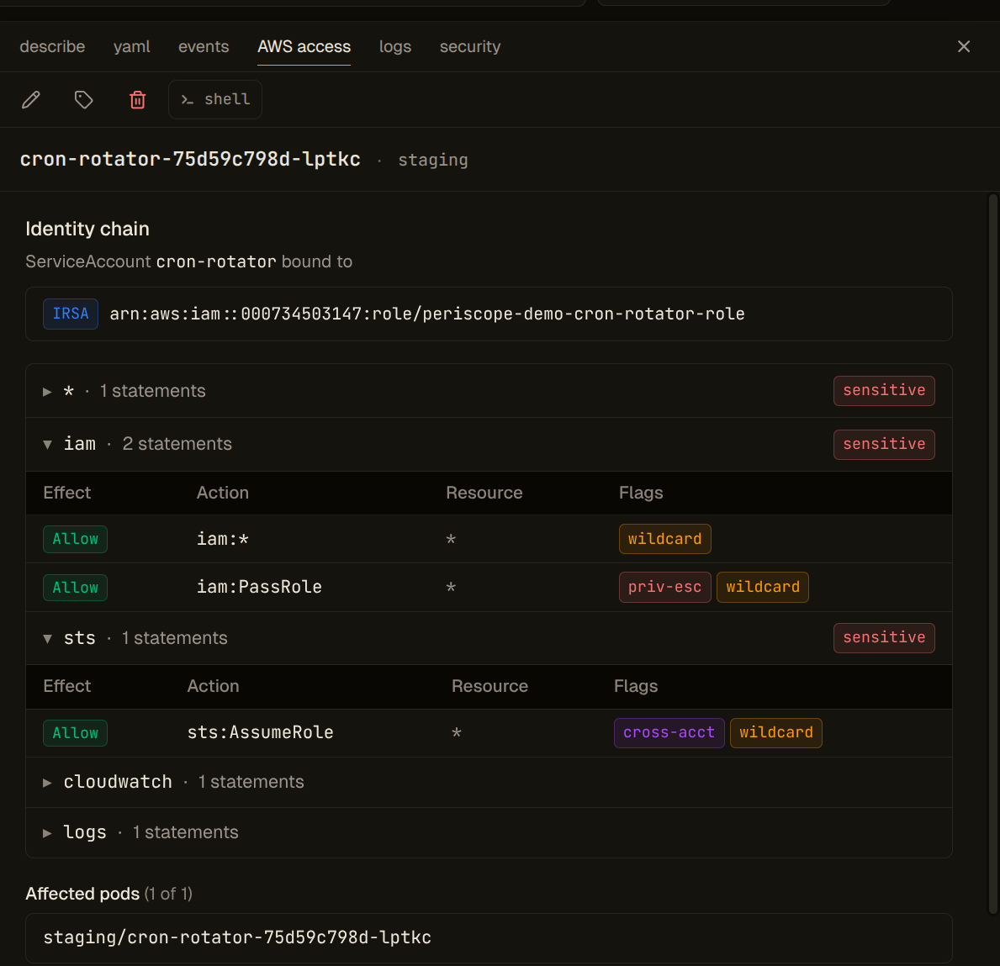

Periscope's v1.1 AWS Access surface answers three operational questions about
an EKS-backed cluster without ever leaving the dashboard:

1. **Who has cluster access?** — the **Cluster Access** page (sidebar →
   EKS → Cluster Access). Reconciles **EKS Access Entries** with the
   legacy `kube-system/aws-auth` ConfigMap and shows the unified
   SA → IAM-role index spanning **IRSA** annotations and **Pod Identity**
   associations.
2. **Forward view — what can this Pod / Deployment / ServiceAccount do
   in AWS?** — an **AWS access** tab on Pod, ServiceAccount,
   Deployment, StatefulSet, and DaemonSet detail panes.
3. **Reverse lookup — which Pods can perform action X on resource Y?** —
   the **AWS reverse lookup** page under the EKS section of the cluster
   nav.

All three sit on top of the EKS Identity layer (#178: Access Entries,
aws-auth, Pod Identity, IRSA) and the IAM policy resolution engine (#187:
inline + attached managed policy fetch + parsing + wildcard matching).

## Cluster Access page

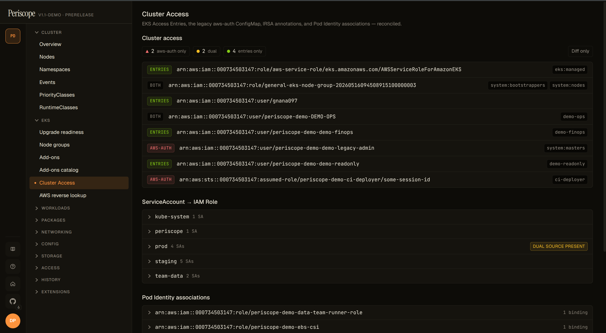

Open from the sidebar at **EKS → Cluster Access**. Three independently-
rendered sections share the page; each fetches its own data, so a 403 on
one (e.g. `iam:GetRole` missing) doesn't blank the rest.

### Migration health (Access Entries ↔ aws-auth diff)

At the top of the page a single compact chip summarises the
aws-auth → Access-Entries migration:

```
2 aws-auth-only · 2 dual · 4 entries-only
```

| Segment | Color | What it means |
|---|---|---|
| `N aws-auth-only` | red | Principals only in the legacy `aws-auth` ConfigMap. Migration not yet started for these. |
| `N dual` | yellow | Principal mapped in BOTH aws-auth AND Access Entries. Functional, but you can safely remove the aws-auth row once you've verified the Access Entry covers it. |
| `N entries-only` | green | Migrated to Access Entries. Healthy. |

Clicking a segment filters the AccessEntriesSection table; the
`Diff only` toggle hides the `Both` rows so operators mid-migration
focus on the delta:

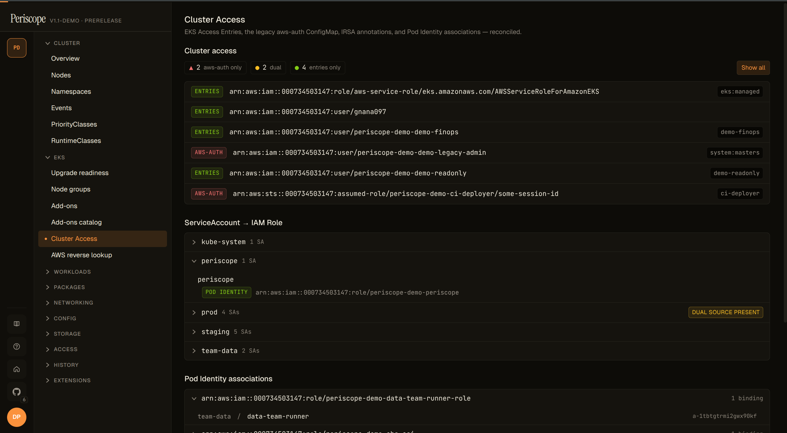

Principal ARNs are canonicalised before the diff runs — STS assumed-role
sessions collapse to their IAM-role form, casing is normalised — so a
case-mismatched aws-auth row and Access Entry resolve to the same
principal and render as `Both` instead of as two unrelated rows.

### SA → Role index (IRSA + Pod Identity)

Grouped by namespace, alphabetical. Each row is one ServiceAccount with
either an IRSA annotation (`eks.amazonaws.com/role-arn`), a Pod Identity
association, or both.

The most operationally-useful chip on this page: when the same SA has
BOTH an IRSA annotation AND a Pod Identity association at **different**
IAM roles, Periscope flags it with a `both — Pod Identity wins`
warning. Pod Identity wins at runtime — the IRSA annotation is
shadowed config that lies about what permissions the workload actually
has:

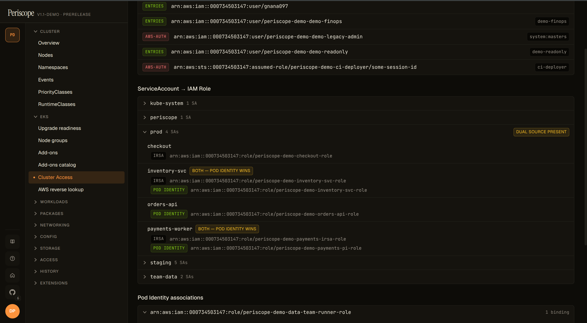

When an annotation or association points at an IAM role that's been
deleted, the row renders red with a `role not found` chip —
`iam:GetRole` returned `NoSuchEntity`. Typical cause: IaC drift where
the role was destroyed but the SA wiring wasn't cleaned up:

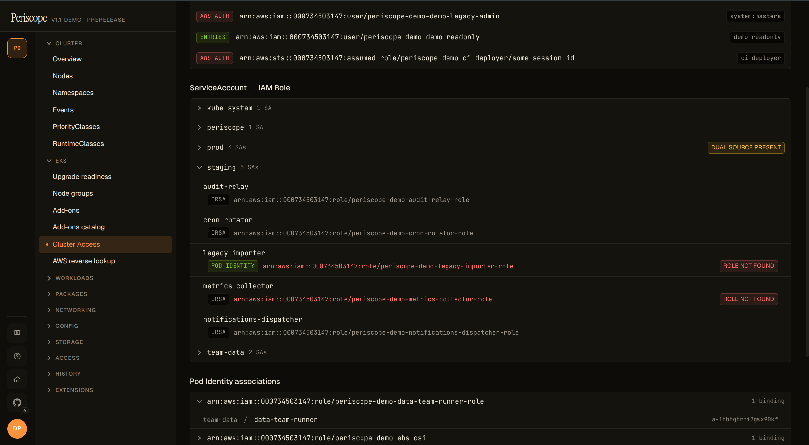

### Pod Identity view (role-centric)

The inverse of SA → Role: grouped by IAM role, child rows are the
`(namespace, ServiceAccount)` pairs bound to each role via Pod Identity.
Surfaces the **default-SA blind spot** — when a Pod Identity association
targets the `default` SA in a namespace, every workload that doesn't
explicitly set `serviceAccountName:` silently inherits the role:

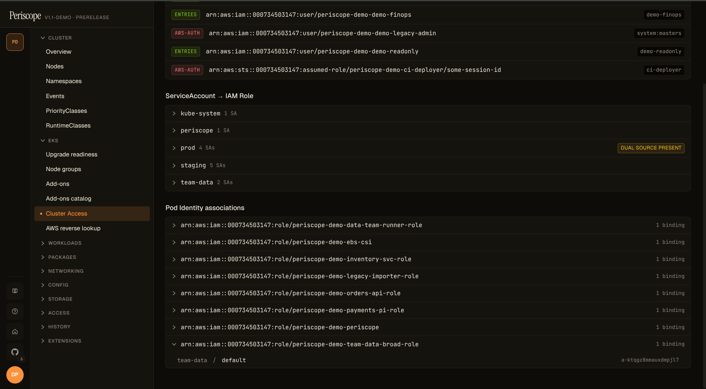

The audit verb for everything on this page is `aws_identity_read` (see
#178). The forward view and reverse lookup below use `aws_iam_read`.

## Forward view — AWS Access tab

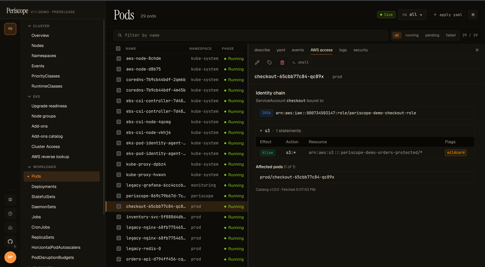

For any workload of one of the supported kinds, the tab body is a single
backend call that composes:

- **Identity chain** — the resolved ServiceAccount and every IAM role
  bound to it. Each binding shows its source (`IRSA`, `PodIdentity`, or
  `Both`); when both are present Periscope renders a
  **DUAL_SOURCE_IRSA_SHADOWED** warning because Pod Identity wins at
  runtime and the IRSA annotation is dead config.
- **Service-grouped permissions** — every Statement from every attached
  policy, expanded into one row per `(action, resource)` and bucketed by
  AWS service (`s3`, `iam`, `kms`, …). Sensitive groups (any row
  flagged) sort to the top.
- **Sensitive-permission chips** against the locked v1.1 catalog (see
  *Sensitive-perms catalog* below). 18 chips total — operators cannot
  extend or suppress in v1.1.
- **Complex statements** — NotAction / NotResource / NotPrincipal cases
  render as a "see in IAM console" link rather than being silently
  mis-evaluated. The link is partition-aware (`aws`, `aws-us-gov`,
  `aws-cn`).
- **Affected pods** — for Deployment / STS / DS / ServiceAccount kinds,
  up to 5 currently-running pods using the resolved SA, with a total
  count. For Pod kind, the pod itself.

Endpoint:

```
GET /api/clusters/{cluster}/identity/workload-permissions
    ?kind=Pod|ServiceAccount|Deployment|StatefulSet|DaemonSet
    &namespace=N
    &name=X
```

Returns a `WorkloadPermissionsResponse` (see
`internal/awseks/iam/types.go`). Every join, dedup, grouping, and
classification is computed server-side so an MCP tool can wrap the
endpoint as one tool call.

### Examples

**Dual-source identity chain.** When the SA has both an IRSA annotation
AND a Pod Identity association — at different roles — the chain header
makes the runtime winner explicit and surfaces the shadowed binding so
operators can clean it up:

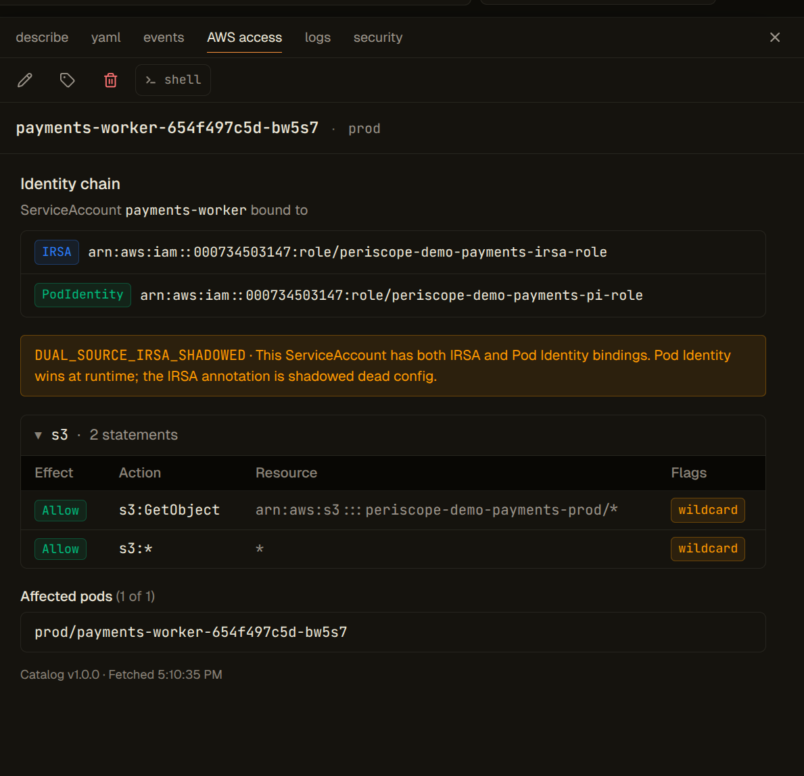

**Sensitive-permission chip close-up.** Every action in the locked v1.1
catalog renders with a red chip wherever it appears. `s3:DeleteObject*`
hits the catalog's `data` category:

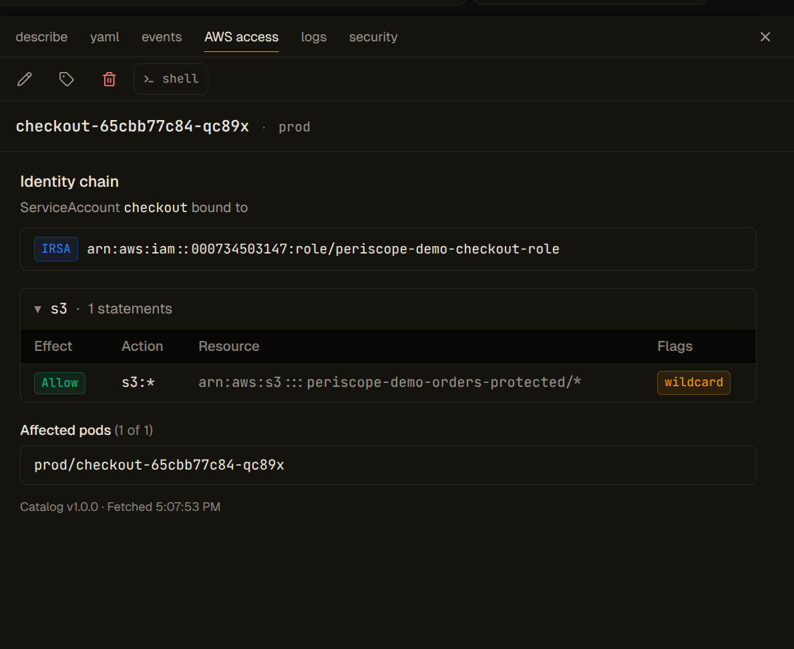

**Statement with a Condition block.** v1.1 doesn't evaluate `Condition`
clauses; it surfaces presence as a neutral chip so operators don't
mistake the action for unconditionally granted. (Conditions evaluation
lands in v1.2.)

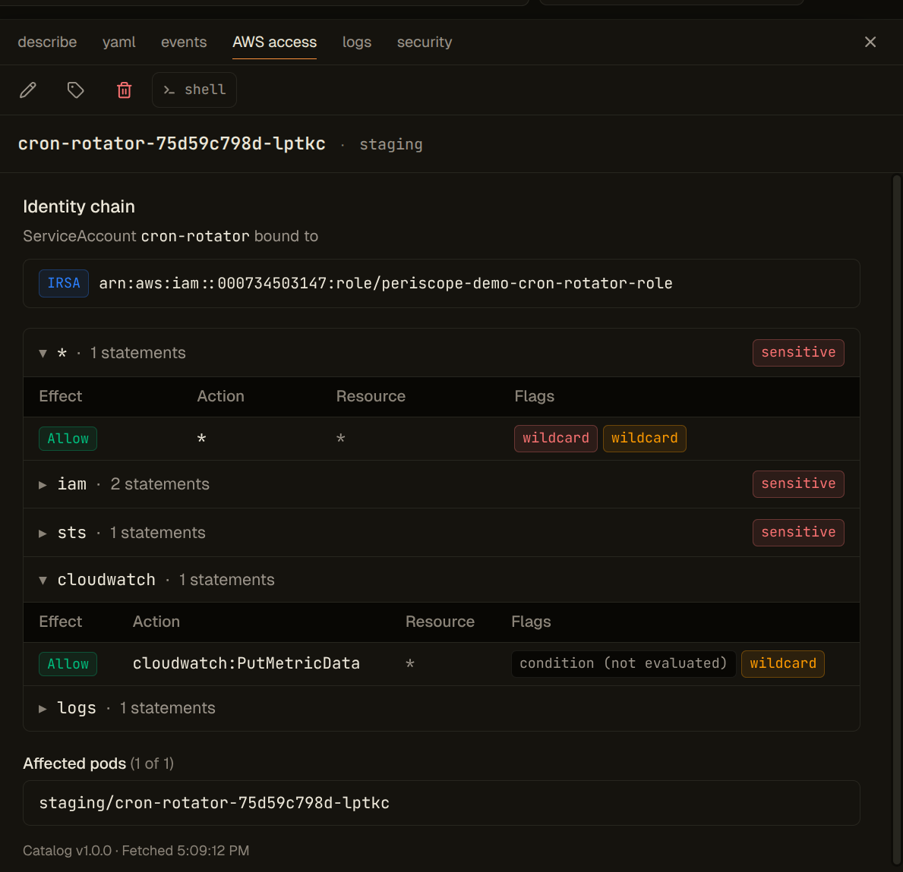

## Reverse lookup

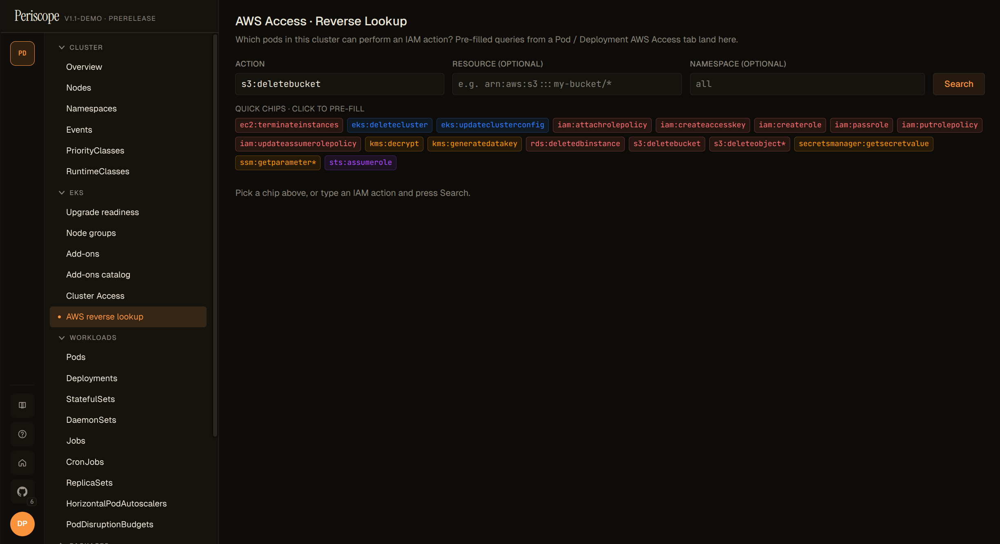

The page accepts an IAM action plus an optional resource ARN and
optional namespace filter. Sensitive-permission chips on the page
pre-fill the form. Each result row is one matched pod, with the IAM
role and the binding source attributed:

```
GET /api/clusters/{cluster}/iam/reverse-lookup
    ?action=s3:GetObject
    &resource=arn:aws:s3:::my-bucket/*
    &namespace=team-foo
```

Returns a `ReverseLookupResponse` with `rows: ReverseLookupPodRow[]`.
Sensitive-flagged rows sort first; the response carries `truncated`
and `totalPods` so the SPA renders honest "N of M" banners.


Dual-source SAs emit **one row per binding per pod** so the result
honestly reflects that the same pod has two distinct permission paths.

Wildcard support: both the action and the resource accept IAM glob
patterns (`s3:*`, `arn:aws:s3:::bucket/*`). Wildcards are matched
case-insensitively, mirroring IAM's evaluation semantics.

## Sensitive-perms catalog

Locked for v1.1. The catalog ships at `internal/awseks/iam/sensitive.yaml`
and is exposed at:

```
GET /api/identity/sensitive-catalog
```

Cluster-agnostic. Returns the catalog version, every entry's action +
category (`privilege-escalation`, `data`, `cross-account`,
`destructive`, `cluster`, `wildcard`), and a `reverseQuery` hint the
SPA fires on chip click. The literal `*` action is classified
`wildcard` by the matcher (not a YAML entry) so operators cannot
disable the wildcard chip.

## Paywall pane (capabilities)

Periscope **does not hide** AWS Access surfaces from users whose
clusters or roles don't yet support them. The tab is always present;
when unavailable, it renders a paywall pane with a structured reason
and the exact list of missing permissions:


```
GET /api/clusters/{cluster}/identity/capabilities
```

Per-feature response (`features.awsAccessTab`, `features.reverseLookup`,
`features.sensitiveCatalog`), each with `available`, a reason code
(`NOT_EKS`, `RBAC_DENIED`, `MISSING_IAM_PERMS`,
`NO_IDENTITY_CONFIGURED`, `INFORMER_WARMING`, `IAM_PROBE_DISABLED`),
a human message, an array of missing permissions / RBAC verbs, and a
docs link. Cached server-side for 5 minutes per `(cluster, actor)`;
the locked pane's **Re-check** button sends `Cache-Control: no-cache`
to force a fresh probe after a permission grant.

### IAM probe configuration

The capabilities probe calls `iam:SimulatePrincipalPolicy` against
Periscope's own caller identity (resolved once via
`sts:GetCallerIdentity` and reused across the process lifetime) to
populate the exact `Missing[]` list for `MISSING_IAM_PERMS`. The
locked pane then shows the specific permissions the operator needs
to add to periscope-server's IAM role. Controlled by:

```
PERISCOPE_AWS_ACCESS_IAM_PROBE=true|false
```

Default: `true`. When `iam:SimulatePrincipalPolicy` itself is denied
to Periscope's role, the capabilities response falls back to
optimistically `available: true` with a `note` explaining the
limitation; the first real call surfaces the underlying 403. When
explicitly disabled, the response carries `reason:
IAM_PROBE_DISABLED` with a similar fallback note. Set to `false` on
locked-down accounts where granting `iam:SimulatePrincipalPolicy` to
periscope-server is not desirable.

## Honest limits (v1.1)

These are explicitly **out of scope** for v1.1; the SPA flags them
clearly so operators don't misread the output:

- **Conditions are not evaluated.** Statements with a `Condition` clause
  render with a `condition (not evaluated)` chip. The matcher only
  surfaces `hasCondition: true`.
- **SCPs and permission boundaries are ignored.** Periscope shows what
  the role's identity-based policies *grant*, not what an SCP /
  permission boundary may further restrict.
- **Resource-based policies are ignored.** S3 bucket policies, KMS key
  policies, etc. are not consulted.
- **No `sts:AssumeRole` chain expansion.** If a role's policy grants
  `sts:AssumeRole`, the chip fires but the downstream role's policies
  are not pulled in.
- **NotAction / NotResource statements are not evaluated.** They
  render as a console link, not as evaluated rows. Half-implementing
  these was deemed dangerous; full support lands in v1.2.

## Required IAM + RBAC

Periscope's server role needs the policy reads to compute the IAM
side of the response. These are additive to the #178 (identity) read
set:

```
"iam:ListRolePolicies"
"iam:GetRolePolicy"
"iam:ListAttachedRolePolicies"
"iam:GetPolicy"
"iam:GetPolicyVersion"
```

Required only when `PERISCOPE_AWS_ACCESS_IAM_PROBE=true` (default).
Resolves the exact missing-permission list shown on the locked
pane; absent grants degrade to an optimistic note rather than a
hard fail:

```
"iam:SimulatePrincipalPolicy"
```

`sts:GetCallerIdentity` is implicit (AWS grants it to every
authenticated principal by default) so it does not need to be
listed.

Kubernetes RBAC (cluster-wide reads — the reverse-lookup page
iterates across namespaces):

```
serviceaccounts: get, list
pods: get, list
```

See `docs/setup/cluster-rbac.md` for the full RBAC + IAM template.

## Audit

Every call to the workload-permissions, reverse-lookup, sensitive-
catalog, and capabilities endpoints emits an audit row with verb
`aws_iam_read`. Internal SDK fan-outs (each `iam:Get*` / `iam:List*`)
also emit `aws_iam_read` rows with a finer-grained `op` field — see
`internal/audit/event.go`'s `VerbAwsIAMRead` docblock for the full op
list.

The four cluster-identity endpoints (#178) continue to emit
`aws_identity_read`; operator audit-feed filters that previously
captured both surfaces under one verb should now include both.
