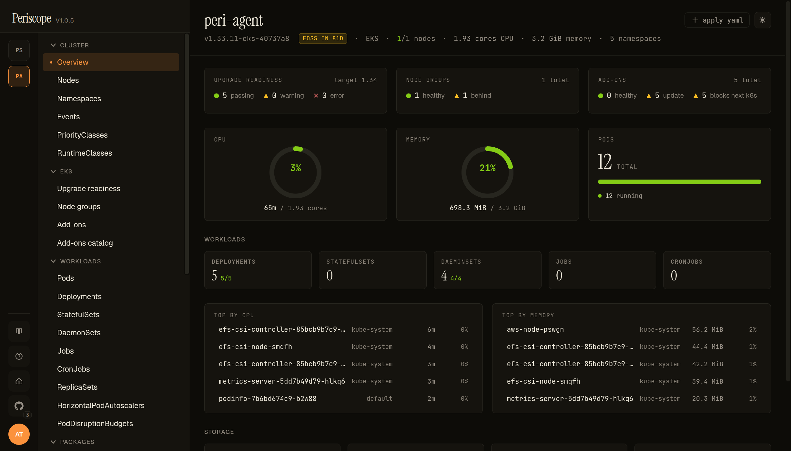

# Cluster overview

The cluster overview is the page you land on after clicking a
cluster card in the [fleet view](../setup/deploy.md#7-verify). It
combines K8s state (capacity, pod phases, workload counts) with
EKS-side state (upgrade readiness, node-group drift, add-on health)
on a single page so an operator preparing an upgrade can answer
"are my manifests OK *and* are my nodes / add-ons current?" without
clicking around.

---

## What you see

The page is read-top-to-bottom by intent:

**Identity banner** — the strip at the top carries the cluster name,
**K8s version** (from the apiserver's `/version` endpoint), an
**EoSS chip** when standard support ends within 180 days, the
**provider** (`EKS` or `Kubeconfig`), the **ready/total node count**,
**CPU / memory allocatable**, and **namespace count**. Forbidden
states (`node access restricted`, `namespace access restricted`)
render in italic when the operator's RBAC denies the underlying
list call — distinguishing "empty cluster" from "hidden by RBAC."

**EKS row** — three cards side-by-side: **Upgrade readiness**, **Node
groups**, **Add-ons**. Each summarises its respective deeper page in
2-3 lines (e.g. "3 healthy · 1 behind · 1 custom" for node groups).
Cards are absent for non-EKS-capable clusters.

**Capacity row** — three gauges: **CPU**, **memory**, **pod phase
distribution**. CPU and memory require metrics-server; absent state
is messaged inline with an install hint instead of zeroes that look
like idle.

**Workloads** — a card per K8s kind (Deployments, StatefulSets,
DaemonSets, Jobs, CronJobs, Pods) with healthy / total fractions.
Click a card to drill into the matching list page.

**Needs attention** — curated list of pods that are reporting a
wait/term reason kubectl marks as broken (`CrashLoopBackOff`,
`ImagePullBackOff`, `RunContainerError`, `Error`,
`ContainerCannotRun`). Capped at 20; each entry deep-links to the
pod detail with the describe tab open.

**Top consumers** — top 5 pods by CPU and by memory, only when
metrics-server is reachable. Each row shows usage in absolute
(`350m`, `512Mi`) plus a percentage of the pod's limit (or of
cluster allocatable when the pod has no limit).

**Storage** — PV + PVC snapshot ([details](./storage.md)). Counts of bound / pending,
allocated capacity by storage class.

**Recent events** — last 20 cluster events (newest first). Tied to
the same SSE stream the dedicated [`Events`](#) page uses.

---

## Refresh cadence

The page is built from the
[`/api/clusters/{cluster}/dashboard`](../api.md) endpoint plus an
SSE event stream. The dashboard endpoint is cached per-actor for
30 seconds; the event stream is live. Most cards refresh in place
without flicker — if a count changes between two refresh ticks,
only the affected number animates.

---

## RBAC

The page shows what the impersonated operator's tier can see. A
`read`-tier operator sees the dashboard but **Top consumers** is
empty if the role lacks `metrics.k8s.io/pods`; **Needs attention**
is empty if the role lacks `pods/list` (rare). The page does not
fan-out additional API calls beyond what the dashboard endpoint
issues, so there's nothing extra to grant.

---

## Related docs

- [`eks-upgrade-readiness.md`](../setup/eks-upgrade-readiness.md)
- [`eks-addons.md`](../setup/eks-addons.md)
- [`nodes.md`](./nodes.md)
- [`workloads.md`](./workloads.md)
