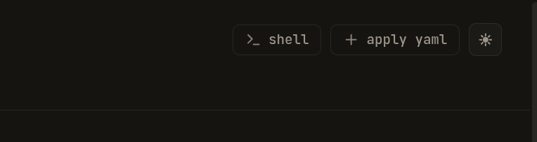

# Cluster shell

The cluster shell drops you into an in-browser kubectl REPL that
impersonates **you** against the target cluster's apiserver. Every
command is yours under RBAC; every command lands in the audit log.
Use it when you need to operate at the cluster level — `kubectl get`
across namespaces, `helm rollback`, `kubectl auth can-i` checks —
without leaving the browser and without dropping to local kubectl
(which would split the audit story).

This page is the user-facing tour. The operator setup guide is at
[`docs/setup/cluster-shell.md`](../setup/cluster-shell.md).

---

## Opening a shell



On any cluster page, click the **shell** button in the right-side
action area of the page header (next to **apply yaml**). The
keyboard shortcut is **Cmd-Shift-E** (or **Ctrl-Shift-E** on Linux).

A terminal drawer slides up from the bottom; the rest of the page
stays visible above so you can keep navigating while the shell is
live. The tab is labeled `shell`; the info expander (small ⓘ
button) shows `kind: cluster shell`, `mode: bash`, and
`(cluster-scoped)` instead of namespace/pod/container.

First open takes ~5–10 seconds — Periscope is provisioning the
backing pod on the target cluster. Subsequent opens to the same
cluster are similar; there's no pre-warmed pool today.

If the button is **missing** from the header on a cluster, the
operator hasn't enabled cluster shell on that cluster. If it's
present but clicking returns an error toast like `E_FORBIDDEN`,
your tier isn't on the allow-list — ask the operator to add it
to `clusterShell.tiers` or grant you a tier that is on the list.

---

## What runs inside

The shell pod's image is a thin debian-slim runtime carrying:

- `kubectl` — pinned to a tested version (typically the latest
  patch of the most recent minor)
- `helm`
- `bash` with login profile + readline
- `nano`, `jq`, `curl`, `coreutils`

Your prompt looks like `root@periscope-shell-<uuid>:/$`. **You are
running as root inside the pod**, but every kubectl call you make
exits the pod and lands at apiserver under your impersonated
identity. The pod's SA is tier-narrow and cannot impersonate
anyone but you — see the security note below.

Try this to verify the identity wiring:

```bash
kubectl auth whoami
```

You should see:

```
ATTRIBUTE  VALUE
Username   <your OIDC sub>
Groups     [periscope-tier:admin system:authenticated]
Extra:                                       audit.periscope.io/session-id   [<this session's UUID>]
                                             audit.periscope.io/actor        [<your OIDC sub>]
```

That session-id is the key — every audit row this session generates
on the apiserver side carries it, and Periscope's own
`cluster_shell_close` envelope carries it too. One UUID, two logs,
joinable with one `grep`.

---

## What you can do

Whatever your tier's RBAC permits. The shell is a thin loop over
the same kubeconfig you'd export from any kubectl install — no
periscope-specific commands, no kubectl plugins beyond what you
shipped in the image.

Common patterns:

```bash
kubectl get pods -A | grep -i crash
kubectl describe deploy/api -n payments
kubectl rollout restart deploy/api -n payments
kubectl logs -f -l app=api -n payments
helm list -A
helm history my-release -n my-ns
kubectl auth can-i create secret -n payments
```

A live transcript of every command runs to a per-session audit file
inside the pod; on session close that transcript is read out and
attached to the `cluster_shell_close` audit row in Periscope's own
audit log.

---

## Caps and idle behavior

Two caps apply (per Periscope-server defaults; your operator may
have raised them):

- **2 concurrent sessions per user**, across all clusters
- **10 concurrent sessions per cluster**, across all users

Hitting either returns a friendly dialog ("session cap reached") —
close an existing shell and try again.

Idle timeout: the session closes itself after **20 minutes of no
stdin or stdout activity**. The drawer banner warns ~30 seconds
before the cut. Active sessions (typing, scrolling output, running
a `watch`) reset the clock on every byte.

The session also closes on:

- `exit` or Ctrl-D
- Browser tab closed (or hidden for ≥5 minutes — Periscope's general
  exec policy)
- Periscope main pod restart
- Network drop the WebSocket reconnect supervisor can't recover

---

## Compared to pod-exec

| | Cluster shell | Pod exec |
|---|---|---|
| Where you launch it | Cluster page header | Pod detail page |
| What runs | A fresh ephemeral pod on the target cluster | Attached to an existing container |
| Default tools | `kubectl`, `helm`, `bash`, `nano`, `jq`, `curl` | Whatever the container ships with |
| Identity | Your OIDC sub + tier-narrow impersonation | Your OIDC sub + tier-narrow impersonation |
| Default idle cut | 20 min | 10 min |
| Default per-user cap | 2 | 5 |
| Drawer tab label | `shell` | `<pod>/<container>` |
| Hotkey | Cmd-Shift-E | Cmd-E |

The two coexist — you can have a pod-exec into a misbehaving app
container and a cluster-shell open at the same time. Both show up
as separate tabs in the same drawer.

---

## Security note

The shell pod runs as root inside its container, but its
ServiceAccount only carries `impersonate` rules tier-narrowed to
your tier. Token theft from the pod gets a credential that can only
impersonate identities carrying your tier's group — which is what
the operator already authorized for you.

The kubeconfig the shell uses lives in a per-session Secret that's
deleted when the session ends, and the bearer token inside it is
also tier-narrow. There's nothing left behind on the cluster after
your session closes.

Apiserver-side audit annotations carry both `actor` and
`session-id` on every request, so even if a different operator
opens a shell into the same cluster a minute later, the two
sessions are trivially distinguishable in the audit log.

The operator setup guide has the full posture writeup at
[`docs/setup/cluster-shell.md#7-security-posture`](../setup/cluster-shell.md#7-security-posture).
