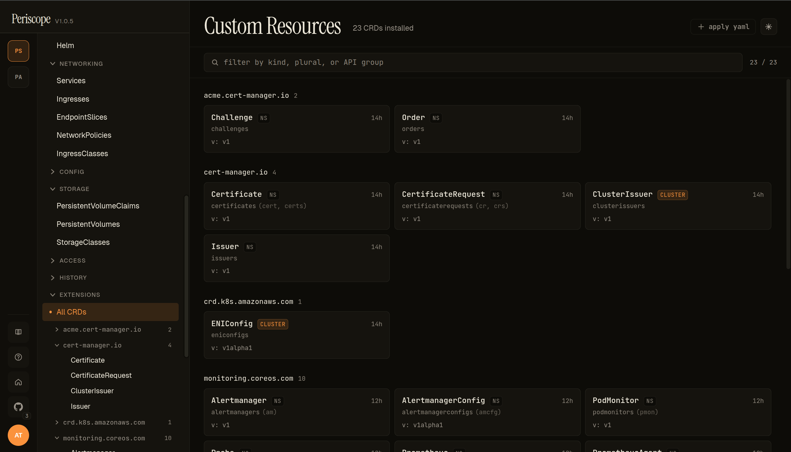
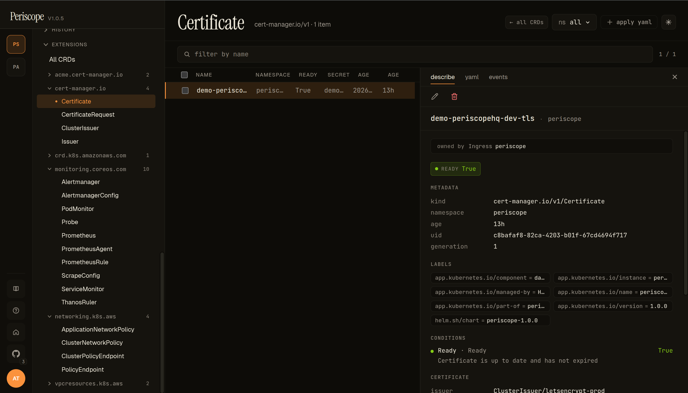

# Custom Resources (CRDs)

The **EXTENSIONS → All CRDs** sidebar entry surfaces every
`apiextensions.k8s.io/v1 CustomResourceDefinition` installed on the
cluster, grouped by API group. From there, drilling into any CRD
opens a per-kind list view that reads identically to the built-in
list pages — same describe / yaml / events tabs, same live SSE
updates, same RBAC gating.

CRDs are runtime-discoverable, so this page reflects whatever
operators have installed (cert-manager, Prometheus Operator, AWS
VPC CNI, EKS pod-identity association controller, ArgoCD, …) without
any Periscope-side config.

---

## What you see

### All CRDs

The page header carries:

- **Title** — `Custom Resources` + the total CRD count
  (`23 CRDs installed` in the screencap).
- **Filter** — substring match across **kind**, **plural**, and
  **API group**.
- **`+ apply yaml`** — quick-action for installing a new CRD via
  the [Apply YAML dialog](../setup/apply-yaml.md).

The body groups CRDs by `spec.group`. Each group renders as a header
with the count, then a grid of cards. Per-card fields:

- **Kind name** — `metadata.name` parsed; `Certificate`,
  `ClusterIssuer`, etc.
- **Short names** — comma-separated shortcuts the apiserver accepts
  (e.g. `cert`, `certs` for `cert-manager.io/v1 Certificate`).
- **Stored version** — `spec.versions[?served=true&storage=true].name`,
  e.g. `v: 1`, `v: 1alpha1`.
- **AGE** — relative timestamp from `metadata.creationTimestamp`.
- **CLUSTER chip** — present when `spec.scope=Cluster` (vs the
  default `Namespaced`). The screencap shows `ClusterIssuer` and
  `ENIConfig` carrying the chip.

The screencap above is from peri-server with cert-manager + AWS VPC
CNI + Prometheus Operator installed — 23 CRDs across 5 groups
(`acme.cert-manager.io`, `cert-manager.io`, `crd.k8s.amazonaws.com`,
`monitoring.coreos.com`, plus a few more below the fold).

### Sidebar drill-down

The sidebar **EXTENSIONS** group expands to show the same grouping —
**All CRDs** at the top, then per-group entries that open per-kind
lists. The screencap shows the sidebar with `cert-manager.io`
expanded → `Certificate` selected. This is the operator-friendliest
path for "I just want to see the Certificates" without hopping
through the All CRDs page each time.

### Per-CRD list

Clicking a kind on the All CRDs page (or the sidebar tree) opens the
per-kind list view, which reads exactly like the built-in resource
pages:

- **Header** — kind name + the API group chip (`cert-manager.io/v1`)
  + the item count + namespace picker + `+ apply yaml`.
- **Back link** — `← all CRDs` jumps back to the catalog.
- **Columns** — kind-specific from the CRD's
  `spec.versions[].additionalPrinterColumns` if defined, else a
  default `NAME / NAMESPACE / AGE` set. The screencap shows
  Certificate's printer columns: `READY` / `SECRET` / `AGE`.
- **Detail pane** — same `describe` / `yaml` / `events` tabs the
  rest of the SPA uses.

The describe tab runs the standard render pipeline:

- **Header** — the resource's kind + namespace + edit / labels /
  delete actions.
- **Owner-reference link** — when `metadata.ownerReferences` is set,
  the owner renders as a clickable chip (`owned by Ingress periscope`
  in the screencap — cert-manager's
  [ingress-shim](https://cert-manager.io/docs/usage/ingress/)
  created this Certificate from an Ingress annotation).
- **Status chip** — pulled from the CRD's `additionalPrinterColumns`
  ready-condition or `status.conditions[type=Ready]`.
  `READY=True` rendered in green; `False` in red.
- **METADATA** — kind / namespace / age / uid / generation.
- **LABELS + ANNOTATIONS** — the Helm-managed set + any controller-set
  annotations.
- **CONDITIONS** — every `status.conditions[]` entry as a row with
  the condition `type` + `status` + `message`. The screencap shows
  Certificate's `Ready=True / "Certificate is up to date and has
  not expired"`.
- **CRD-specific cards** — when the CRD has well-known status fields
  (e.g. Certificate's `issuer` / `notAfter` / `notBefore`), they
  render as dedicated cards below conditions. Otherwise the **yaml**
  tab is the full-fidelity view.

### YAML + events

The **yaml** tab is the canonical manifest. Useful for CRDs whose
status is structured beyond what the describe tab surfaces (CRD
authors put a lot of state in `status.conditions[]` *and*
`status.<custom>` fields; the yaml tab is where you find the
`<custom>` part).

The **events** tab is the per-resource event feed. For CRDs whose
controller is observable (cert-manager, Prometheus Operator), the
events tab is where you find `Issuing` / `Reconciling` / `Synced`
verbatim.

---

## Live updates

Both the catalog and per-CRD list pages are wired to the cluster's
[`watch streams`](../setup/watch-streams.md). When a controller
installs a new CRD or a new CR is created, the lists update without
a refresh.

---

## RBAC

The catalog needs `customresourcedefinitions:list` on
`apiextensions.k8s.io` (cluster-scoped — the standard `view`
ClusterRole grants it). Per-CRD list pages additionally need
`<plural>:list` on the CRD's group (e.g.
`certificates:list` on `cert-manager.io`).

A user denied either verb sees the standard "your role can't see
these" forbidden state. Per-CRD list pages render the kind on the
sidebar tree even when the user is denied the list — clicking shows
the forbidden state, so the operator knows the CRD exists but they
can't see instances. (This is a deliberate UX choice: hiding denied
kinds from the sidebar would create the false impression that the
CRD isn't installed.)

---

## What's not yet

- **Form-mode editing for CRDs.** The schema engine renders most
  kubebuilder-generated CRDs (since `oneOf` and `allOf` landed in
  v1.1 — see [`form-editor.md`](./form-editor.md)), but
  `KindEditRouter` is intentionally scoped to ConfigMap / Secret /
  Service / Ingress for v1.x. CRD edits open in YAML mode.
- **Controller-aware actions.** No "trigger renewal" button on
  Certificate, no "force resync" on Application — those are
  controller-specific verbs that don't generalize. Use the YAML
  editor + label/annotation pokes the controllers respect, or shell
  out to the controller's CLI.

---

## Related docs

- [`form-editor.md`](./form-editor.md) — the form/yaml toggle that
  CRDs currently fall through to YAML on.
- [`../setup/apply-yaml.md`](../setup/apply-yaml.md) — installing a
  new CRD or applying CR instances.
- [`../setup/watch-streams.md`](../setup/watch-streams.md) — the
  SSE plumbing that makes the catalog + per-CRD lists live.
- [`workloads.md`](./workloads.md) — for CRDs whose `ownerReferences`
  point at a workload, the link in the describe header jumps there.
