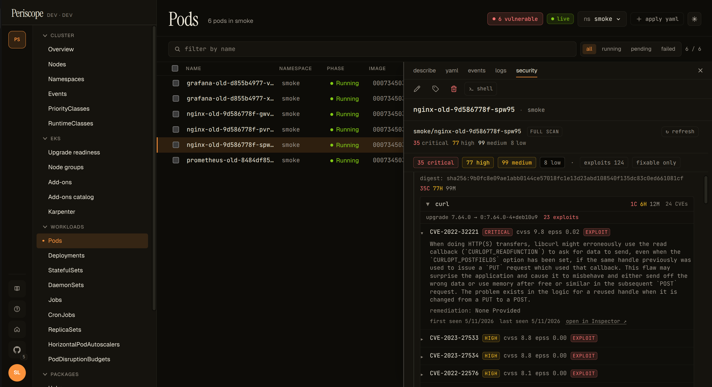
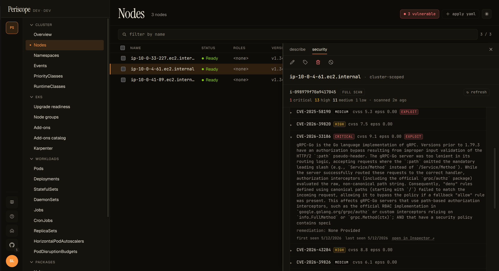
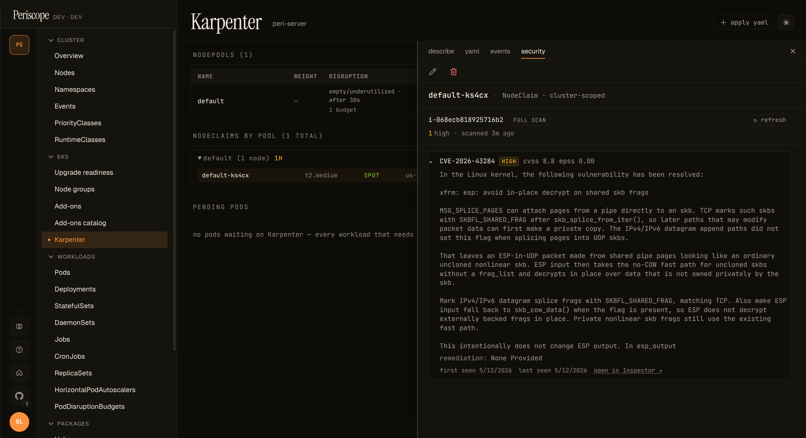
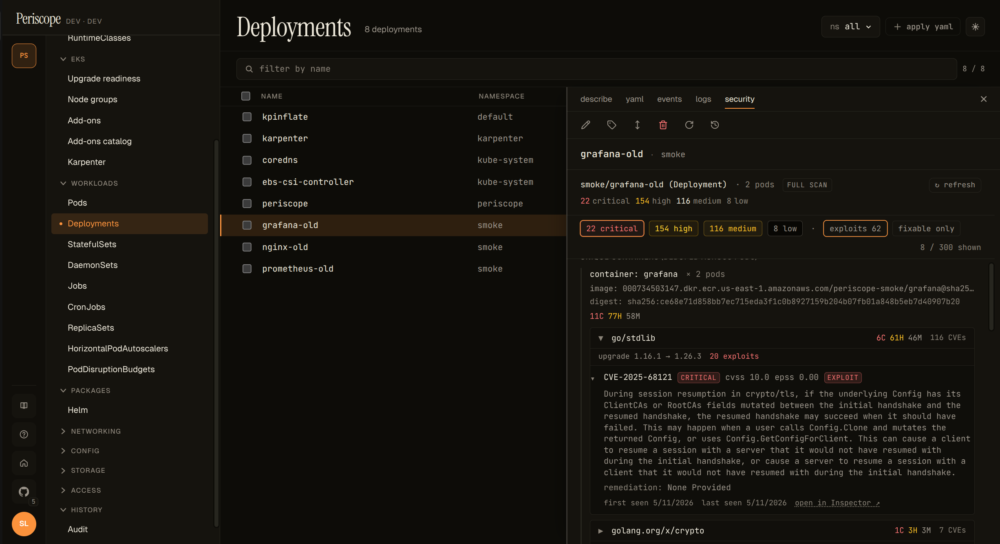
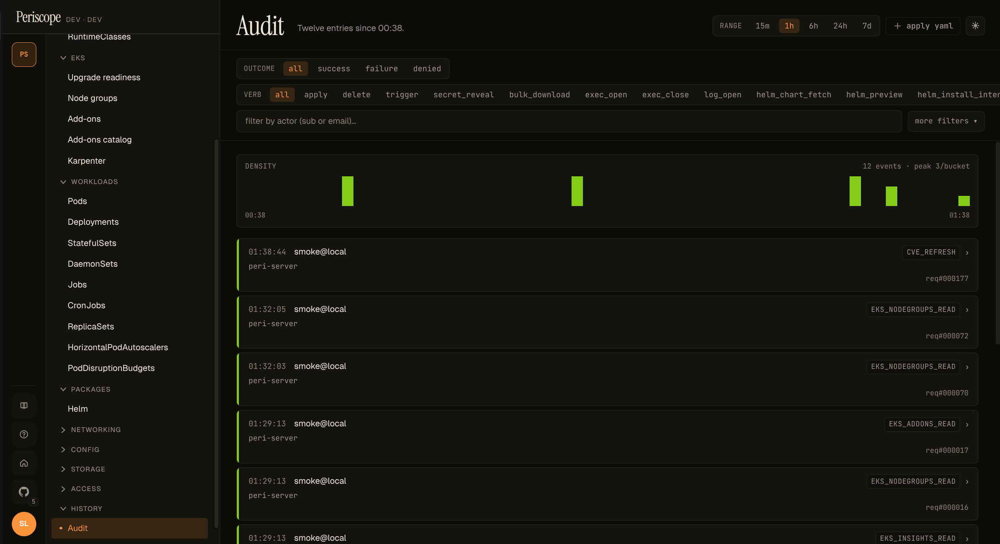
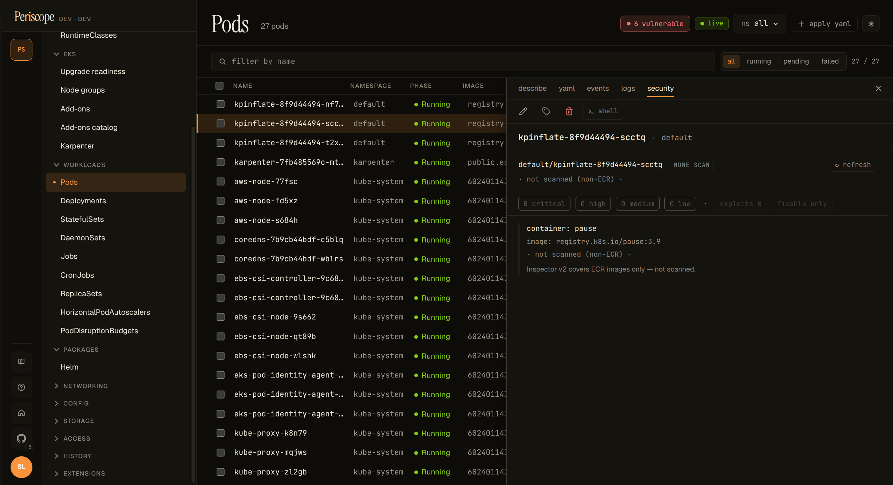

# CVE surfacing (Amazon Inspector v2)

Periscope shows per-pod, per-workload, per-node, and per-NodeClaim
CVE counts inline on the Pods / Nodes / Workloads / Karpenter pages,
with a drill-down **Security** detail-pane tab that groups raw
Inspector findings by package, sorts them by triage priority, and
surfaces the per-package upgrade target. Data comes from Amazon
Inspector v2 via a per-cluster local cache the periscope-server
hydrates on first request.



## Enable Inspector v2

CVE data is opt-in. Operators have to (1) turn on Inspector v2 in
the AWS account, (2) grant the periscope-server's Pod Identity /
IRSA role the `inspector2:*` + `ec2:Describe*` permissions, and (3)
flip the Helm value:

```yaml
inspector:
  enabled: true
```

Full IAM block (and the rationale for each permission) is in
[`cluster-rbac.md`](../setup/cluster-rbac.md#aws-inspector-v2-optional-v11).

The first request after `inspector.enabled: true` blocks ~10-30s
while Periscope hydrates the per-cluster cache from Inspector;
subsequent reads are served from memory at single-digit-ms latency.

**Inspector-disabled empty state.** When `inspector.enabled: false`
(the default) or the IAM grant is missing, every CVE-aware page
shows a once-per-cluster hairline banner — _"Inspector v2 is not
enabled on this cluster — vulnerability data is unavailable"_ —
with a link back to this guide. The vulnerabilities columns render
`not scanned`. Periscope never errors out; the empty-state contract
is the standard "no data" path. Dismiss is cluster-scoped via
localStorage, so dismissing on one CVE-aware page also dismisses on
the others.

## Read the row chip

The list-row chip uses a compact form: `2C · 5H · 12M`. Each letter
is the bucket: `C` critical, `H` high, `M` medium. Low and
informational are dropped from the inline view; hover the chip for
the full breakdown plus the last-scanned timestamp.

Chip states:

| State          | What it means                                                       |
|----------------|---------------------------------------------------------------------|
| `2C · 5H · 12M`| Entity has findings of those severities.                            |
| `· clean ·`    | Scanned, zero findings.                                             |
| `partial`      | Some containers scanned, at least one not (mixed pod, see below).   |
| `non-ECR`      | Image is not in ECR. Inspector v2 doesn't cover non-ECR images.     |
| `pending`      | ECR image, but the pod hasn't pulled it yet (no digest available).  |
| `unscanned`    | The cache hasn't covered this entity yet, or inspector is disabled. |

The chip column lights up across Pods, Nodes, and Karpenter:





The Deployments page renders a per-Deployment Security tab but does
not yet carry a chip column (the SPA's `DeploymentSummary` doesn't
carry the replica pod list, so populating a row chip would need
either N parallel `/cve/by-workload` fetches per visible row or a
new server-side aggregation index — tracked as a follow-up).

## Read the Security tab

Open any pod, node, deployment / statefulset / daemonset, or
Karpenter NodeClaim detail pane — the new `security` tab sits next
to `describe / yaml / events / logs`. A small red dot on the tab
label means the entity has at least one critical finding; amber
means at least one high. Silence is the signal — no dot means no
critical or high findings.

The tab content has three shapes:

- **Pod**: per-container groups, each rendered as a header (image,
  digest, scan state, chip) plus a **package-grouped** finding
  list.
- **Node / NodeClaim**: flat finding list against the EC2 instance,
  with the instance ID and owner badge at the top. No package
  grouping yet — Inspector's EC2 findings are kernel-level + AMI
  package-level and don't share the same "bump the package" pattern
  the container side does.
- **Deployment / StatefulSet / DaemonSet**: unique containers
  deduped across replicas (`× N pods` annotation) plus a per-pod
  replica chip list at the bottom — click a replica to jump
  straight to that pod's Security tab.


### Package grouping

Per-container findings are **grouped by package** server-side. A
typical container with 200+ raw Inspector findings collapses to
roughly 5-20 package groups, because most findings are CVEs in the
same upstream package (the v1.1 smoke against `grafana:8.0.0`
shipped 116 go/stdlib CVEs in one group + a handful of single-CVE
groups for `golang.org/x/crypto`, `golang.org/x/net`, etc).

Each group header shows the package name, a compact severity chip,
the suggested upgrade target ("upgrade `1.16.1 → 1.26.3` fixes
all"), and the exploit / fixability hints when they're non-zero.
Expand the header to see the per-CVE rows, pre-sorted by triage
priority (exploit-available > severity > CVSS > EPSS).

The highest-priority group opens by default, so the most actionable
CVEs are visible without an extra click; the long tail stays
collapsed.



### Filter chips

Above the per-container groups, a chip strip lets the operator
focus:

- **Severity chips** — `N critical`, `N high`, `N medium`, `N low`.
  Click one to filter to that severity only; click again to clear.
- **`exploits N`** — toggle to show only findings with
  `exploitAvailable: YES`. The single biggest signal for "what to
  fix _today_".
- **`fixable only`** — hide findings with no published fix. Useful
  late in a release window when un-fixable rows are noise.
- **`X / Y shown`** indicator on the right when filters are active.


Filters are client-side (no backend roundtrip on toggle). The
underlying group + sort happens once on the server; chip toggles
just hide rows from view.

## Refresh manually

Each Security tab carries an entity-scoped `↻ refresh` button at
the top right. Clicking it forces an immediate Inspector re-scan of
the digests / instance IDs in scope and writes **one** `cve_refresh`
audit row carrying the affected resource IDs. Use it to verify a
fix landed without waiting for the 6-hour TTL refresh tick.



The button is disabled when the operator's role doesn't have the
`cve_refresh` audit verb. There is no page-level refresh (the
operator's intent — refresh which digests, which instances? — is
ambiguous at the page level); the entity-scoped button is the only
refresh shape in v1.1.

## Empty states

### No findings (`· clean ·`)

A scanned ECR container with zero CVEs renders as a muted "clean"
chip plus a "no findings" body. Important reassurance — this is
what success looks like.


### Non-ECR images

Inspector v2 covers ECR-pulled images only. A non-ECR pod (Docker
Hub, GHCR, Quay, etc.) renders a graceful `non-ECR · not scanned`
state instead of a confusing zero-counts chip — Periscope is
explicit about _why_ there's no data.



### Inspector v2 disabled

Cluster-wide banner described above — yellow hairline at the top of
every CVE-aware page when the `/cve/status` endpoint reports
`inspectorEnabled: false`. Operators dismiss once per cluster (the
banner re-appears when they switch to a different cluster that's
also disabled).

### Bare-metal or pre-Initialized NodeClaim

A Node without an EC2 `providerID` (kind, bare-metal, an
unprovisioned Karpenter NodeClaim) renders the Security tab as
_"no scan possible — instance not on a cloud provider Periscope
can introspect"_. Not an error; the operator gets a clear "by
design" explanation.

## What `partial scan` means

A pod with one ECR container plus a non-ECR sidecar (say
`docker.io/library/nginx`) reports `partial` scan coverage. The ECR
container is scanned and contributes to the rolled-up severity
counts; the sidecar shows `non-ECR · not scanned`. The pod-level
chip downgrades to `partial` so operators don't read the rollup as
"this pod is fully clean" when one image was skipped by Inspector
entirely.

## What gets scanned, what doesn't

- ECR images Periscope can resolve to a `sha256:` digest from the
  pod's `containerStatus.imageID` field: **scanned**.
- ECR images not yet pulled by the pod (no digest): **pending**.
  The next refresh / TTL tick should resolve them.
- Non-ECR images (`docker.io`, `ghcr.io`, `quay.io`, etc.): **never
  scanned**. Inspector v2's coverage is ECR-only.
- EC2 instances are scanned at the OS-package level via Inspector's
  instance coverage. Karpenter NodeClaims pre-`Initialized` (no
  providerID yet) are `not scanned`.

## What isn't covered (yet)

- **CronJob** ownership chain is three-hop (Pod → Job → CronJob)
  and is not surfaced; this is tracked for v1.2.
- **ReplicaSet** and **Job** detail panes don't have a Security
  tab today because the SPA's detail-pane wiring for those
  resources is thin / non-existent. The backend already supports
  `/cve/by-workload/ReplicaSet/...` and `Job/...`; the tab lands if
  / when those panes mature.
- **NodeGroup row-level chip**: the SPA's nodegroup data doesn't
  include the instance ID list per group. Operators get per-node
  chips on the Nodes page and the per-instance Security tab on each
  node; the aggregate-by-group chip is a follow-up.
- **Deployment / STS / DS list row chip column** — see the
  "Read the row chip" section above. Detail-pane tab covers the
  per-workload story for v1.1.

## Audit + cost

- Reads of any CVE endpoint do **not** emit audit rows — they're
  internal metadata reads. CloudTrail records the underlying
  Inspector API calls under the periscope-server's Pod Identity /
  IRSA role.
- Manual refresh emits exactly one `cve_refresh` audit row per
  click, carrying the affected digests + instance IDs in the
  `Extra` field.
- Inspector v2 is **billed per scan** at the AWS account level. See
  [Inspector pricing](https://aws.amazon.com/inspector/pricing/).
  Periscope serves chip data from a 6h-TTL cache; the per-scan cost
  is the operator's call when they enable the feature. A typical
  ECR repo with weekly image pushes runs under $1/month per repo.

## For tool / agent integrations

The package-grouping + priority-sort is computed **server-side** in
`internal/cve/findings_group.go` and surfaced on the same wire
shape the SPA renders from. That's intentional: when the future
v1.2 AI-agent epic (#151) wires an MCP-style tool registry, an LLM
calling `/cve/by-workload/Deployment/{ns}/{name}` receives:

- pre-grouped packages (the actionable units, not 200 raw CVEs)
- pre-sorted by triage priority (exploits → severity → CVSS → EPSS)
- per-group "upgrade `X.Y.Z` → `A.B.C` fixes all" hints

Both consumers — the human operator at the SPA and the LLM in the
chat surface — see one source of truth for "what to fix first"
prioritization. No second representation, no separate "agent-
friendly" endpoint.
