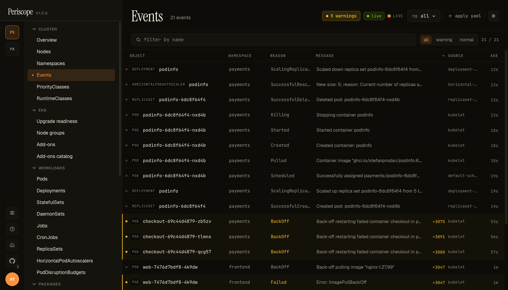

# Events

The Events page is the cluster-wide event feed — every K8s event from
every namespace, newest first, live-streaming via SSE so new events
appear at the top without a refresh. Distinct from the per-resource
events tab (covered in [`workloads.md`](./workloads.md#events-tab))
which scopes to a single object's involvedObject feed.

---

## What you see

The page header shows the **total event count**, an active-stream
indicator (`live` pill, green when the SSE connection is healthy),
the **namespace picker**, and the **+ apply yaml** quick-action.

The filter strip below carries:

- **Type pills** — `all` (default) / `warning` / `normal`. The
  warning count is shown explicitly (`5 warnings` in the screencap).
- **Search** — substring match across event name, reason, message.

Each row carries:

- **OBJECT** — `kind / name` of the event's `involvedObject`. Kind
  badges (`POD`, `DEPLOYMENT`, `HORIZONTALPODAUTOSCALER`,
  `REPLICASET`) render in monospace as a small uppercase chip.
- **NAMESPACE** — where the involved object lives. Empty for
  cluster-scoped resources.
- **REASON** — kubectl-style reason in monospace. Warnings render
  yellow (`BackOff`, `Failed`, `FailedScheduling`); Normal events
  render in muted text.
- **MESSAGE** — kubelet's human-readable detail (truncated; full text
  on hover).
- **COUNT** — kubelet collapses repeated identical events into one
  row with a count. Yellow at >100 occurrences, red at >999.
- **SOURCE** — `kubelet`, `replicaset-controller`,
  `horizontal-pod-autoscaler`, etc.
- **AGE** — relative timestamp.

Warning rows render with a left border tint so an operator scanning
the feed catches them at a glance.

The screencap above is from peri-server with the seeded broken
workloads — `web-7476d7bdf8-*` Pods showing `ImagePullBackOff` from
the `nginx:1.27.99` typo, `checkout-*` Pods showing `BackOff` from
the deliberate-fail container, plus normal `ScalingReplicaSet` and
`SuccessfulCreate` events from the healthy parts of the fleet. Real
operational mix, not synthetic.

---

## Live updates

The page connects to the cluster's
[`watch streams`](../setup/watch-streams.md) for events specifically.
New events arrive at the top in real time; the SSE connection
auto-reconnects on transient drops with a small "polling fallback"
indicator if the watch stream can't be reestablished (rare, usually
indicates apiserver-side issues).

---

## RBAC

The Events page needs `events:list` cluster-scoped (or
namespace-scoped if you want a single-namespace view). The standard
`view` ClusterRole carries this. When the role denies the list, the
page renders a forbidden state with the same "your role can't see
these" wording the rest of the SPA uses.

---

## Related docs

- [`cluster-overview.md`](./cluster-overview.md) — "Recent events"
  card on the overview page (last 20, same SSE stream)
- [`workloads.md`](./workloads.md#events-tab) — per-pod events tab
- [`watch-streams.md`](../setup/watch-streams.md) — the SSE plumbing
  that makes this live
