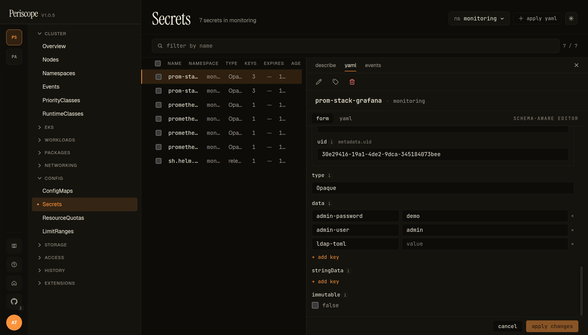
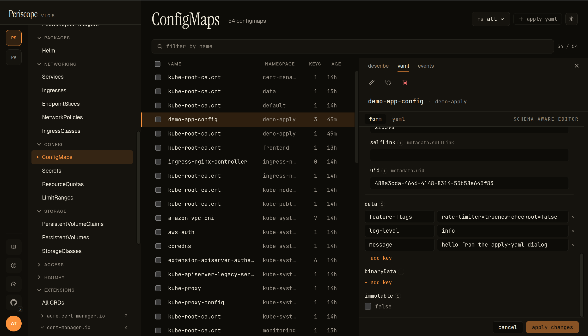
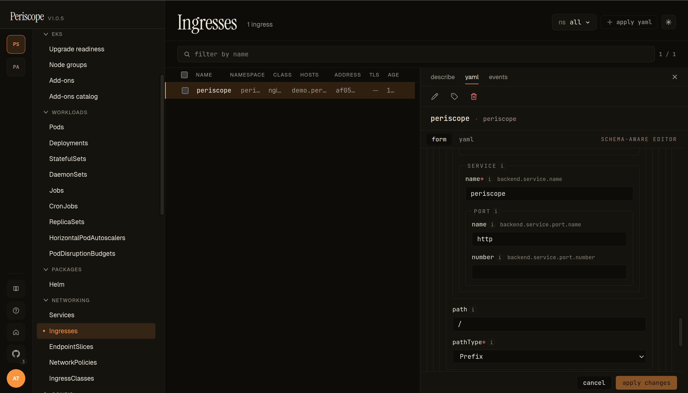

# Form-mode editor for ConfigMap, Secret, Service, Ingress

Periscope's resource editor offers a **schema-aware form view** for the
four operator-facing config kinds — ConfigMap, Secret, Service, Ingress
— alongside the existing Monaco YAML editor.  Form view is the default
when you click **edit** on one of those four kinds; the Monaco editor
stays one click away as the escape hatch.

Workloads (Deployment, StatefulSet, DaemonSet, Job, CronJob) and every
other kind continue to open in YAML mode unchanged.

---

## What you see

### Secret form (kv-map + base64 round-trip)

The detail pane's edit view shows:

- **`form` / `yaml`** tabs in the header, with a small **SCHEMA-AWARE EDITOR** badge to the right when the form has a real OpenAPI v3 schema backing it.
- **`uid`** rendered as a read-only metadata input (immutable post-create).
- **`type`** as a free-text input (`Opaque` here; for `kubernetes.io/dockerconfigjson` etc. the type is whatever the apiserver accepts).
- **`data`** as a key/value map editor — each key is a row with key + value text inputs. The screencap shows three keys (`admin-password`, `admin-user`, `ldap-toml`); the **+ add key** button below the list adds a new pair.
- **`stringData`** as a parallel kv-map editor (plaintext, no base64 round-trip — see [`Secret base-64 layer`](#secret-base-64-layer) for the data path).
- **`immutable`** as a checkbox (false here).
- Footer: **cancel** / **apply changes**. Apply runs the same `SelfSubjectAccessReview` pre-flight + server-side dry-run + audit row that the YAML editor uses.

### Service form (array-of-objects)

![Service detail pane in form mode — spec.ports[] array editor with named entry, port 80, protocol TCP](../assets/form-editor/service.png)

Service exercises the **array-of-objects** path of the form engine. `spec.ports[]` renders as a list of expandable cards; each card carries the schema-defined fields (`appProtocol`, `name`, `nodePort`, `port`, `protocol`, `targetPort`) with the (i) tooltips on every label.

- **PORTS #1** header + per-row **remove** button — array entries can be deleted independently.
- **`add item, press Enter`** input below — type a label name to push a new entry onto the array. Required-field validation runs per entry, so the new card lights up missing required fields immediately.
- `port` is required (asterisk shown); `protocol` defaults to `TCP` via the schema's default.
- `targetPort` is the canonical **`oneOf` (string-or-int) discriminator picker** — flip the picker to switch between an int (e.g. `9898`) and a string port name (e.g. `http`); branch switching wipes the previous-branch value with a confirm prompt as described under [`Composition-keyword coverage`](#composition-keyword-coverage-oneof-allof).

### ConfigMap form (kv-map for `data`)

ConfigMap exercises the same **kv-map** path as Secret, minus the base64 layer (ConfigMap stores plaintext on the wire). The screencap is the `demo-app-config` ConfigMap from the [Apply YAML demo](../setup/apply-yaml.md#demo-5-doc-mini-app), in the `demo-apply` namespace:

- **`selfLink`** + **`uid`** render as read-only metadata inputs at the top — populated from the existing object, immutable on update.
- **`data`** as a kv-map. Each row is a key + value pair. Multi-line values (the `feature-flags` entry: `rate-limiter=true\nnew-checkout=false`) are preserved verbatim; the value editor wraps without re-flowing.
- **`+ add key`** appends a fresh row at the bottom.
- **`binaryData`** (collapsed) for binary-only contents (base64-encoded on the wire). `binaryData` keys cannot collide with `data` keys; the form enforces this client-side before apply.
- **`immutable`** as a checkbox. Setting `immutable: true` is a one-way door (the apiserver rejects mutations after); the form surfaces a confirmation step before applying.

### Ingress form (deeply-nested objects + enum picker)

Ingress exercises the **deeply-nested object** path. The screencap is peri-server's `periscope` Ingress, with the rule's backend service expanded:

- **SERVICE** → `name` — the backing Service name (`periscope`).
- **PORT** → `name` / `number` — the canonical `oneOf` (string-or-int) port reference. Either field is sufficient; supplying both is rejected by the apiserver.
- **path** — the request path (`/`). The form does no validation beyond the schema's `pattern`; controller-specific quirks (nginx regex paths, ALB wildcards) pass through.
- **pathType** — enum dropdown surfacing the schema's three values: `Prefix` (default in the screencap), `Exact`, `ImplementationSpecific`. Schema enums always render as dropdowns; free-text isn't allowed.

Above the rule (off-screen in the screencap), `spec.tls[]` and `spec.ingressClassName` follow the same patterns — `tls[]` is array-of-objects (one card per TLS host group with `hosts[]` + `secretName`), `ingressClassName` is a free-text input (no enum because IngressClasses are discovered runtime, not schema-defined).

Controller-specific annotations (`alb.ingress.kubernetes.io/*`, `nginx.ingress.kubernetes.io/*`, `cert-manager.io/*`) pass through the metadata annotations editor verbatim — the form does not validate them, since they vary by ingress controller.

---

## When the form shows up

| Kind | Default mode |
|---|---|
| ConfigMap, Secret, Service, Ingress | Form (with YAML toggle) |
| Everything else (Deployment, Pod, CRDs, …) | YAML |

The schema for each form is sourced from the apiserver's
`/openapi/v3/{group}/{version}` doc, which Periscope already caches
for the YAML editor's autocomplete.  When the schema isn't reachable
(a transient apiserver fetch failure), the form falls back to a banner
prompting you to switch to YAML.

---

## What the form covers per kind

| Kind | Surfaced fields |
|---|---|
| **ConfigMap** | `metadata.{name, namespace, labels, annotations}`, `data` (key/value editor), `binaryData`, `immutable` |
| **Secret** | metadata, `type`, `data` (plaintext editor with base64 round-trip), `stringData`, `immutable` |
| **Service** | metadata, `spec.{type, selector, ports[], clusterIP, externalTrafficPolicy, internalTrafficPolicy, sessionAffinity, loadBalancerSourceRanges, loadBalancerClass, ipFamilies, ipFamilyPolicy}` |
| **Ingress** | metadata, `spec.{ingressClassName, rules[], tls[], defaultBackend}` |

Fields that aren't on the per-kind allowlist (e.g. `status`,
`metadata.managedFields`, `metadata.uid`, `metadata.creationTimestamp`,
`metadata.resourceVersion`) are filtered out before the form renders so
operators never see them.

`metadata.name`, `metadata.namespace`, Service `spec.clusterIP`, and
Service `spec.loadBalancerClass` are immutable after create — they
render as read-only inputs in edit mode.

Controller-specific Ingress annotations (`alb.ingress.kubernetes.io/*`,
`nginx.ingress.kubernetes.io/*`, etc.) pass through verbatim in the
annotations key/value editor; Periscope does not validate them.

---

## Secret base-64 layer

The Secret form decodes `data[k]` to plaintext for editing and
re-encodes to base64 on apply.  A **show raw base64** toggle in the
banner switches the data editor between plaintext and the canonical
wire format — useful when auditing what's actually stored.

`stringData` continues to be edited as plaintext (matching the K8s API
itself).  Multi-byte characters in plaintext (UTF-8) round-trip
cleanly.

---

## Form ↔ YAML toggle

Every form view ships a **[form | yaml]** toggle in the header.

- The toggle persists per-user via `localStorage["periscope.editor.preferred"]`
  (`"form"` or `"yaml"`).  Power users who prefer YAML can flip the
  default once.
- **Toggling preserves your edits in both directions.** The draft
  YAML buffer is shared between the two modes — flipping form→yaml
  carries your form edits straight into Monaco; flipping yaml→form
  re-parses your YAML edits back into the form.  Only **Cancel**
  prompts to discard.
- The dirty-tracking anchor stays the original server YAML, so the
  tab strip's `yaml*` indicator reflects "edited since fetch"
  consistently across both modes.

---

## Composition-keyword coverage (`oneOf`, `allOf`)

JSON Schema's composition keywords used to all surface as a yellow
"yaml only" badge.  Two of them now render properly in the form:

- **`allOf` flattens.**  `allOf:[{$ref: Base}, {properties: Override}]`
  is the standard `kubebuilder` shape for embedding `metav1.ObjectMeta`
  and similar inheritance — the form merges the entries into a single
  rendered shape before the walker emits descriptors.  This is why
  `metadata` renders as a regular nested object on every kind (was
  previously yaml-only).  Type conflicts across `allOf` entries
  (rare schema authoring bug) abort the merge and surface as the
  unsupported badge.
- **`oneOf` renders as a discriminator picker.**  Two structural
  shapes are detected:
  - **Whole-value oneOf** — e.g. `Service.spec.ports[].targetPort`
    (string-or-int), `Ingress.spec.rules[].http.paths[].backend`
    (Service backend or Resource backend).  Picker switches between
    the branch shapes.
  - **Object-level oneOf with required-key branches** — e.g.
    cert-manager `Issuer.spec` (`selfSigned` / `ca` / `vault` /
    `acme`), `aws-ebs-csi-driver` IAM identity (IRSA vs Pod Identity
    vs none).  Picker uses the required key as the branch label.
  - Branch switching is destructive: the values you set under the
    previous branch are wiped (different shapes, no clean merge).
    Periscope confirms before wiping.

`anyOf` and `patternProperties` still surface as the unsupported
badge.  They're rare in K8s/Helm/CRD schemas — most authors who want
disambiguation reach for `oneOf` instead.

---

## Field descriptions

Every field carries a small **(i)** icon next to its label.  Hover or
focus the icon to see the schema's description (sourced from the
apiserver's OpenAPI v3 doc for K8s kinds, or the chart's
`values.schema.json` for Helm).  Some K8s fields have lengthy
multi-paragraph descriptions — these stay tucked behind the tooltip
to keep the form scannable.

---

## Field ownership and apply semantics

The form submits via the same `PATCH .../resources/{group}/{version}/{resource}/{ns}/{name}`
endpoint the YAML editor uses, with `application/apply-patch+yaml`,
field manager `periscope-spa`, and a server-side dry-run before the
real apply.  All of the following still happen on every form apply:

- Per-doc `SelfSubjectAccessReview` pre-flight (PR #100).
- Audit log row with `verb=apply`, `kind/namespace/name/operation`.
- Server-side apply: Periscope takes ownership only of the fields it
  serializes; fields managed by other controllers (e.g. an Operator)
  remain owned by them.

When form mode submits and the apiserver returns a `409` field-manager
conflict, the form surfaces a banner that links you to **switch to YAML
mode** — that's where the per-field `ConflictResolutionView` lives, so
you can resolve fields individually.  The form's banner explains why
form mode doesn't try to handle 409s itself.

---

## What the form doesn't do (yet)

- **Drift detection** while you edit.  Form mode loads pristine YAML
  once on mount; if the cluster object changes under you mid-edit, you
  won't see a drift banner like you do in YAML mode.  Apply still
  goes through SSA and will be rejected by the apiserver if it
  conflicts.
- **Per-field reset to default.**
- **Field-ownership glyphs** in the form margin (the YAML editor still
  shows them).
- **Controller secret picker for `tls[].secretName`** — currently a
  plain text input.  Selecting from existing Secrets in the namespace
  is a polish follow-up.
- **CRDs.**  See [`custom-resources.md`](./custom-resources.md) — form-mode *routing* is intentionally limited to the
  four v1.1-supported kinds (the schema engine itself can render
  most kubebuilder-generated CRDs now that `oneOf` and `allOf` are
  handled, but CRDs aren't wired through `KindEditRouter`).  CRDs
  and workloads stay YAML-only as a deliberate scope choice.
- **`anyOf` and `patternProperties` schemas.**  Used much less than
  `oneOf` in real K8s/Helm/CRD schemas, so still surface as the
  unsupported badge.  Switch to YAML for fields that use these
  keywords.

For any of the above, switch to YAML mode — it remains the full-power
editing path.
