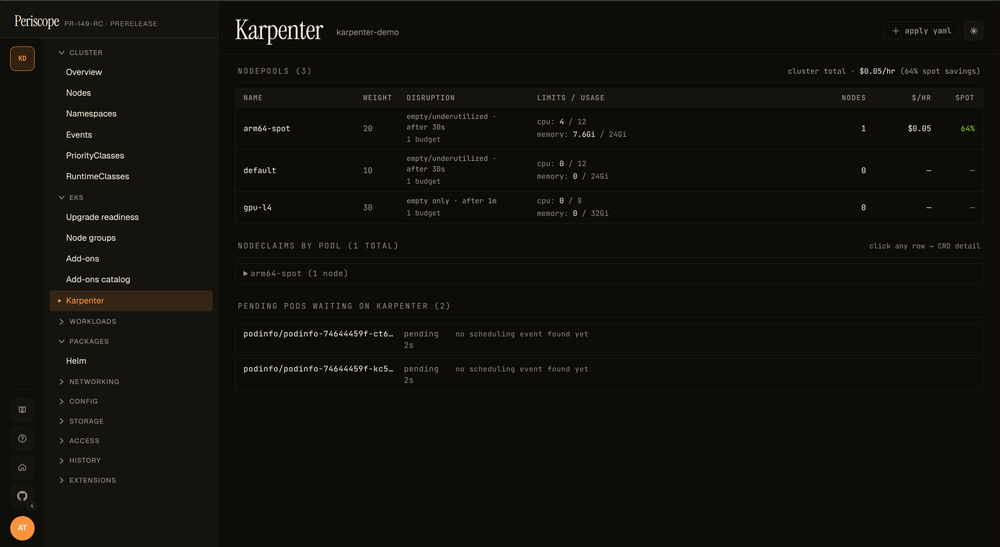
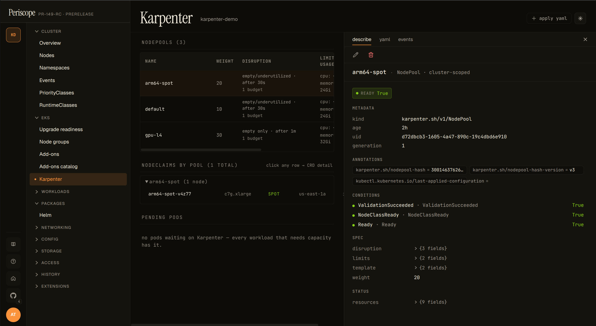
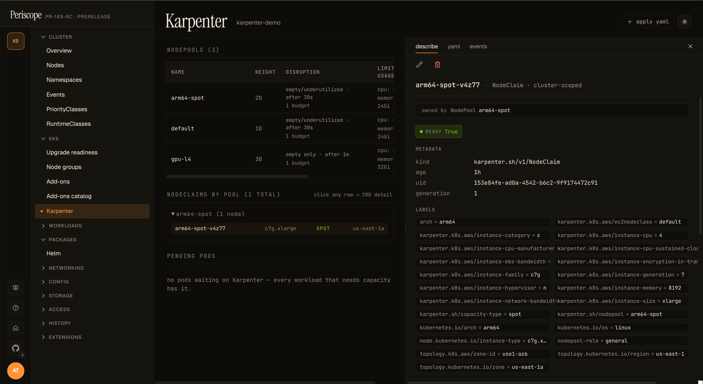
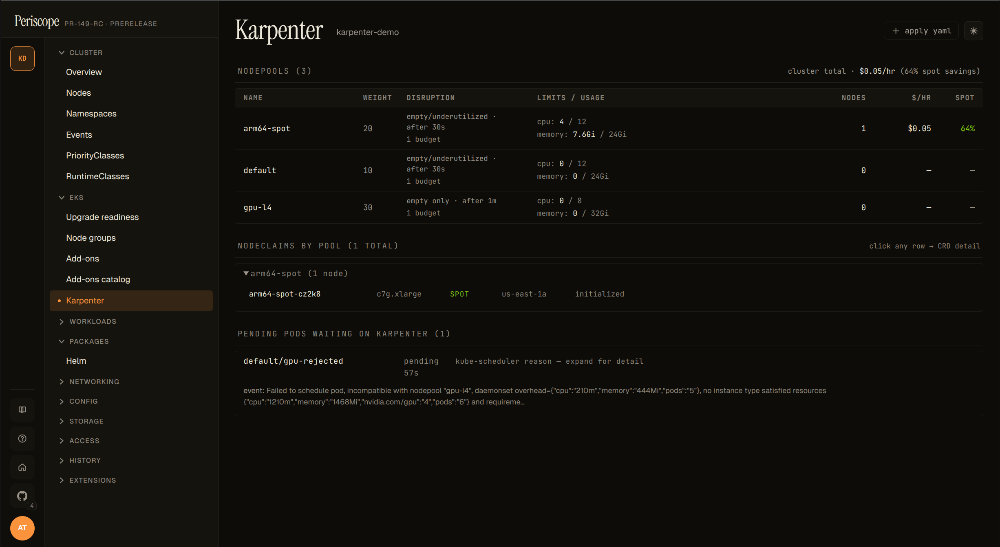
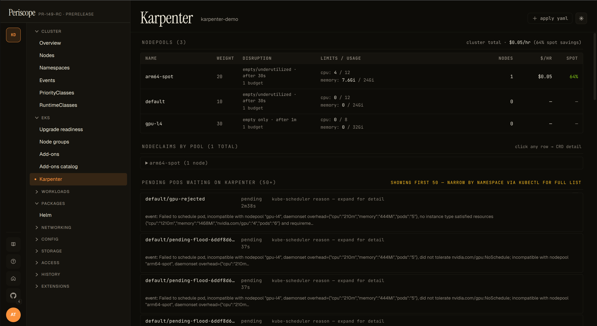

# Karpenter dashboard

Periscope's Karpenter view is a curated read-only page at
`/clusters/{cluster}/karpenter` that joins three data sources kubectl
can't:

1. **NodePools** — weight, disruption knobs, current/limit usage,
   and per-pool `$/hr` + spot-savings (when controller metrics are
   reachable).
2. **NodeClaims grouped by NodePool** — per-node instance type,
   capacity type (spot / on-demand), zone, and the K8s status
   conditions that matter (Drifted, Initialized, Launched).
3. **Pending pods waiting on Karpenter** — the per-NodePool
   incompatibility breakdown extracted from `FailedScheduling`
   apiserver Events. Operators no longer have to grep
   karpenter-controller logs to find out *why* a pod isn't being
   scheduled.

The page auto-detects via the discovery API. The sidebar entry only
appears on clusters with `karpenter.sh/v1` CRDs installed.

Clicking any NodePool or NodeClaim row opens a resizable detail pane
on the right with **describe**, **yaml**, and **events** tabs —
operators stay on the Karpenter page instead of bouncing into the
generic CRD catalog. Pane width persists across page refreshes.

## When the sidebar entry doesn't appear

| Cause | Fix |
|---|---|
| Karpenter not installed | Install per <https://karpenter.sh/docs/getting-started/>; the sidebar lights up on next page reload. |
| Karpenter installed but on v1beta1 / v1alpha5 | Migrate to v1 (the v1 GA shipped 2024-07). The dashboard targets v1 only — v1beta1 clusters can still use the generic CRD viewer at `/clusters/{c}/customresources/karpenter.sh/v1beta1/nodepools`. |
| Operator's RBAC blocks the discovery API | Periscope impersonates the operator on every K8s call. The CRD probe needs `get` on `customresourcedefinitions.apiextensions.k8s.io`. |

## When the cost columns don't render

The `$/hr` and `spot %` columns appear when Periscope's backend
successfully scrapes the karpenter-controller's `/metrics` endpoint
via the apiserver service-proxy. When that scrape fails, the columns
are hidden and a yellow "metrics unreachable" hint appears above the
table. Common causes:

- **Karpenter installed in a non-default namespace.** Periscope looks
  for the controller Service at `karpenter/karpenter:8080`. If the
  helm release was installed under a different namespace or with
  `controller.metrics.serviceMonitor.endpointConfig.targetPort` set
  to something other than 8080, the scrape fails. Reinstall with the
  default chart values OR file a follow-up issue if you need a
  configurable namespace.
- **Operator's RBAC lacks `services/proxy`.** The cost scrape uses
  the apiserver's service-proxy verb so the call respects user
  impersonation. If your operator's bound role doesn't include
  `services/proxy` in the karpenter namespace, the scrape returns
  403 and the columns are hidden. The shipped tier ClusterRoles
  don't include `services/proxy` by default (it's a privileged
  verb), so this almost always needs an explicit binding. Apply
  [`examples/karpenter-cost-rbac.yaml`](../../examples/karpenter-cost-rbac.yaml)
  for a copy-pasteable Role + RoleBinding scoped to the karpenter
  namespace; the rest of the dashboard works without it.
- **Cluster-SG → node-SG ingress missing.** The apiserver-proxy
  request lands on the karpenter pod via the node's security group;
  if the rule allowing the cluster security group to reach the node
  SG on TCP `1025-65535` was dropped (some terraform-aws-modules
  versions stop creating it implicitly), the proxy hangs and the
  scrape times out. Run `aws ec2 describe-security-group-rules
  --filters Name=group-id,Values=$NODE_SG` to confirm the rule
  exists; if it's missing, add it with
  `aws ec2 authorize-security-group-ingress --group-id $NODE_SG
  --source-group $CLUSTER_SG --protocol tcp --port 1025-65535`.
- **NetworkPolicy blocks apiserver → karpenter Service.** If your
  cluster restricts apiserver egress to only specific namespaces, add
  the karpenter namespace to the allowlist. (Rare — most clusters
  allow apiserver-initiated traffic by default.)
- **Cold-start race.** On the first page load after a fresh apiserver
  pod (or a periscope rollout), the apiserver→karpenter `/metrics`
  proxy call sometimes exceeds the handler's 15-second budget while
  TLS handshake + connection establishment warms up. The dashboard
  auto-refetches every 12 seconds, so cold-start emptiness self-heals
  on the next poll without an operator refresh.

The dashboard's other panels (NodePools list, NodeClaim grouping,
pending pods) all render normally without metrics — the cost summary
is the only thing affected.

## Pending pods panel

The most operationally-useful panel. Each row is one pod stuck
`Pending`; clicking the row reveals the per-NodePool rejection
reasons that Karpenter logged via the `FailedScheduling` apiserver
Event. Example expanded row:

The breakdown is parsed out of the `Reason="FailedScheduling"` Event
that Karpenter publishes for each unschedulable pod. The Event has a
5-minute deduplication window, so very recently-failed pods may
briefly show the raw event text instead of the parsed breakdown
(re-render after a few seconds usually fills it in). Pods that
haven't yet had their first FailedScheduling event surface as
"no scheduling event found yet" — give it a few seconds.

The list is capped at 50 pods (sorted oldest-pending-first); a
`showing first 50 of N` hint appears when more exist. Bursting
clusters with hundreds of pending pods should drill into specific
namespaces via `kubectl describe pod` for the full list — the
dashboard is for triage, not for batch reporting.

## NodeClaim grouping

NodeClaims are grouped by their `karpenter.sh/nodepool` label and
collapsed by default — pools with at least one drifted node auto-open
so the drift signal is visible without a click.

The `Drifted=True` condition is the v1 operator signal that a node
was provisioned against a NodePool / EC2NodeClass that has since
changed (image bump, taint added, etc.). On a single drifted node
this means "consolidate / replace this one"; on dozens-of-drifted
across a pool it's typically the result of an EKS upgrade or AMI
refresh in progress.

Each row click opens the inline detail pane (describe / yaml /
events) on the right — same pane as the NodePool table, scoped to
the selected NodeClaim. No separate detail page exists in the
dashboard.

## What's not in v1.1 (tracked for future)

- **Disruption-blocked-by badge** — see #148.
- **EC2NodeClass detail with AMI rollout progress** — see #148.
- **ICE (InsufficientInstanceCapacity) blacklist panel** — see #148.
- **Consolidation event timeline** — bigger feature, no current issue.
- **Karpenter CRD edits** — the page is read-only by design.
  Operators edit NodePools via their GitOps pipeline.

## Audit

Every page load emits one `karpenter_read` audit row regardless of
outcome, with an `op` extra distinguishing `available_false` /
`list` / `*_failed` paths. See RFC 0003 §4 for the full taxonomy.
