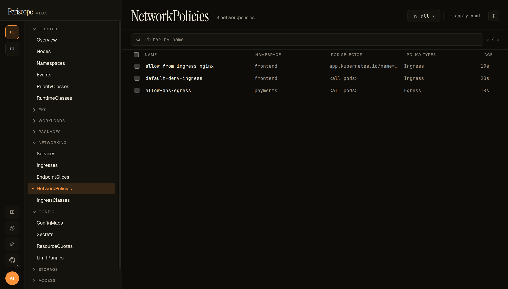
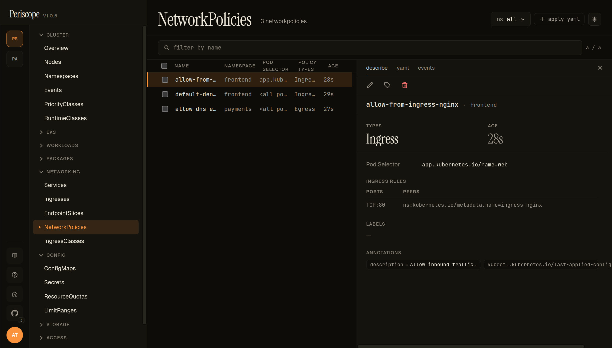
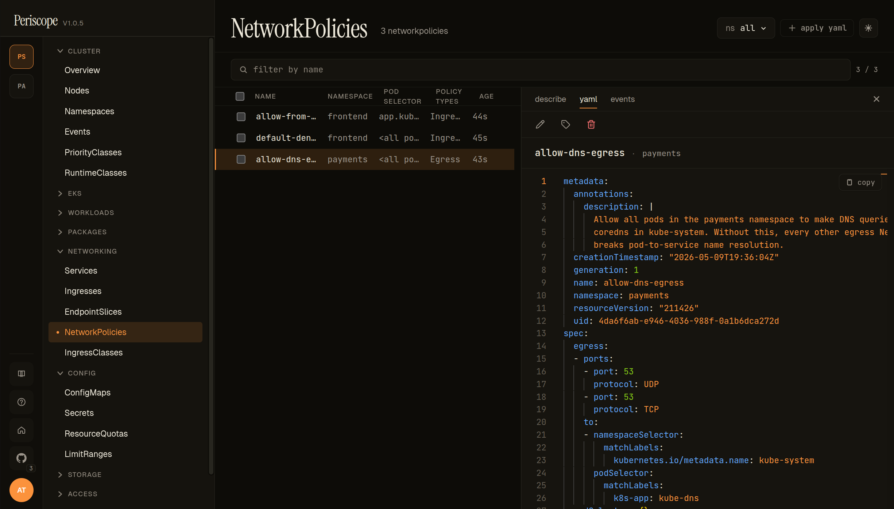

# NetworkPolicies

The NetworkPolicies page shows every `networking.k8s.io/v1`
NetworkPolicy in the cluster (or in the namespace picker's current
selection). Operator-facing read view + per-resource detail; for
applying / editing them, use the YAML editor or
[`+ apply yaml`](../setup/apply-yaml.md).

> Setup-side note: the doc at [`../setup/networkpolicy.md`](../setup/networkpolicy.md)
> covers Periscope's *own* chart-level NetworkPolicy (locking down
> the Periscope pod). This page is the operator's browser for
> NetworkPolicies that already exist on the cluster.

---

## What you see

### List

The list view shows one row per NetworkPolicy with these columns:

- **NAME** — `metadata.name`.
- **NAMESPACE** — `metadata.namespace`.
- **POD SELECTOR** — the policy's `spec.podSelector`. Empty selector
  (matches every pod in the namespace) renders as `<all pods>`. A
  matchLabels selector renders the first label as
  `app.kubernetes.io/name=…` (truncated at column width; full
  selector visible in the detail pane).
- **POLICY TYPES** — `spec.policyTypes` (`Ingress`, `Egress`, or both).
- **AGE** — relative timestamp from `metadata.creationTimestamp`.

The screencap above is from peri-server with three seeded NetPols
demonstrating the common patterns:

- `default-deny-ingress` (frontend, `<all pods>`, Ingress) — the
  baseline namespace-wide block.
- `allow-from-ingress-nginx` (frontend, `app.kubernetes.io/name=web`,
  Ingress) — the targeted exception that pairs with the default-deny.
- `allow-dns-egress` (payments, `<all pods>`, Egress) — the
  must-have DNS exception every default-deny-egress policy needs.

The page header carries the namespace picker (`ns all` shown) and
the `+ apply yaml` quick-action.

### Detail (describe)

Click any row to open the detail pane. The **describe** tab carries:

- **Header** — name + namespace + edit / labels / delete actions.
- **TYPES** — `Ingress` / `Egress` / both, badged.
- **AGE** — same relative timestamp as the list.
- **Pod Selector** — the full `spec.podSelector` (matchLabels +
  matchExpressions if used).
- **INGRESS RULES** / **EGRESS RULES** — one row per rule, with
  **PORTS** (e.g. `TCP:80`) and **PEERS** (e.g.
  `ns:kubernetes.io/metadata.name=ingress-nginx`). Empty rule lists
  render as "no rules".
- **LABELS** + **ANNOTATIONS** — `metadata.labels` and
  `metadata.annotations`. The seeded NetPols above carry a
  `description` annotation that is surfaced verbatim — a useful
  pattern for explaining intent without the operator having to flip
  to YAML.

### Detail (yaml)

The **yaml** tab shows the full canonical manifest in a Monaco
viewer with syntax highlighting and copy-to-clipboard. The
`description` annotation is visible in full — useful because the
describe tab truncates long annotations to one line. `creationTimestamp`,
`resourceVersion`, `uid` are visible here only (filtered out of the
form/describe view).

### Detail (events)

The **events** tab is the per-resource event feed (events whose
`involvedObject` matches this NetworkPolicy). Most NetPols emit no
events directly — this tab is most useful for surfacing CNI plugin
errors when the cluster's enforcer rejects a policy.

---

## Live updates

The list is wired to the cluster's
[`watch streams`](../setup/watch-streams.md) — adds, updates, and
deletes propagate without a page refresh. The list reorders on
update; row selection persists across updates.

---

## RBAC

The page needs `networkpolicies:list` (in `networking.k8s.io`).
Detail tab needs `networkpolicies:get`. The standard `view` ClusterRole
carries both. A role denied either verb sees the same forbidden
state the rest of the SPA uses.

---

## Related docs

- [`../setup/networkpolicy.md`](../setup/networkpolicy.md) —
  Periscope's own chart-level NetworkPolicy (different topic;
  for locking down the Periscope pod).
- [`../setup/apply-yaml.md`](../setup/apply-yaml.md) — applying
  NetworkPolicy manifests via the dialog.
- [`workloads.md`](./workloads.md) — the POD SELECTOR refers to
  pod labels visible on the Pods page.
- [`../setup/watch-streams.md`](../setup/watch-streams.md) — the
  SSE plumbing that makes the list live.
