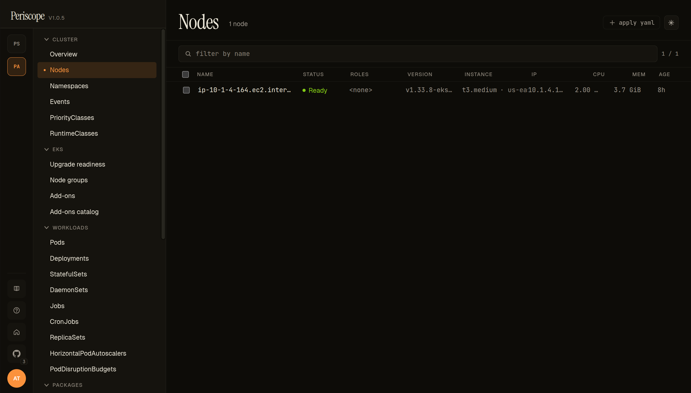
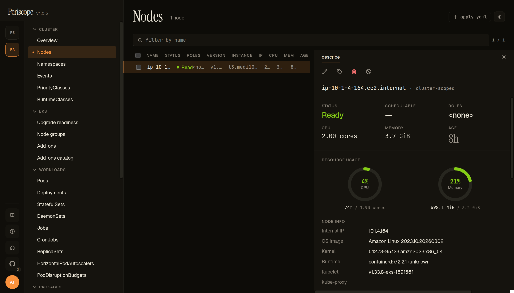

# Nodes

The Nodes page lists every K8s node in the cluster with the metadata
operators read at 11pm — instance type, zone, capacity-type (spot vs
on-demand), kubelet version, schedulability, and a status glyph. Pairs
with the [Node Groups](../setup/eks-upgrade-readiness.md#node-groups-card--page)
EKS-side surface, which lists the AWS-managed group abstraction
above individual nodes.

---

## What you see

### List

Each row carries:

- **Status glyph** — `●` Ready (green), `✕` NotReady (red), `○`
  Unknown (grey, animated). A `cordoned` overlay renders when the
  node has `spec.unschedulable=true`.
- **Roles** — extracted from labels with the
  `node-role.kubernetes.io/<role>` prefix. Most EKS-managed nodes
  show no role; control-plane nodes (rare in EKS user clusters)
  show `control-plane`.
- **Instance** — combined column showing **instance type** + **zone**
  + an optional **`spot` chip** when the node carries
  `eks.amazonaws.com/capacityType=SPOT` (or
  `karpenter.sh/capacity-type=spot`). The spot chip renders yellow
  to surface "this node can be reclaimed at 2-min notice" — answers
  the "why did my pod die overnight" question at scroll glance.
- **Kubelet version** — from `node.status.nodeInfo.kubeletVersion`.
- **Internal IP** — `node.status.addresses[type=InternalIP]`.
- **CPU / mem capacity** — from `node.status.capacity`.
- **Age** — relative (e.g. `4h`, `2d`).

### Detail

Clicking a row opens the detail pane. Tabs:

- **Describe** — kubectl-describe-style summary: conditions, taints,
  allocated resources, system info, addresses, labels, annotations.
- **YAML** — full node manifest, monaco-editor read-only view.
- **Events** — events filtered to this node (eviction, OOMKilled
  on hosted pods, etc).

---

## Capacity-type detection

Periscope reads two label families and surfaces whichever is present:

| Source | Label | Values |
|---|---|---|
| EKS managed nodegroups | `eks.amazonaws.com/capacityType` | `ON_DEMAND`, `SPOT` |
| Karpenter | `karpenter.sh/capacity-type` | `on-demand`, `spot` |

Both lowercase + uppercase forms are normalized to the chip. Nodes
with neither label (self-managed, raw EC2, kops, etc) leave the
chip slot blank — no false signal.

---

## RBAC

The page needs `nodes:list` cluster-scoped (the standard `view` /
`read` ClusterRole carries this). When `node access restricted` shows
in the [cluster overview](./cluster-overview.md) identity banner,
this page renders an empty state with the same message — denoting
the difference between "cluster has no nodes" and "your role can't
see them."
