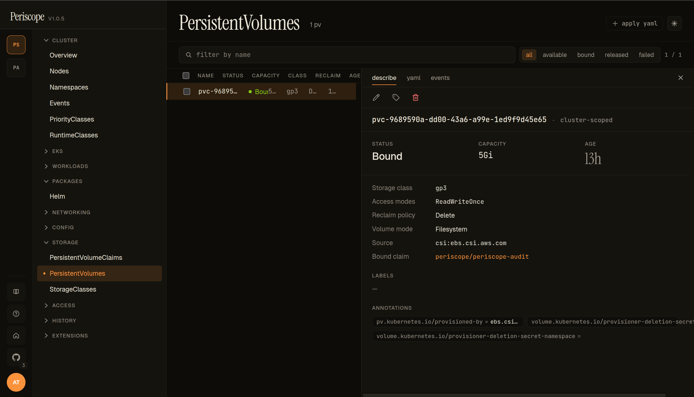
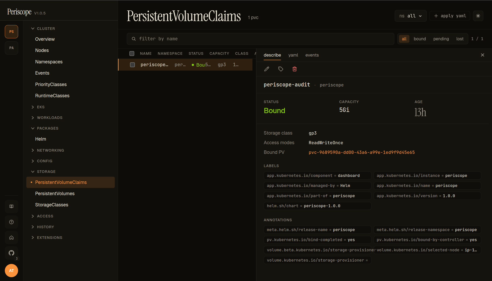

# Storage (PVs, PVCs, StorageClasses)

The **STORAGE** sidebar group surfaces the three K8s storage objects
operators reach for during incidents — `PersistentVolumes`,
`PersistentVolumeClaims`, and `StorageClasses`. Live-watched lists
with detail panes that pair the Bound PV ↔ PVC for a single click.

---

## PersistentVolumes

### List

The page header shows the PV count and the **status filter pills** —
`all` / `available` / `bound` / `released` / `failed`. Each row carries:

- **NAME** — `metadata.name`. Dynamically-provisioned PVs use the
  `pvc-<uid>` convention.
- **STATUS** — colored chip (`Bound` green, `Available` neutral,
  `Released`/`Failed` warning).
- **CAPACITY** — `spec.capacity.storage`.
- **CLASS** — `spec.storageClassName`.
- **RECLAIM** — `spec.persistentVolumeReclaimPolicy`. `Retain` keeps
  the underlying volume on PVC delete; `Delete` reclaims it.
- **AGE** — relative timestamp.

### Detail (describe)

The detail pane's **describe** tab carries:

- **Header** — name + the `cluster-scoped` chip (PVs are
  cluster-scoped) + edit / labels / delete actions.
- **Runtime cards** — STATUS / CAPACITY / AGE.
- **Storage class / Access modes / Reclaim policy / Volume mode**
  — the four config knobs, each one row.
- **Source** — the CSI driver name (`csi.ebs.csi.aws.com` in the
  screencap, indicating the AWS EBS CSI driver provisioned this PV).
  In-tree drivers (legacy) render as `awsElasticBlockStore`,
  `gcePersistentDisk`, etc.; the source row is the easiest way to
  spot in-tree usage you should migrate off.
- **Bound claim** — `namespace/name` of the PVC currently bound to
  this PV. Click to jump to the PVC detail.
- **Annotations** — provisioner-set annotations are surfaced verbatim
  (e.g. `pv.kubernetes.io/provisioned-by`, the deletion-secret
  annotations).

The screencap above is the EBS-backed PV that holds Periscope's
own audit log on peri-server — a `5Gi gp3 RWO` volume bound to
`periscope/periscope-audit`.

### Detail (yaml + events)

The **yaml** tab shows the canonical manifest including the source
spec block (`csi: { driver, volumeHandle, fsType, volumeAttributes }`)
that the describe tab summarizes. The **events** tab is the
per-PV event feed — most operationally interesting for surfacing
provisioner failures (`ProvisioningFailed`, `Resizing`).

---

## PersistentVolumeClaims

### List

Same shape as the PV list, scoped per-namespace via the namespace
picker. Status filter pills — `all` / `bound` / `pending` / `lost`.
Each row carries:

- **NAME / NAMESPACE** — the claim itself.
- **STATUS** — colored chip (`Bound` green, `Pending` amber, `Lost`
  warning).
- **CAPACITY** — `status.capacity.storage` (the actually-bound size).
- **CLASS** — `spec.storageClassName`.
- **AGE** — relative timestamp.

### Detail (describe)

- **Runtime cards** — STATUS / CAPACITY / AGE.
- **Storage class / Access modes** — same as the PV detail.
- **Bound PV** — `pvc-<uid>` link to the matching PV detail page.
  The pair `claim → bound PV` is one click each direction; useful
  when a PVC is `Pending` and you need to see whether a matching PV
  exists.
- **LABELS / ANNOTATIONS** — Helm-managed labels render verbatim
  (the screencap shows the standard `app.kubernetes.io/*` set);
  provisioner annotations include
  `volume.kubernetes.io/storage-provisioner=ebs.csi.aws.com` and
  `volume.kubernetes.io/selected-node=ip-…` (CSI external-provisioner
  state).

### Common Pending-state debugging

When a PVC stays `Pending`, the events tab surfaces the
`ProvisioningFailed` reason verbatim. Common culprits:

- **No matching StorageClass.** PVC requests `storageClassName: foo`
  but no SC named `foo` exists. Events tab shows
  `storageclass.storage.k8s.io "foo" not found`.
- **Provisioner can't allocate.** AZ mismatch (PVC on a node in
  `us-west-2c` but the EBS CSI driver IRSA only allows `us-west-2a`),
  quota exhaustion, missing IAM permission. Events tab carries the
  CSI driver's verbatim error message.
- **WaitForFirstConsumer.** PVC is `Pending` *deliberately* — the
  StorageClass uses `WaitForFirstConsumer` topology and no Pod has
  been scheduled to a node yet. Not a problem; resolves when a Pod
  references the PVC.

---

## StorageClasses

The StorageClasses page lists every `storage.k8s.io/v1
StorageClass` on the cluster. Operationally simpler than PV/PVC —
one row per SC with **PROVISIONER**, **RECLAIM**, **VOLUME BINDING
MODE** (`Immediate` / `WaitForFirstConsumer`), and **DEFAULT** chip
(set when the SC carries the
`storageclass.kubernetes.io/is-default-class=true` annotation).

The detail pane shows the full `parameters` block (the per-driver
config — for EBS, the `type`, `encrypted`, `iopsPerGB`, etc.) plus
labels / annotations.

> No screenshot for this page — the layout matches the PV list shape
> with a smaller column set.

---

## Live updates

All three list pages are wired to the cluster's
[`watch streams`](../setup/watch-streams.md). PVC binding state
transitions (`Pending → Bound`) propagate without a refresh — useful
for staring at a fresh PVC and watching the provisioner pick it up.

---

## RBAC

The standard `view` ClusterRole grants `get` + `list` on PVs, PVCs,
and StorageClasses cluster-wide. Role-restricted users see only the
PVCs in namespaces their Role permits; PVs and StorageClasses are
cluster-scoped, so a denial there hides the entire page.

---

## Related docs

- [`workloads.md`](./workloads.md) — Pods reference their PVCs in
  `spec.volumes`; the workload detail surfaces the volume mounts.
- [`../setup/watch-streams.md`](../setup/watch-streams.md) — the
  SSE plumbing that makes these list pages live.
- [`cluster-overview.md`](./cluster-overview.md) — the **Storage**
  card on the overview page summarizes total/bound capacity.
