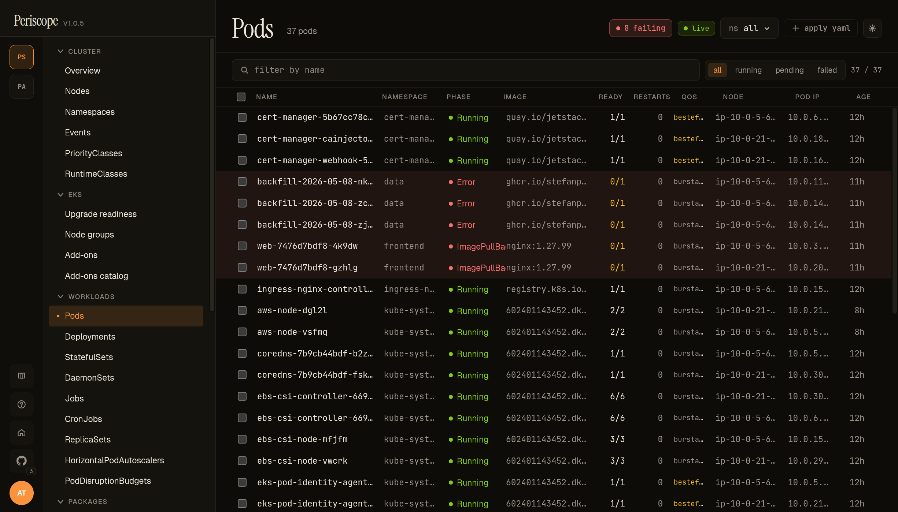
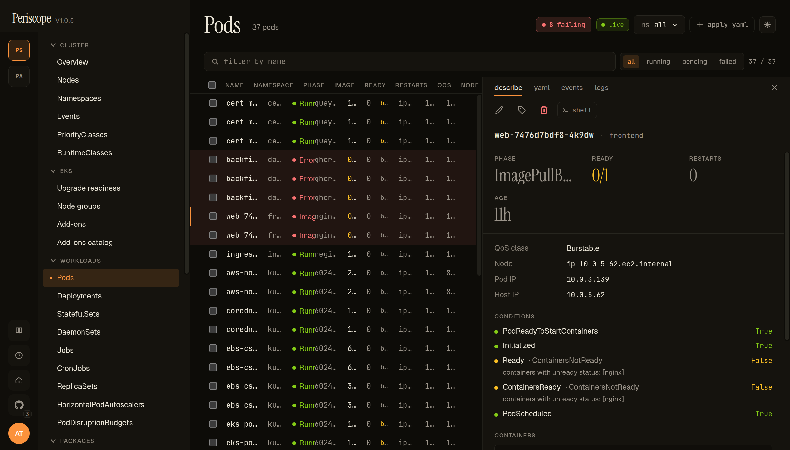
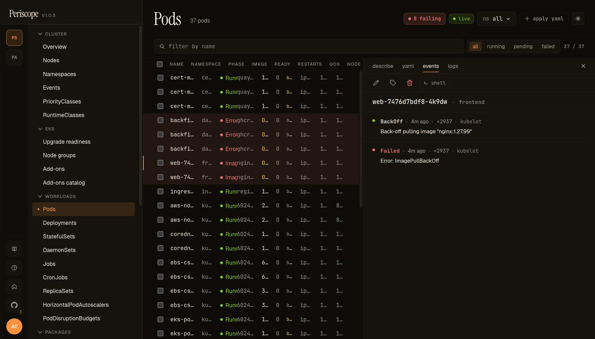
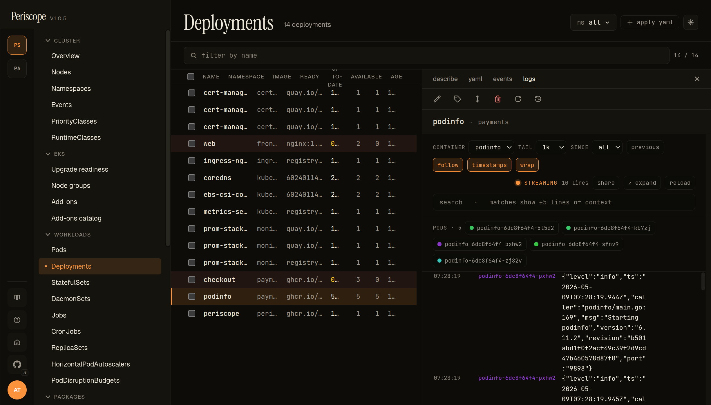
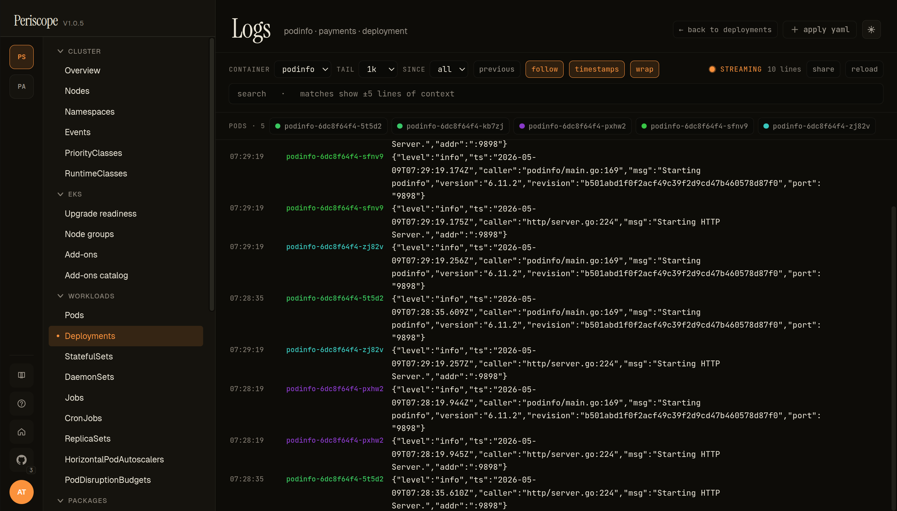
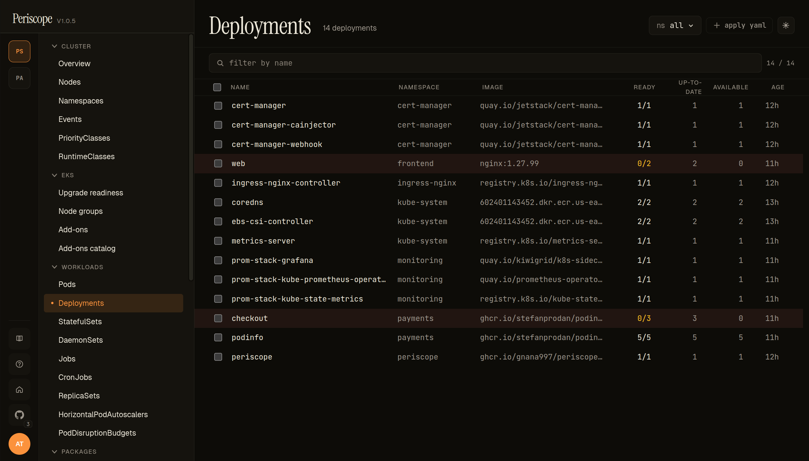
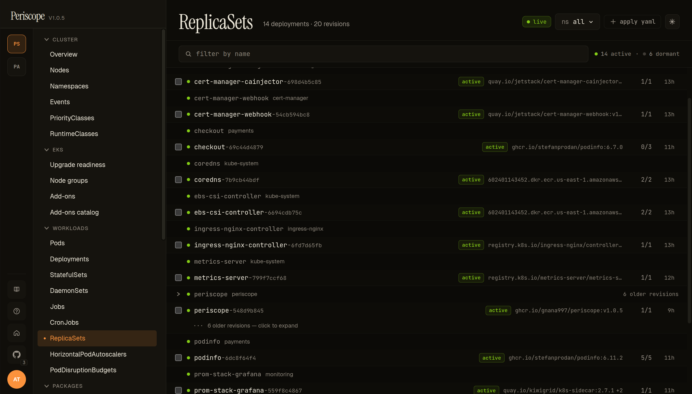
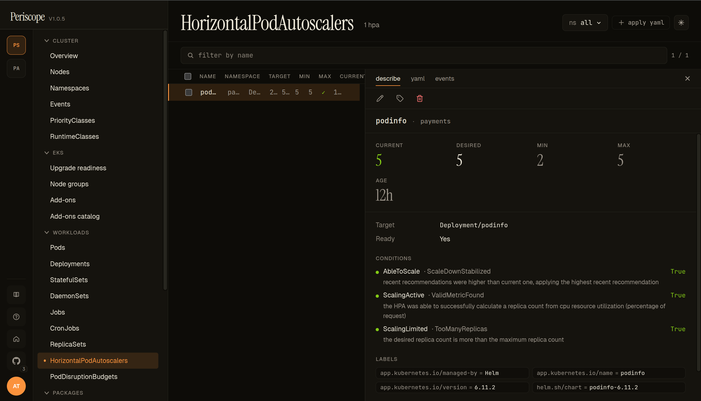
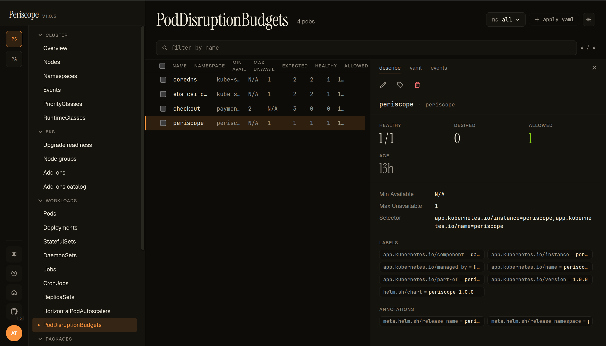

# Workloads

The Workloads pages — Pods, Deployments, StatefulSets, DaemonSets,
ReplicaSets, Jobs, CronJobs — share a column shape: name, namespace,
ready/total, image, status, age. Each kind has its own list page
with a detail pane that drills into describe / YAML / events / logs
tabs.

This page covers the cross-cutting view; per-kind specifics (e.g.
DaemonSet's `misscheduled` count, CronJob's last-success time) live
in the existing kubectl reference. The Periscope-specific story is
in the **image** + **QoS** columns and the **live logs** experience.

---

## Pods list

The pods list adds a few columns kubectl-get doesn't:

- **Image** — the **first container's image** in the pod, truncated
  with full path in the row's title tooltip. When a pod has > 1
  container, a small `+N` badge follows the image to surface
  multi-container pods at scroll glance.
- **QoS** — the kubectl-style class (**Guaranteed**, **Burstable**,
  **BestEffort**). BestEffort renders yellow because those pods get
  evicted first when the node hits memory pressure — informs the
  "who gets killed first" question without opening describe.
- **Restarts** — coloured by severity: `0` muted, `1-5` neutral, `>5`
  yellow, terminal failures `red`.
- **Phase** — Running / Pending / Succeeded / Failed / Unknown plus
  a synthesized **Stuck** for pods reporting a wait/term reason
  kubectl flags as broken (CrashLoopBackOff, ImagePullBackOff,
  RunContainerError). Stuck rows tint red.

Filtering: namespace picker in the top strip; search by name in the
filter strip below; a status pills row offers `phase=Stuck` /
`phase=Pending` / `phase=Failed` quick filters.

---

## Pod detail

Clicking a row opens the right-pane detail. Tabs:

- **Describe** — kubectl-describe-equivalent summary. Containers
  block expands per-container with image, last state, restart
  count, ready-and-started flags.
- **YAML** — Monaco-editor read-only view of the live pod manifest.
- **Events** — see below.
- **Logs** — see below.
- **Exec** — the [Open Shell](../setup/pod-exec.md) action.

### Events tab

Events tab shows every K8s event with the pod as `involvedObject`,
newest first. Type pill (`Normal` / `Warning` — Warning rows tint
yellow), Reason, Message, Count, Source, Age.

The screencap above shows the failing `web` pod from the seeded `frontend` namespace — `Back-off pulling image "nginx:1.27.99"` and `Error: ImagePullBackOff`. The high `Count` value (× 2937 in the shot) is realistic for a pod that has been stuck in the BackOff loop for hours; kubelet collapses repeated pull attempts into one event with an incrementing counter. The events page carries the same shape across resources
(also see [Cluster events](./cluster-overview.md) for the
all-events feed).

---

## Live logs

The Logs tab streams stdout + stderr from the kube-apiserver via
SSE. The header strip carries:

- **Container picker** — for multi-container pods, switch which
  container's logs are streaming.
- **Follow toggle** — pause/resume the live stream. Auto-pauses
  when you scroll up to read history; click the toggle (or scroll
  to bottom) to resume.
- **Search** — filter visible lines by substring.
- **Time range** — `last N min`, `since pod start`, custom.
- **Wrap toggle** — on by default; off renders horizontally
  scrolling.

### Expanded detail

Click any log line to expand it. Structured-log lines (JSON,
logfmt) get key-value previewed; plain text lines render verbatim.
Useful when one line is wider than the viewport — the expanded
view wraps cleanly.

---

## Deployments list

Same column shape as Pods, plus:

- **Replicas** — desired / current / ready / updated. Yellow tint
  when ready < desired, red when ready=0.
- **Image** — first container's image in the **pod template**.
- **Strategy** — `RollingUpdate` (default) or `Recreate`. Surfaced
  on the detail tab; will move to the list in v1.1.

The detail pane mirrors Pods but with **Replicas tab** showing the
ReplicaSet history and a **Rollback** action that swaps to a prior
revision (see [`workload-rollback.md`](../setup/workload-rollback.md)).

---

## ReplicaSets

ReplicaSets get a custom layout instead of a flat table — they're **grouped under their owning Deployment** with the active RS shown by default and dormant historical revisions collapsed behind a `+ N older revisions — click to expand` row. Distinguishes the operational signal (which RS is live; what's its image) from the historical archive (every prior rollout) without flooding the page.

Each row carries the **active** badge (green) when the RS has `desired > 0`, the **container image** (the column added in v1.0.5 — same shape as Pods + Deployments), and the **READY/DESIRED** counts. Standalone ReplicaSets (without a Deployment owner) get their own section at the bottom of the page.

The screencap above shows **periscope** with 6 older revisions collapsed — these correspond to the 7 helm revisions visible in the [rollback dialog](../setup/workload-rollback.md), one ReplicaSet per Deployment-template change. Click into any RS to see its detail (manifest, owned pods, events).

---

## HorizontalPodAutoscalers

The HPA list page shows every `autoscaling/v2 HorizontalPodAutoscaler` in scope with these columns:

- **NAME / NAMESPACE** — the HPA itself.
- **TARGET** — `Kind/name` reference (`Deployment/podinfo` in the screencap), pointing at what the HPA scales.
- **MIN / MAX** — replica bounds from `spec.{minReplicas, maxReplicas}`.
- **CURRENT / DESIRED** — runtime state from `status.{currentReplicas, desiredReplicas}`.
- **AGE** — relative timestamp.

The detail pane's **describe** tab carries the runtime state cards (CURRENT / DESIRED / MIN / MAX), the **Target** + **Ready** chips, and the autoscaler **conditions** block — the operator-meaningful part.

The screencap above is the deliberately-overloaded `podinfo` HPA on peri-server's payments namespace: at `5/5/2/5` with three conditions reporting:

- **AbleToScale** = `True` (`ScaleDownStabilized`) — recent recommendations were higher than current; HPA is applying the highest recommendation.
- **ScalingActive** = `True` (`ValidMetricFound`) — the HPA was able to successfully calculate a replica count from CPU resource utilization.
- **ScalingLimited** = `True` (`TooManyReplicas`) — the desired replica count is more than the maximum replica count.

`ScalingLimited=TooManyReplicas` is the canonical "your HPA wants to scale further but is capped" signal — usually the reason a paged-on-demand workload doesn't recover. Surfacing it on the describe tab without forcing the operator to dig through events is the point.

---

## PodDisruptionBudgets

The PDB list page shows every `policy/v1 PodDisruptionBudget` with these columns:

- **NAME / NAMESPACE** — the PDB itself.
- **MIN AVAIL / MAX UNAVAIL** — the configured budget. Mutually exclusive — exactly one is set per PDB.
- **EXPECTED / HEALTHY / ALLOWED** — runtime state. **ALLOWED** is the headline number: how many additional disruptions the PDB will tolerate **right now**. `0` means a `kubectl drain` will block.

The detail pane's **describe** tab carries the runtime cards (HEALTHY / DESIRED / ALLOWED), the budget config (Min Available / Max Unavailable), the pod **Selector**, and labels + annotations.

The screencap shows peri-server's 4-PDB set — `coredns`, `ebs-csi-c…`, `checkout`, `periscope` — with the `periscope` PDB selected: `1/1` healthy, `1` disruption allowed, `Max Unavailable=1`, selecting on the periscope-instance label.

Use this page during cluster maintenance windows: a quick scan of the **ALLOWED** column tells you which workloads will block a node drain before you start the drain.

---

## RBAC

Each list page needs `<kind>:list` for the namespace scope (or
cluster-scoped for cross-namespace browsing). The events tab
additionally needs `events:list` in the involved-object's namespace.
Logs require `pods/log:get` — granted by the standard `view`
ClusterRole. Exec requires `pods/exec:create`, intentionally NOT
in `view` — granted by `triage` and above (see
[`cluster-rbac.md`](../setup/cluster-rbac.md)).

---

## Related docs

- [`cluster-overview.md`](./cluster-overview.md) — landing page
- [`workload-rollback.md`](../setup/workload-rollback.md) — rollback
  flow
- [`pod-exec.md`](../setup/pod-exec.md) — Open Shell
- [`watch-streams.md`](../setup/watch-streams.md) — the SSE plumbing
- [`storage.md`](./storage.md) — PV + PVC pages reached from a Pod's `spec.volumes`
- [`custom-resources.md`](./custom-resources.md) — CRDs that own workloads via `metadata.ownerReferences`
  that makes these list pages live
