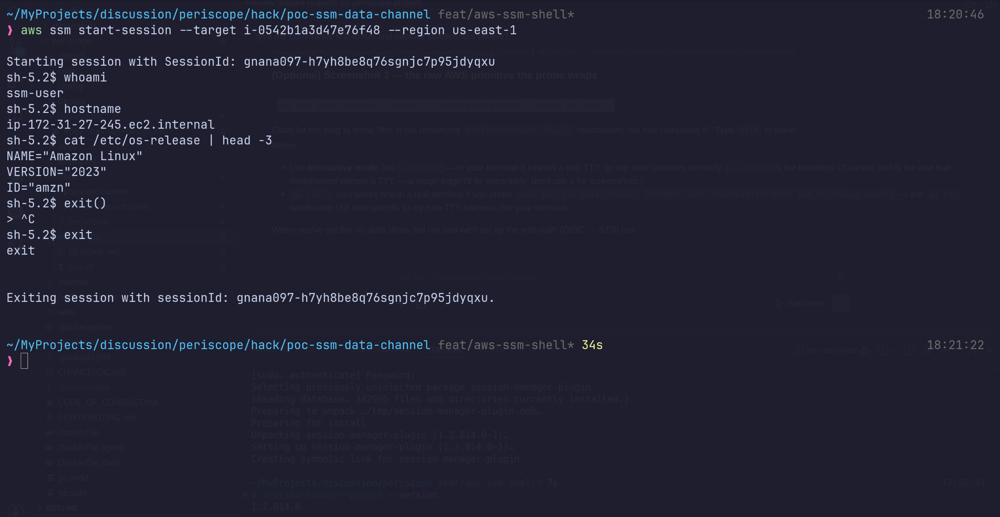
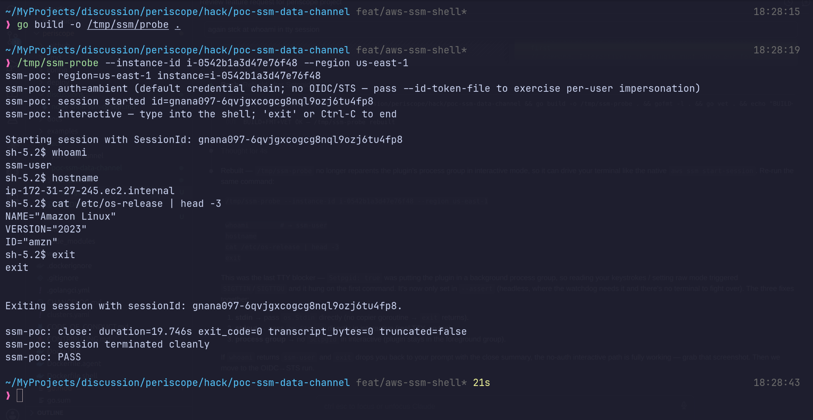
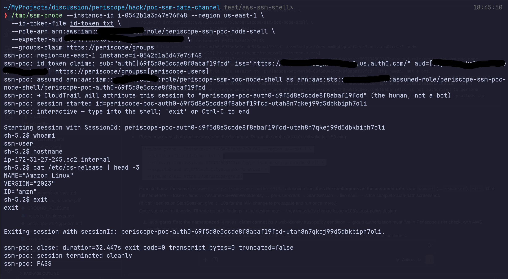

# Issue #105 spike — SSM node-shell data channel

Proves the **transport composition** behind the "in-browser node shell"
feature ([#105](https://github.com/gnana997/periscope/issues/105)) in
isolation from auth — the same discipline as
[`hack/poc-exec-tunnel`](../poc-exec-tunnel), which proved the
exec-over-tunnel *path* while stubbing auth with a dev cookie.

Here the auth/STS layer is stubbed by the laptop's **ambient AWS
credentials** (default chain: `AWS_PROFILE` / SSO / env). That leaves the
one piece genuinely new to us under test:

```
ambient creds → ssm:StartSession → session-manager-plugin → interactive bytes
```

We do **not** reimplement the SSM message-gateway (MGS) binary protocol.
`session-manager-plugin` is AWS's maintained, Apache-2.0 reference
implementation; production composes it — just as poc-exec-tunnel reused
client-go's exec machinery rather than reimplementing the exec wire
format.

The primitive we compose — a raw `aws ssm start-session` into the node:



## Need a target instance?

[`terraform/`](terraform) stands up a free-tier `t2.micro` (Amazon Linux
2023, SSM agent preinstalled) and outputs its id:

```sh
cd hack/poc-ssm-data-channel/terraform
terraform init && terraform apply        # prints a ready-to-paste run_hint
# ... give the SSM agent ~1-2 min to report Online, then run the probe ...
terraform destroy                        # when done
```

## Run

```sh
# interactive shell on the node (type 'exit' or Ctrl-C to end)
make poc-ssm-data-channel INSTANCE_ID=i-0abc123 AWS_REGION=us-east-1

# automated: assert an echo token round-trips, then exit
make poc-ssm-data-channel INSTANCE_ID=i-0abc123 ASSERT=1

# demo the idle-timeout kill
make poc-ssm-data-channel INSTANCE_ID=i-0abc123 IDLE_SECONDS=30
```

Or call the probe directly:

```sh
cd hack/poc-ssm-data-channel
go run . --instance-id i-0abc123 --region us-east-1 --assert
```

No-auth run (ambient creds): session opens, an interactive shell round-trips,
and the close summary prints `duration / exit_code / transcript_bytes` — the
`ssm_session_close` audit shape:



### Per-user impersonation (opt-in)

By default the probe uses **ambient AWS creds** — no Periscope, no OIDC.
To exercise the *production* auth model instead — the OIDC id_token →
`sts:AssumeRoleWithWebIdentity` → per-user creds chain — stand up the role
(`terraform apply -var enable_oidc=true`, see [`terraform/`](terraform)),
drop a real id_token in a file, and:

```sh
# grab an id_token (see "Getting an id_token" below) into id-token.txt, then:
ID_TOKEN_FILE=id-token.txt \
ROLE_ARN="$(terraform -chdir=terraform output -raw node_shell_role_arn)" \
EXPECTED_AUD="<your-oidc-client-id>" \
make poc-ssm-data-channel INSTANCE_ID=i-0abc123 AWS_REGION=us-east-1 ASSERT=1
```

The `terraform output run_hint_oidc` command prints this line prefilled with
your own values.

The probe then prints the id_token's claims, runs the `aud` pre-check,
assumes the role, and prints the **assumed-role ARN** — the human the
session is attributed to. Run it with a token whose `groups` lacks the
required group and STS refuses *before any session opens* — the security
gate, demonstrated. This is the blog's money shot.



The shell still runs as the OS `ssm-user` (SSM's default) — but the session
id and CloudTrail `Owner` carry the human's OIDC `sub`
(`…/periscope-ssm-poc-node-shell/periscope-poc-auth0-…`). Attribution lives
at the audit layer, not in `whoami`. A key spike finding: `aud` gates in the
trust policy but the namespaced `groups` claim does not, so group
authorization moves to Periscope's tier check.

#### Getting an id_token

The probe consumes a token; it doesn't mint one. Obtain one from the same
IdP your Periscope uses (whatever issuer / client_id / groups claim you
configured in `auth.oidc`) via any OIDC login — a device-code/auth-code
CLI, or copy it from the IdP's token response — and save the raw JWT to
`id-token.txt`. The IAM side (issuer, client_id, groups claim) is set in
your `terraform.tfvars`, not hardcoded. id_tokens
are short-lived (~1h), so re-grab before a run. **This staleness is exactly
why production needs the `FreshIDToken` refresh seam.**

## Prerequisites

- `session-manager-plugin` on `PATH`
  ([install](https://docs.aws.amazon.com/systems-manager/latest/userguide/session-manager-working-with-install-plugin.html)).
- Ambient AWS creds that allow `ssm:StartSession` / `ssm:TerminateSession`
  on the target.
- A target EC2 instance whose **SSM agent is Online**
  (`aws ssm describe-instance-information`). EKS managed nodes qualify out
  of the box.

## Topology

```
┌─ your laptop ──────────────────────────────────────────────┐
│                                                             │
│  go run .  (this probe)                                     │
│    │  1. config.LoadDefaultConfig   ← ambient creds (stub)  │
│    │  2. ssm:StartSession(target=i-…) ──────────────┐       │
│    │       ← {SessionId, StreamUrl, TokenValue}      │       │
│    │  3. exec session-manager-plugin <response> …    │       │
│    │       stdin ─┐                  ┌─ stdout       │       │
│    │              ▼                  │  (tee→transcript, activity) 
│    │     ┌──────────────────────┐    │               │       │
│    └────▶│ session-manager-plugin│───┘               │       │
│          └───────────┬──────────┘                    │       │
│                      │ MGS WebSocket (StreamUrl+Token)│       │
└──────────────────────┼───────────────────────────────┼───────┘
                       ▼                                ▼
              ┌─────────────────┐              ssm:TerminateSession
              │ SSM message     │                 (on exit)
              │ gateway → agent │
              │ on the EC2 node │
              └─────────────────┘
```

## What it asserts

Parallels poc-exec-tunnel's `probe.go`:

1. **StartSession handshake** — `ssm:StartSession` returns a live
   `StreamUrl`/`TokenValue` and the plugin opens the data channel
   (proves the composition connects with the supplied creds).
2. **Byte round-trip** (`--assert`) — `echo PERISCOPE-SSM-POC-OK-…` is
   sent on stdin and observed on stdout (proves interactive transport).
3. **Transcript capture** — stdout is tee'd into a write-capped buffer
   with a `truncated` flag, the exact shape `clustershell`'s
   `TranscriptMaxBytes` enforces in production (proves the audit-row
   body is feasible to capture here).
4. **Idle kill** (`--idle-seconds N`) — no stdin/stdout byte for N
   seconds kills the plugin's whole process group (activity = any
   stdin OR stdout byte, mirroring exec).
5. **Clean teardown** — `ssm:TerminateSession` always fires on exit,
   ctrl-c, idle-kill, or timeout. The close summary prints
   `duration / exit_code / transcript_bytes / truncated` — the
   `ssm_session_close` audit row, prototyped.

6. **Per-user impersonation** (`--id-token-file`, opt-in) — the OIDC
   id_token → `sts:AssumeRoleWithWebIdentity` → per-user creds chain,
   the IAM trust policy as source of truth, and CloudTrail attribution
   to the human. Also surfaces the open question of whether a namespaced
   `groups` claim works as a trust-policy condition key (see
   [`terraform/iam.tf`](terraform/iam.tf)).

## What this spike does NOT cover (production, layered on top)

All low-risk, deliberately excluded so the spike stays focused:

- **The `FreshIDToken` egress seam** — getting the raw id_token out of
  the auth boundary and refreshing it when stale (the design's
  load-bearing finding). Here you paste a token by hand instead.
- **The `providerID` gate**, preflight (assume + DescribeInstance
  Information), audit verbs, Helm flag, and the SPA button.
